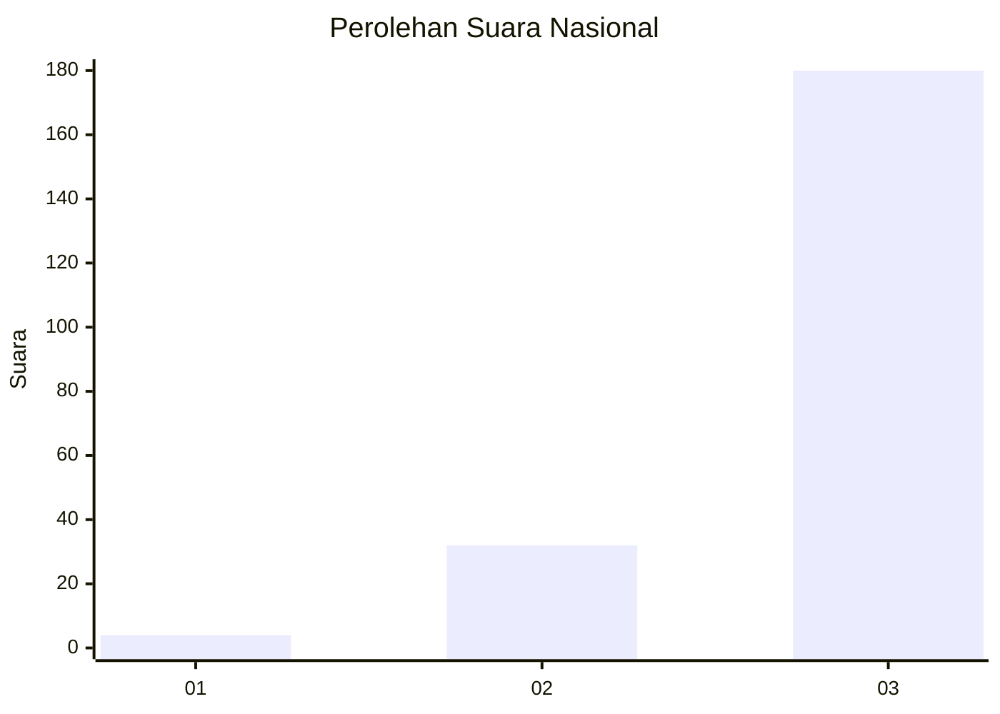
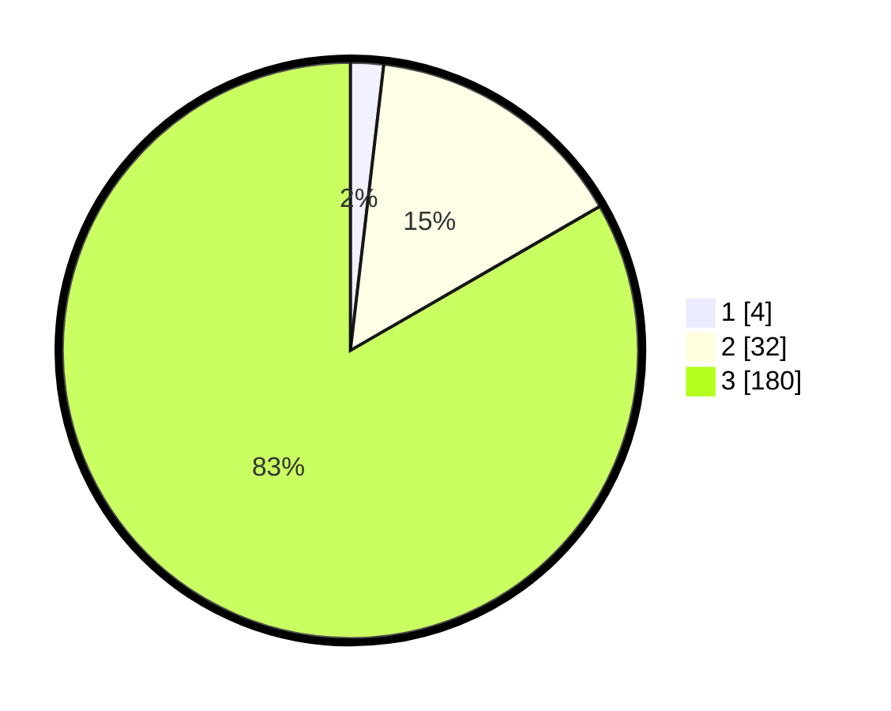

# Hasil

## Grafik

## Tabel

| No. | Nama Paslon    | Suara | Suara (raw) | Persentase |
|:--- |:-------------- | -----:| -----------:| ----------:|
| 1   | ANIES MUHAIMIN | 4     | [4][p-1]    | 1,85       |
| 2   | PRABOWO GIBRAN | 32    | [32][p-2]   | 14,81      |
| 3   | GANJAR MAHFUD  | 180   | [180][p-3]  | 83,33      |

[p-1]: https://github.com/gigit-pemilu/pemilu-2024/blob/main/pilpres/hitung-suara/sub/92-papua-barat/sub/02-manokwari/sub/03-warmare/sub/2002-indisey/sub/001-tps/sub/paslon-1.txt
[p-2]: https://github.com/gigit-pemilu/pemilu-2024/blob/main/pilpres/hitung-suara/sub/92-papua-barat/sub/02-manokwari/sub/03-warmare/sub/2002-indisey/sub/001-tps/sub/paslon-2.txt
[p-3]: https://github.com/gigit-pemilu/pemilu-2024/blob/main/pilpres/hitung-suara/sub/92-papua-barat/sub/02-manokwari/sub/03-warmare/sub/2002-indisey/sub/001-tps/sub/paslon-3.txt

## Foto C Plano

https://sirekap-obj-formc.kpu.go.id/b732/pemilu/ppwp/92/02/03/20/02/9202032002001-20240214-140948--68fc78c5-d70a-491e-a012-028f387dbc82.jpg

https://sirekap-obj-formc.kpu.go.id/b732/pemilu/ppwp/92/02/03/20/02/9202032002001-20240214-141008--e2349cc1-d9e9-4876-ae7a-fb1eb4cf6d58.jpg

https://sirekap-obj-formc.kpu.go.id/b732/pemilu/ppwp/92/02/03/20/02/9202032002001-20240214-141035--ee6dd617-be67-42aa-bcc6-637726430d7d.jpg

## Metadata

| Key        | Value               |
| ---------- | ------------------- |
| Time Stamp | 2024-02-14 21:46:01 |

## DATA PEMILIH TETAP

Jumlah pemilih dalam DPT: **214**.
 * L: **96**.
 * P: **118**.

## DATA PENGGUNA HAK PILIH

Jumlah pengguna hak pilih dalam DPT: **214**.
 * L: **96**.
 * P: **118**.

Jumlah pengguna hak pilih dalam DPTb: **0**.
 * L: **0**.
 * P: **0**.

Jumlah pengguna hak pilih dalam DPK: **2**.
 * L: **2**.
 * P: **0**.

Jumlah pengguna hak pilih: **216**.
 * L: **98**.
 * P: **118**.

## JUMLAH SUARA SAH DAN TIDAK SAH

JUMLAH SELURUH SUARA SAH: **216**.

JUMLAH SUARA TIDAK SAH: **0**.

JUMLAH SELURUH SUARA SAH DAN SUARA TIDAK SAH: **216**.

