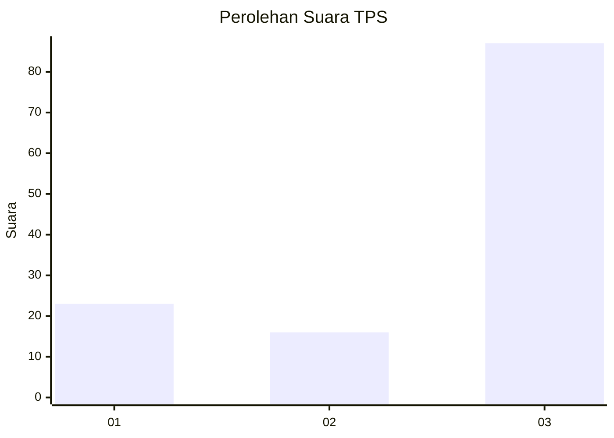
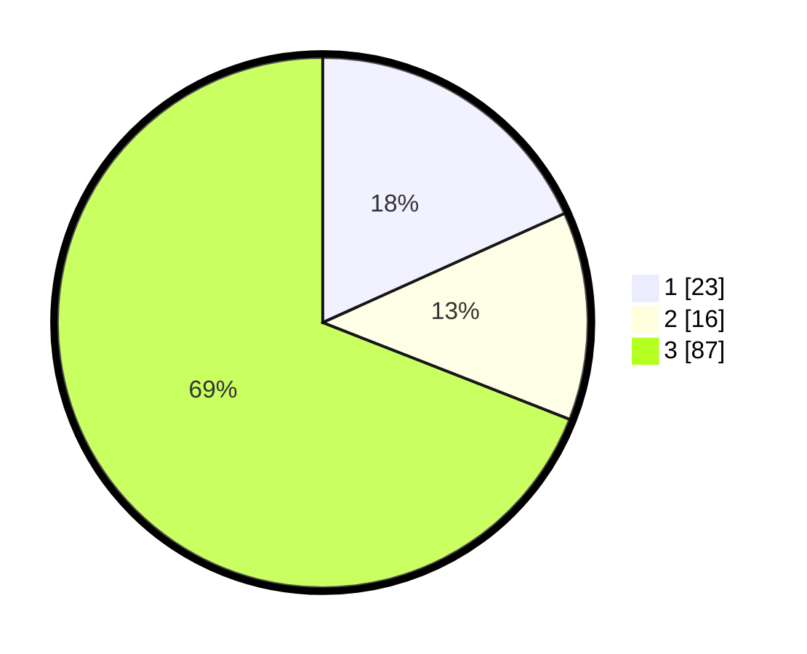

# Hasil

## Grafik

## Tabel

| No. | Nama Paslon    | Suara | Suara (raw) | Persentase |
|:--- |:-------------- | -----:| -----------:| ----------:|
| 1   | ANIES MUHAIMIN | 23    | [23][p-1]   | 18,25      |
| 2   | PRABOWO GIBRAN | 16    | [16][p-2]   | 12,70      |
| 3   | GANJAR MAHFUD  | 87    | [87][p-3]   | 69,05      |

[p-1]: https://github.com/gigit-pemilu/pemilu-2024-92-papua-barat/blob/main/pilpres/hitung-suara/sub/92-papua-barat/sub/02-manokwari/sub/03-warmare/sub/2003-hingk/sub/001-tps/sub/paslon-1.txt
[p-2]: https://github.com/gigit-pemilu/pemilu-2024-92-papua-barat/blob/main/pilpres/hitung-suara/sub/92-papua-barat/sub/02-manokwari/sub/03-warmare/sub/2003-hingk/sub/001-tps/sub/paslon-2.txt
[p-3]: https://github.com/gigit-pemilu/pemilu-2024-92-papua-barat/blob/main/pilpres/hitung-suara/sub/92-papua-barat/sub/02-manokwari/sub/03-warmare/sub/2003-hingk/sub/001-tps/sub/paslon-3.txt

## Foto C Plano

https://sirekap-obj-formc.kpu.go.id/b572/pemilu/ppwp/92/02/03/20/03/9202032003001-20240215-012436--06f02426-0665-4633-9f89-c9fc638332bd.jpg

https://sirekap-obj-formc.kpu.go.id/b572/pemilu/ppwp/92/02/03/20/03/9202032003001-20240215-013041--7c8f2265-c2b3-4c23-bbcf-6651daa4e9bf.jpg

## Metadata

| Key        | Value               |
| ---------- | ------------------- |
| Time Stamp | 2024-02-15 12:00:28 |

