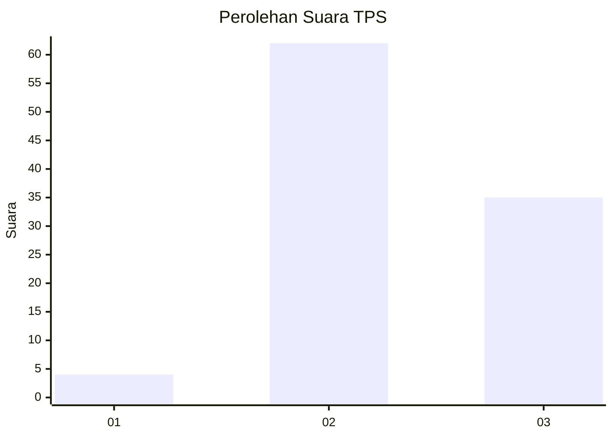
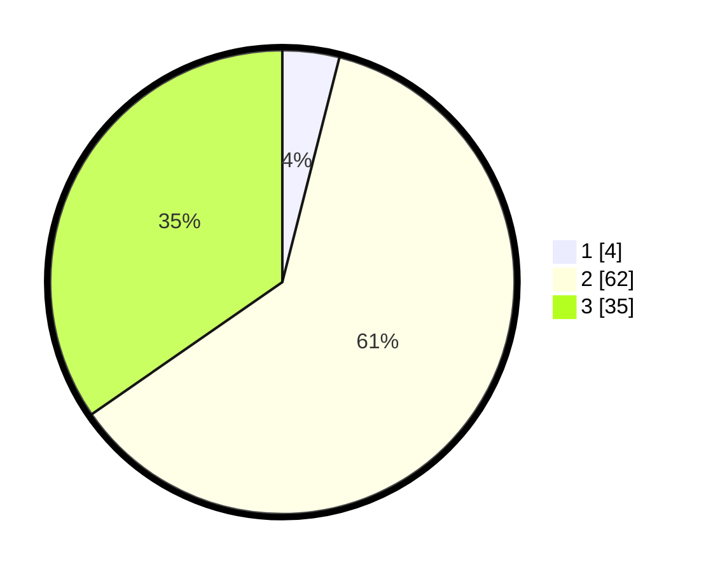

# Hasil

## Grafik

## Tabel

| No. | Nama Paslon    | Suara | Suara (raw) | Persentase |
|:--- |:-------------- | -----:| -----------:| ----------:|
| 1   | ANIES MUHAIMIN | 4     | [4][p-1]    | 3,96       |
| 2   | PRABOWO GIBRAN | 62    | [62][p-2]   | 61,39      |
| 3   | GANJAR MAHFUD  | 35    | [35][p-3]   | 34,65      |

[p-1]: https://github.com/gigit-pemilu/pemilu-2024-92-papua-barat/blob/main/pilpres/hitung-suara/sub/92-papua-barat/sub/02-manokwari/sub/03-warmare/sub/2005-nimbay/sub/002-tps/sub/paslon-1.txt
[p-2]: https://github.com/gigit-pemilu/pemilu-2024-92-papua-barat/blob/main/pilpres/hitung-suara/sub/92-papua-barat/sub/02-manokwari/sub/03-warmare/sub/2005-nimbay/sub/002-tps/sub/paslon-2.txt
[p-3]: https://github.com/gigit-pemilu/pemilu-2024-92-papua-barat/blob/main/pilpres/hitung-suara/sub/92-papua-barat/sub/02-manokwari/sub/03-warmare/sub/2005-nimbay/sub/002-tps/sub/paslon-3.txt

## Foto C Plano

https://sirekap-obj-formc.kpu.go.id/75af/pemilu/ppwp/92/02/03/20/05/9202032005002-20240319-050912--f08df95c-3caa-4186-97ad-d05444e01d56.jpg

https://sirekap-obj-formc.kpu.go.id/75af/pemilu/ppwp/92/02/03/20/05/9202032005002-20240215-164023--bf1fcb82-9be4-4757-8dff-58f6a5df7389.jpg

https://sirekap-obj-formc.kpu.go.id/75af/pemilu/ppwp/92/02/03/20/05/9202032005002-20240319-050934--98787a3f-7c58-41ea-938d-4c39e45f6597.jpg

## Metadata

| Key        | Value               |
| ---------- | ------------------- |
| Time Stamp | 2024-03-19 05:30:00 |

