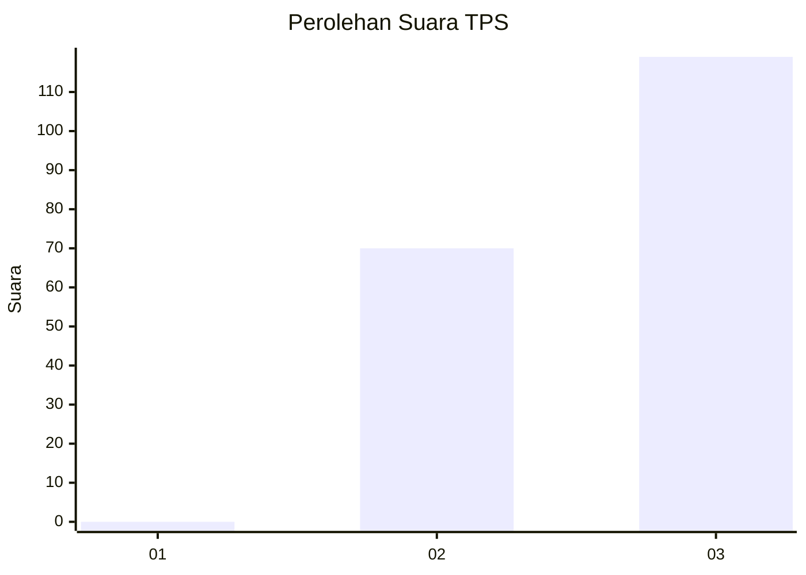
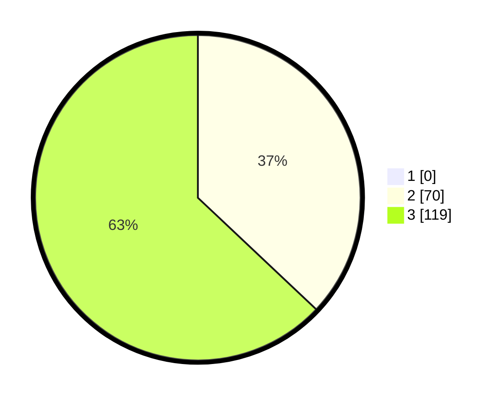

# Hasil

## Grafik

## Tabel

| No. | Nama Paslon    | Suara | Suara (raw) | Persentase |
|:--- |:-------------- | -----:| -----------:| ----------:|
| 1   | ANIES MUHAIMIN | 0     | [0][p-1]    | 0,00       |
| 2   | PRABOWO GIBRAN | 70    | [70][p-2]   | 37,04      |
| 3   | GANJAR MAHFUD  | 119   | [119][p-3]  | 62,96      |

[p-1]: https://github.com/gigit-pemilu/pemilu-2024-92-papua-barat/blob/main/pilpres/hitung-suara/sub/92-papua-barat/sub/02-manokwari/sub/03-warmare/sub/2006-meny/sub/001-tps/sub/paslon-1.txt
[p-2]: https://github.com/gigit-pemilu/pemilu-2024-92-papua-barat/blob/main/pilpres/hitung-suara/sub/92-papua-barat/sub/02-manokwari/sub/03-warmare/sub/2006-meny/sub/001-tps/sub/paslon-2.txt
[p-3]: https://github.com/gigit-pemilu/pemilu-2024-92-papua-barat/blob/main/pilpres/hitung-suara/sub/92-papua-barat/sub/02-manokwari/sub/03-warmare/sub/2006-meny/sub/001-tps/sub/paslon-3.txt

## Foto C Plano

https://sirekap-obj-formc.kpu.go.id/2469/pemilu/ppwp/92/02/03/20/06/9202032006001-20240215-152134--4dda95ac-09d5-473c-b2f7-2477059f2dc7.jpg

https://sirekap-obj-formc.kpu.go.id/2469/pemilu/ppwp/92/02/03/20/06/9202032006001-20240215-152632--fcacc0bf-bca0-4ac1-a178-faa33e4645df.jpg

## Metadata

| Key        | Value               |
| ---------- | ------------------- |
| Time Stamp | 2024-02-16 23:30:00 |

