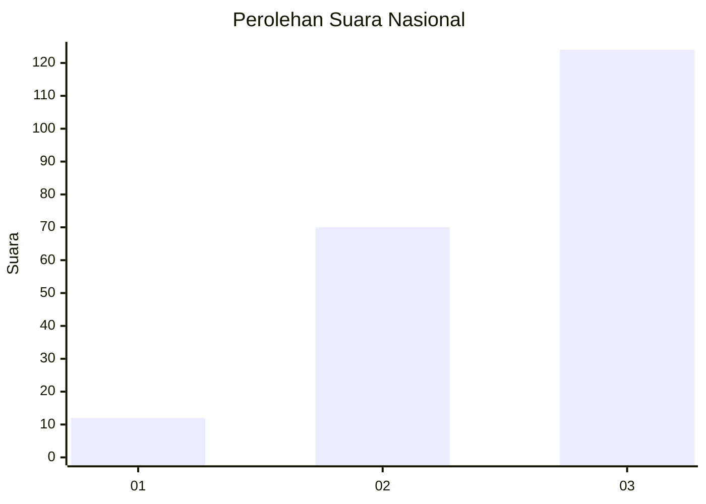
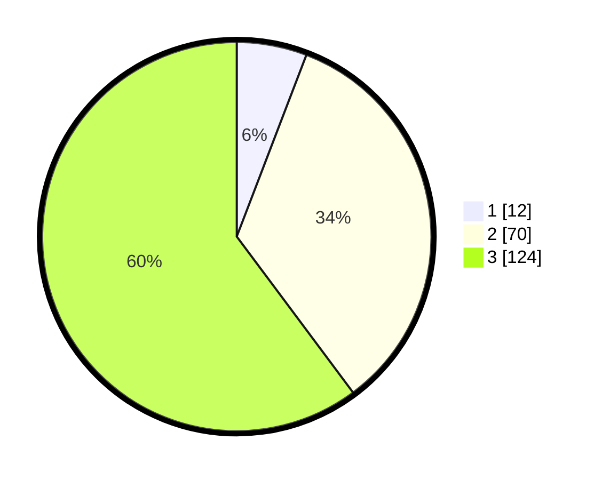

# Hasil

## Grafik

## Tabel

| No. | Nama Paslon    | Suara | Suara (raw) | Persentase |
|:--- |:-------------- | -----:| -----------:| ----------:|
| 1   | ANIES MUHAIMIN | 12    | [12][p-1]   | 5,83       |
| 2   | PRABOWO GIBRAN | 70    | [70][p-2]   | 33,98      |
| 3   | GANJAR MAHFUD  | 124   | [124][p-3]  | 60,19      |

[p-1]: https://github.com/gigit-pemilu/pemilu-2024/blob/main/pilpres/hitung-suara/sub/92-papua-barat/sub/02-manokwari/sub/03-warmare/sub/2008-umcen/sub/002-tps/sub/paslon-1.txt
[p-2]: https://github.com/gigit-pemilu/pemilu-2024/blob/main/pilpres/hitung-suara/sub/92-papua-barat/sub/02-manokwari/sub/03-warmare/sub/2008-umcen/sub/002-tps/sub/paslon-2.txt
[p-3]: https://github.com/gigit-pemilu/pemilu-2024/blob/main/pilpres/hitung-suara/sub/92-papua-barat/sub/02-manokwari/sub/03-warmare/sub/2008-umcen/sub/002-tps/sub/paslon-3.txt

## Foto C Plano

https://sirekap-obj-formc.kpu.go.id/d772/pemilu/ppwp/92/02/03/20/08/9202032008002-20240215-135109--6a8ea2dc-9067-4810-a498-4f76d365269e.jpg

https://sirekap-obj-formc.kpu.go.id/d772/pemilu/ppwp/92/02/03/20/08/9202032008002-20240216-075559--691c8cab-f872-44f7-9e68-4700aad88d5d.jpg

https://sirekap-obj-formc.kpu.go.id/d772/pemilu/ppwp/92/02/03/20/08/9202032008002-20240215-135517--8144b0ff-f70a-444a-8ed2-8849b5783b49.jpg

## Metadata

| Key        | Value               |
| ---------- | ------------------- |
| Time Stamp | 2024-02-16 08:00:28 |

