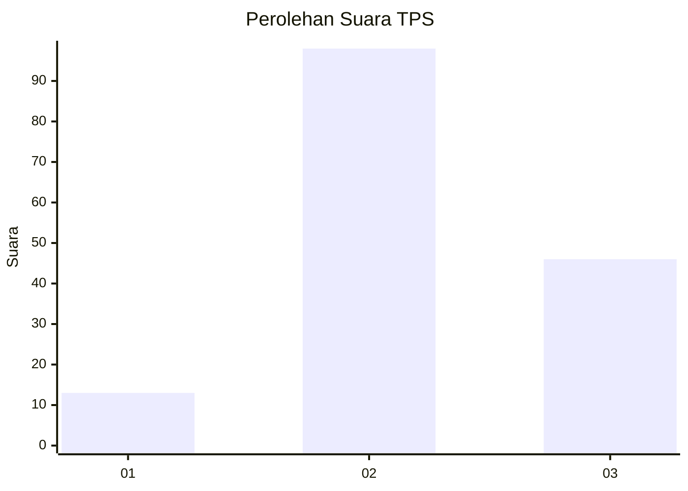
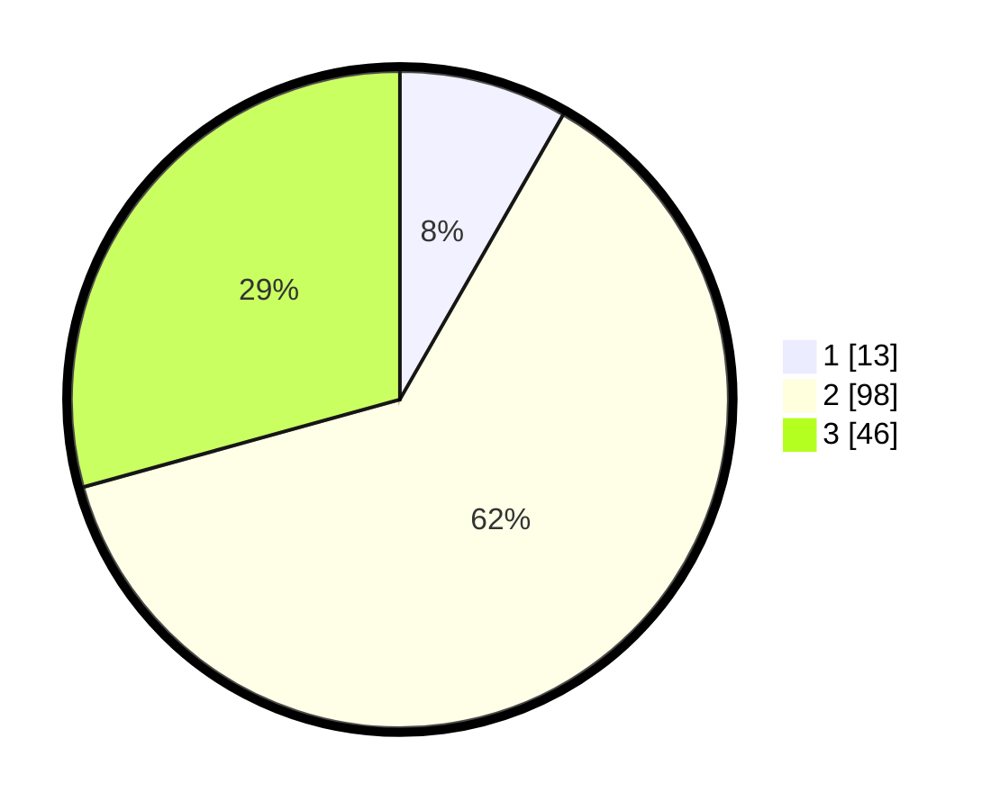

# Hasil

## Grafik

## Tabel

| No. | Nama Paslon    | Suara | Suara (raw) | Persentase |
|:--- |:-------------- | -----:| -----------:| ----------:|
| 1   | ANIES MUHAIMIN | 13    | [13][p-1]   | 8,28       |
| 2   | PRABOWO GIBRAN | 98    | [98][p-2]   | 62,42      |
| 3   | GANJAR MAHFUD  | 46    | [46][p-3]   | 29,30      |

[p-1]: https://github.com/gigit-pemilu/pemilu-2024-92-papua-barat/blob/main/pilpres/hitung-suara/sub/92-papua-barat/sub/02-manokwari/sub/03-warmare/sub/2014-sotea/sub/001-tps/sub/paslon-1.txt
[p-2]: https://github.com/gigit-pemilu/pemilu-2024-92-papua-barat/blob/main/pilpres/hitung-suara/sub/92-papua-barat/sub/02-manokwari/sub/03-warmare/sub/2014-sotea/sub/001-tps/sub/paslon-2.txt
[p-3]: https://github.com/gigit-pemilu/pemilu-2024-92-papua-barat/blob/main/pilpres/hitung-suara/sub/92-papua-barat/sub/02-manokwari/sub/03-warmare/sub/2014-sotea/sub/001-tps/sub/paslon-3.txt

## Foto C Plano

https://sirekap-obj-formc.kpu.go.id/e90a/pemilu/ppwp/92/02/03/20/14/9202032014001-20240215-093924--b526349b-1a18-4817-a971-a097fb44dcd5.jpg

https://sirekap-obj-formc.kpu.go.id/e90a/pemilu/ppwp/92/02/03/20/14/9202032014001-20240214-222437--dfbb0300-9e05-49f8-8caf-76a4f0f73f61.jpg

https://sirekap-obj-formc.kpu.go.id/e90a/pemilu/ppwp/92/02/03/20/14/9202032014001-20240214-222638--74513147-b8ca-45a8-a2e8-9af6add8f0df.jpg

## Metadata

| Key        | Value               |
| ---------- | ------------------- |
| Time Stamp | 2024-02-15 20:00:44 |

