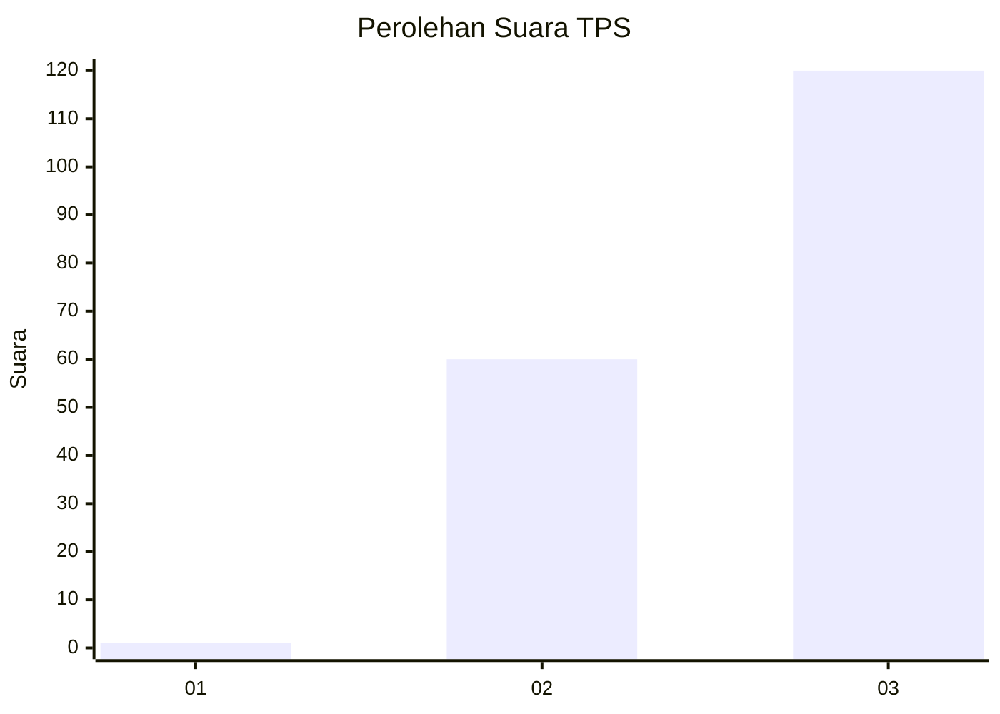
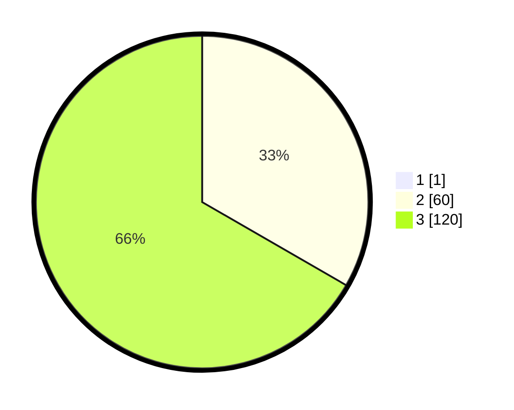

# Hasil

## Grafik

## Tabel

| No. | Nama Paslon    | Suara | Suara (raw) | Persentase |
|:--- |:-------------- | -----:| -----------:| ----------:|
| 1   | ANIES MUHAIMIN | 1     | [1][p-1]    | 0,55       |
| 2   | PRABOWO GIBRAN | 60    | [60][p-2]   | 33,15      |
| 3   | GANJAR MAHFUD  | 120   | [120][p-3]  | 66,30      |

[p-1]: https://github.com/gigit-pemilu/pemilu-2024-92-papua-barat/blob/main/pilpres/hitung-suara/sub/92-papua-barat/sub/02-manokwari/sub/03-warmare/sub/2016-ibuwau/sub/001-tps/sub/paslon-1.txt
[p-2]: https://github.com/gigit-pemilu/pemilu-2024-92-papua-barat/blob/main/pilpres/hitung-suara/sub/92-papua-barat/sub/02-manokwari/sub/03-warmare/sub/2016-ibuwau/sub/001-tps/sub/paslon-2.txt
[p-3]: https://github.com/gigit-pemilu/pemilu-2024-92-papua-barat/blob/main/pilpres/hitung-suara/sub/92-papua-barat/sub/02-manokwari/sub/03-warmare/sub/2016-ibuwau/sub/001-tps/sub/paslon-3.txt

## Foto C Plano

https://sirekap-obj-formc.kpu.go.id/82d5/pemilu/ppwp/92/02/03/20/16/9202032016001-20240215-101501--1512adcd-342a-4c7e-9ae1-6f734cc24950.jpg

https://sirekap-obj-formc.kpu.go.id/82d5/pemilu/ppwp/92/02/03/20/16/9202032016001-20240215-095311--3527c527-70a4-4140-82a9-dd53e9b88654.jpg

https://sirekap-obj-formc.kpu.go.id/82d5/pemilu/ppwp/92/02/03/20/16/9202032016001-20240319-040200--6315305a-97ba-4d29-93d9-15ce2ac125a4.jpg

## Metadata

| Key        | Value               |
| ---------- | ------------------- |
| Time Stamp | 2024-03-19 04:30:00 |

