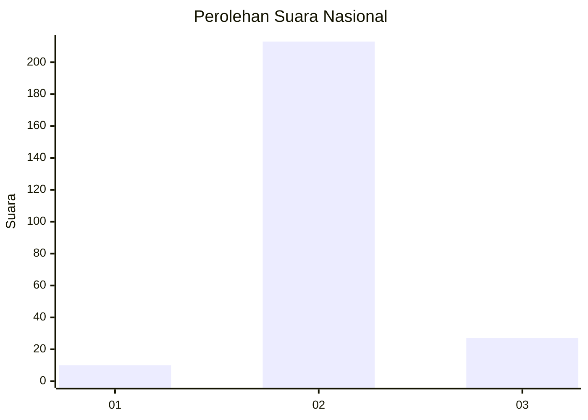
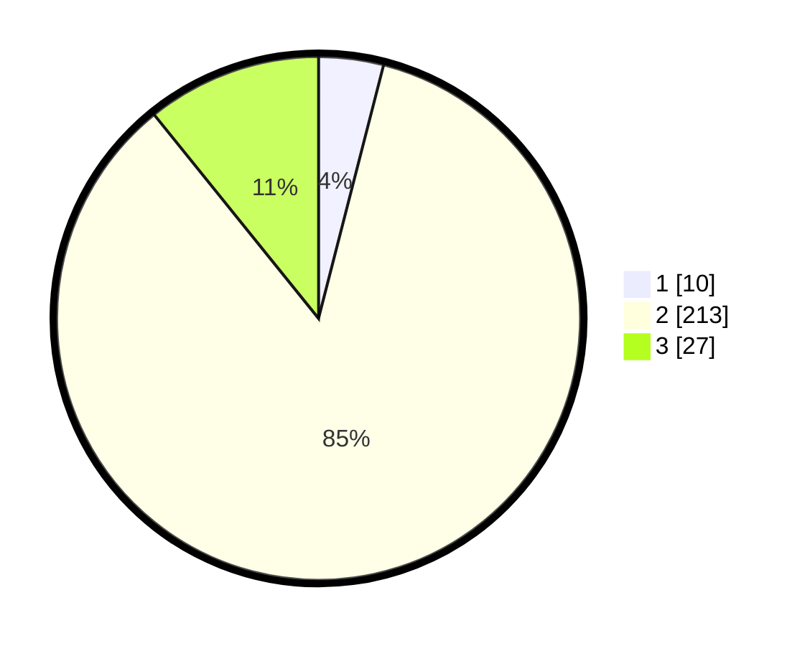

# Hasil

## Grafik

## Tabel

| No. | Nama Paslon    | Suara | Suara (raw) | Persentase |
|:--- |:-------------- | -----:| -----------:| ----------:|
| 1   | ANIES MUHAIMIN | 10    | [10][p-1]   | 4,00       |
| 2   | PRABOWO GIBRAN | 213   | [213][p-2]  | 85,20      |
| 3   | GANJAR MAHFUD  | 27    | [27][p-3]   | 10,80      |

[p-1]: https://github.com/gigit-pemilu/pemilu-2024/blob/main/pilpres/hitung-suara/sub/92-papua-barat/sub/02-manokwari/sub/04-prafi/sub/2001-prafi-mulya/sub/005-tps/sub/paslon-1.txt
[p-2]: https://github.com/gigit-pemilu/pemilu-2024/blob/main/pilpres/hitung-suara/sub/92-papua-barat/sub/02-manokwari/sub/04-prafi/sub/2001-prafi-mulya/sub/005-tps/sub/paslon-2.txt
[p-3]: https://github.com/gigit-pemilu/pemilu-2024/blob/main/pilpres/hitung-suara/sub/92-papua-barat/sub/02-manokwari/sub/04-prafi/sub/2001-prafi-mulya/sub/005-tps/sub/paslon-3.txt

## Foto C Plano

https://sirekap-obj-formc.kpu.go.id/19a8/pemilu/ppwp/92/02/04/20/01/9202042001005-20240214-202931--4bcc832c-9491-46fe-95a1-a2724e6c88a5.jpg

https://sirekap-obj-formc.kpu.go.id/19a8/pemilu/ppwp/92/02/04/20/01/9202042001005-20240214-203036--3c8209be-c61e-4b35-8f86-06b19605acf6.jpg

https://sirekap-obj-formc.kpu.go.id/19a8/pemilu/ppwp/92/02/04/20/01/9202042001005-20240214-203317--255c6208-3d0e-4c7b-8f0a-12d958fddeee.jpg

## Metadata

| Key        | Value               |
| ---------- | ------------------- |
| Time Stamp | 2024-02-15 00:41:44 |

