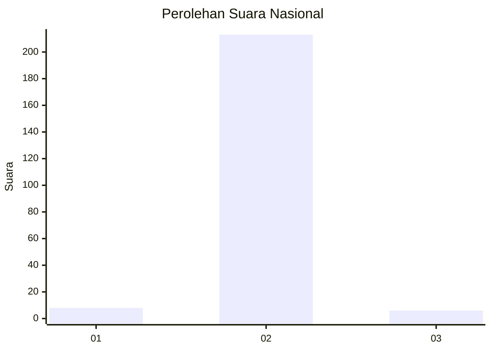
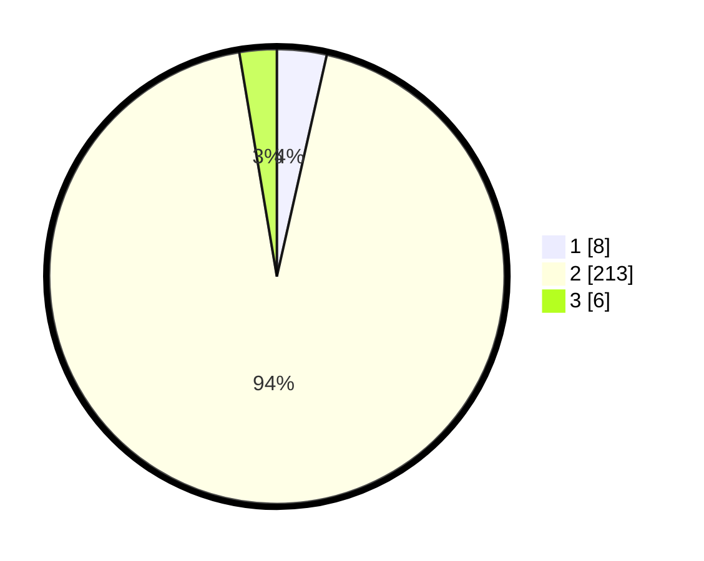

# Hasil

## Grafik

## Tabel

| No. | Nama Paslon    | Suara | Suara (raw) | Persentase |
|:--- |:-------------- | -----:| -----------:| ----------:|
| 1   | ANIES MUHAIMIN | 8     | [8][p-1]    | 3,52       |
| 2   | PRABOWO GIBRAN | 213   | [213][p-2]  | 93,83      |
| 3   | GANJAR MAHFUD  | 6     | [6][p-3]    | 2,64       |

[p-1]: https://github.com/gigit-pemilu/pemilu-2024/blob/main/pilpres/hitung-suara/sub/92-papua-barat/sub/02-manokwari/sub/04-prafi/sub/2003-desay/sub/007-tps/sub/paslon-1.txt
[p-2]: https://github.com/gigit-pemilu/pemilu-2024/blob/main/pilpres/hitung-suara/sub/92-papua-barat/sub/02-manokwari/sub/04-prafi/sub/2003-desay/sub/007-tps/sub/paslon-2.txt
[p-3]: https://github.com/gigit-pemilu/pemilu-2024/blob/main/pilpres/hitung-suara/sub/92-papua-barat/sub/02-manokwari/sub/04-prafi/sub/2003-desay/sub/007-tps/sub/paslon-3.txt

## Foto C Plano

https://sirekap-obj-formc.kpu.go.id/c5ce/pemilu/ppwp/92/02/04/20/03/9202042003007-20240315-170315--db414d4b-d491-40d9-b8ad-d14eee321615.jpg

https://sirekap-obj-formc.kpu.go.id/c5ce/pemilu/ppwp/92/02/04/20/03/9202042003007-20240214-203957--6479186a-d2a5-4ba2-9de6-68cb18fe1c3c.jpg

https://sirekap-obj-formc.kpu.go.id/c5ce/pemilu/ppwp/92/02/04/20/03/9202042003007-20240214-204024--cc51953a-81cf-4818-a575-567f33d2ff1a.jpg

## Metadata

| Key        | Value               |
| ---------- | ------------------- |
| Time Stamp | 2024-03-15 17:30:00 |

