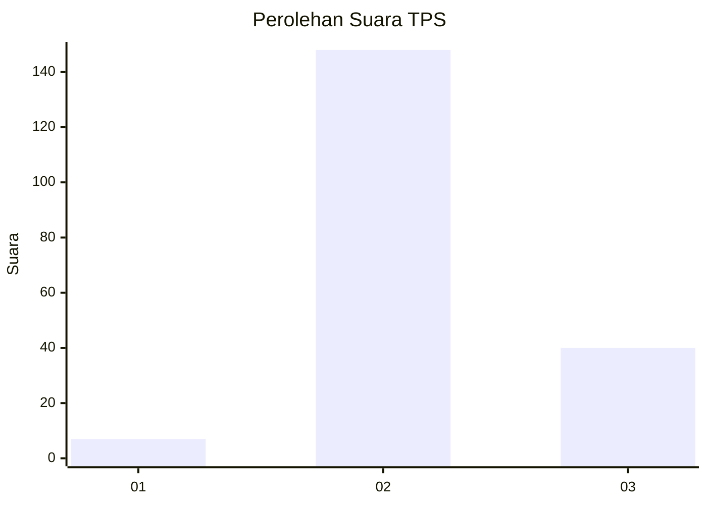

# Hasil

## Grafik

## Tabel

| No. | Nama Paslon    | Suara | Suara (raw) | Persentase |
|:--- |:-------------- | -----:| -----------:| ----------:|
| 1   | ANIES MUHAIMIN | 7     | [7][p-1]    | 3,59       |
| 2   | PRABOWO GIBRAN | 148   | [148][p-2]  | 75,90      |
| 3   | GANJAR MAHFUD  | 40    | [40][p-3]   | 20,51      |

[p-1]: https://github.com/gigit-pemilu/pemilu-2024-92-papua-barat/blob/main/pilpres/hitung-suara/sub/92-papua-barat/sub/02-manokwari/sub/05-masni/sub/2002-sumber-boga/sub/001-tps/sub/paslon-1.txt
[p-2]: https://github.com/gigit-pemilu/pemilu-2024-92-papua-barat/blob/main/pilpres/hitung-suara/sub/92-papua-barat/sub/02-manokwari/sub/05-masni/sub/2002-sumber-boga/sub/001-tps/sub/paslon-2.txt
[p-3]: https://github.com/gigit-pemilu/pemilu-2024-92-papua-barat/blob/main/pilpres/hitung-suara/sub/92-papua-barat/sub/02-manokwari/sub/05-masni/sub/2002-sumber-boga/sub/001-tps/sub/paslon-3.txt

## Foto C Plano

https://sirekap-obj-formc.kpu.go.id/c6e4/pemilu/ppwp/92/02/05/20/02/9202052002001-20240318-182711--307e42da-156e-409d-91f4-8f695410e915.jpg

https://sirekap-obj-formc.kpu.go.id/c6e4/pemilu/ppwp/92/02/05/20/02/9202052002001-20240215-071039--2b3a6003-b50c-4735-9873-be7cd5ebd70d.jpg

https://sirekap-obj-formc.kpu.go.id/c6e4/pemilu/ppwp/92/02/05/20/02/9202052002001-20240215-071154--ad7547b7-d6c1-43c7-b393-71a4a7cbf921.jpg

## Metadata

| Key        | Value               |
| ---------- | ------------------- |
| Time Stamp | 2024-03-18 18:30:00 |

