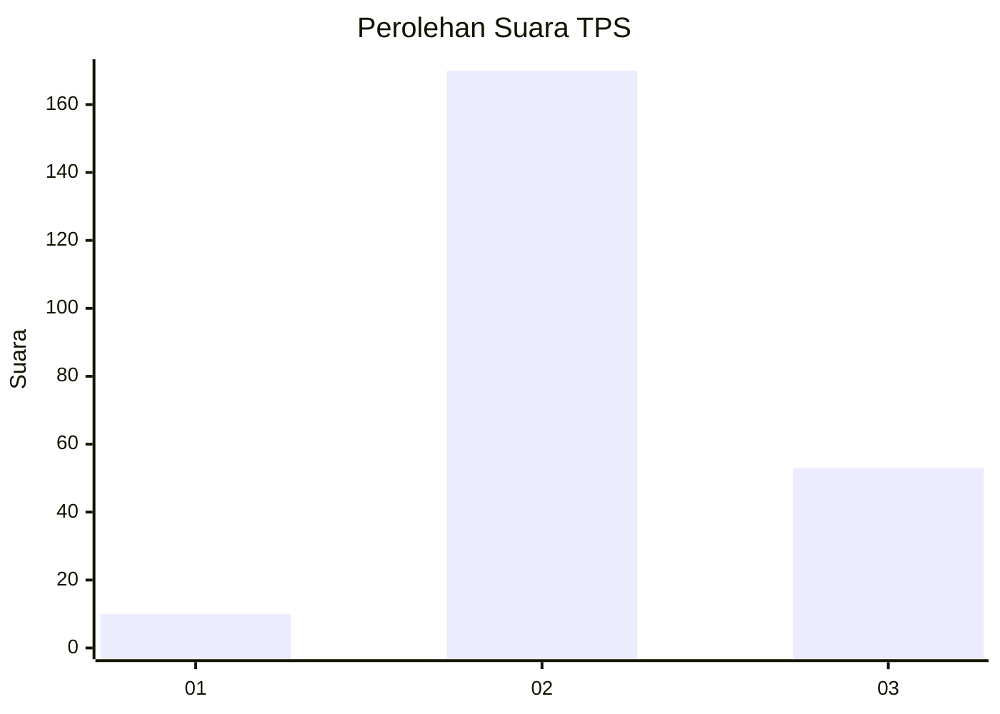
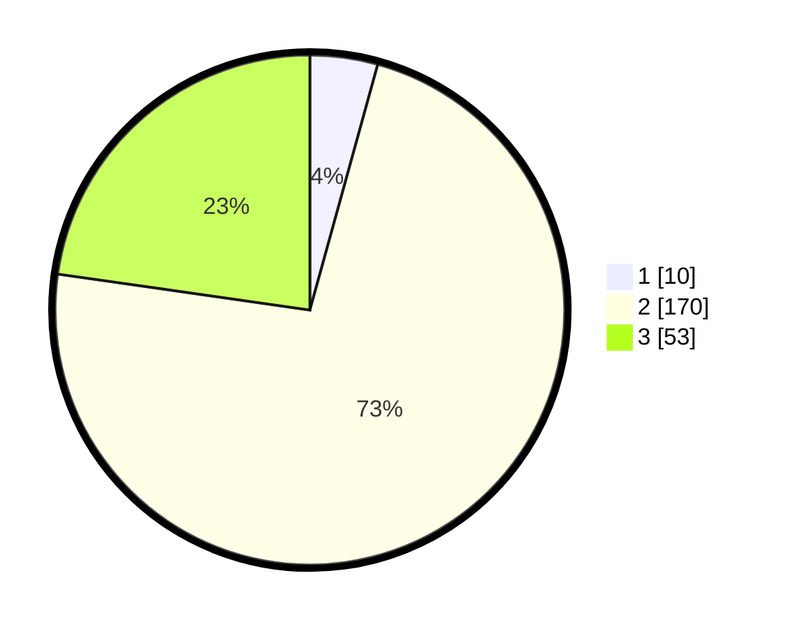

# Hasil

## Grafik

## Tabel

| No. | Nama Paslon    | Suara | Suara (raw) | Persentase |
|:--- |:-------------- | -----:| -----------:| ----------:|
| 1   | ANIES MUHAIMIN | 10    | [10][p-1]   | 4,29       |
| 2   | PRABOWO GIBRAN | 170   | [170][p-2]  | 72,96      |
| 3   | GANJAR MAHFUD  | 53    | [53][p-3]   | 22,75      |

[p-1]: https://github.com/gigit-pemilu/pemilu-2024-92-papua-barat/blob/main/pilpres/hitung-suara/sub/92-papua-barat/sub/02-manokwari/sub/05-masni/sub/2004-muara-prafi/sub/001-tps/sub/paslon-1.txt
[p-2]: https://github.com/gigit-pemilu/pemilu-2024-92-papua-barat/blob/main/pilpres/hitung-suara/sub/92-papua-barat/sub/02-manokwari/sub/05-masni/sub/2004-muara-prafi/sub/001-tps/sub/paslon-2.txt
[p-3]: https://github.com/gigit-pemilu/pemilu-2024-92-papua-barat/blob/main/pilpres/hitung-suara/sub/92-papua-barat/sub/02-manokwari/sub/05-masni/sub/2004-muara-prafi/sub/001-tps/sub/paslon-3.txt

## Foto C Plano

https://sirekap-obj-formc.kpu.go.id/5f26/pemilu/ppwp/92/02/05/20/04/9202052004001-20240318-142427--d20cef03-1869-4807-97e4-d447a2a9abbb.jpg

https://sirekap-obj-formc.kpu.go.id/5f26/pemilu/ppwp/92/02/05/20/04/9202052004001-20240217-145605--1ad2728b-c28e-4101-b2f8-36d0b573f69e.jpg

https://sirekap-obj-formc.kpu.go.id/5f26/pemilu/ppwp/92/02/05/20/04/9202052004001-20240217-145806--7c70c6c1-b758-41d6-90b6-e875df64e897.jpg

## Metadata

| Key        | Value               |
| ---------- | ------------------- |
| Time Stamp | 2024-03-18 14:30:00 |

