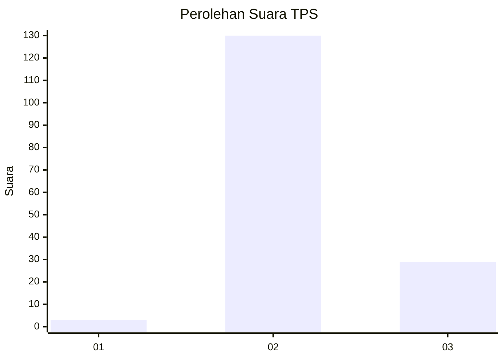
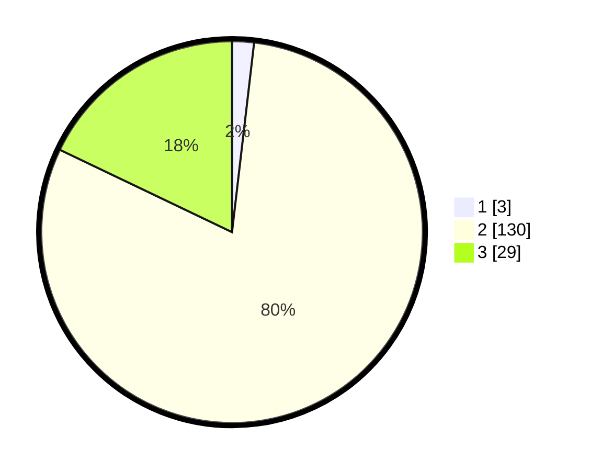

# Hasil

## Grafik

## Tabel

| No. | Nama Paslon    | Suara | Suara (raw) | Persentase |
|:--- |:-------------- | -----:| -----------:| ----------:|
| 1   | ANIES MUHAIMIN | 3     | [3][p-1]    | 1,85       |
| 2   | PRABOWO GIBRAN | 130   | [130][p-2]  | 80,25      |
| 3   | GANJAR MAHFUD  | 29    | [29][p-3]   | 17,90      |

[p-1]: https://github.com/gigit-pemilu/pemilu-2024-92-papua-barat/blob/main/pilpres/hitung-suara/sub/92-papua-barat/sub/02-manokwari/sub/05-masni/sub/2004-muara-prafi/sub/002-tps/sub/paslon-1.txt
[p-2]: https://github.com/gigit-pemilu/pemilu-2024-92-papua-barat/blob/main/pilpres/hitung-suara/sub/92-papua-barat/sub/02-manokwari/sub/05-masni/sub/2004-muara-prafi/sub/002-tps/sub/paslon-2.txt
[p-3]: https://github.com/gigit-pemilu/pemilu-2024-92-papua-barat/blob/main/pilpres/hitung-suara/sub/92-papua-barat/sub/02-manokwari/sub/05-masni/sub/2004-muara-prafi/sub/002-tps/sub/paslon-3.txt

## Foto C Plano

https://sirekap-obj-formc.kpu.go.id/2727/pemilu/ppwp/92/02/05/20/04/9202052004002-20240215-093213--22bd006e-4738-4d89-b916-af97bc42d923.jpg

https://sirekap-obj-formc.kpu.go.id/2727/pemilu/ppwp/92/02/05/20/04/9202052004002-20240215-093811--d754413c-33d3-4b19-b8af-40317c437890.jpg

https://sirekap-obj-formc.kpu.go.id/2727/pemilu/ppwp/92/02/05/20/04/9202052004002-20240318-142549--49b80f2d-adfa-4486-b962-cde06254f2c5.jpg

## Metadata

| Key        | Value               |
| ---------- | ------------------- |
| Time Stamp | 2024-03-18 14:30:00 |

