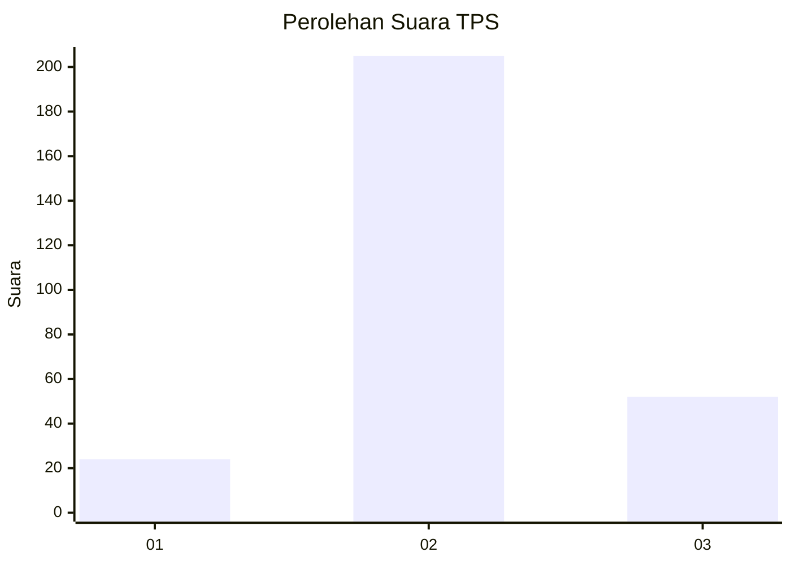
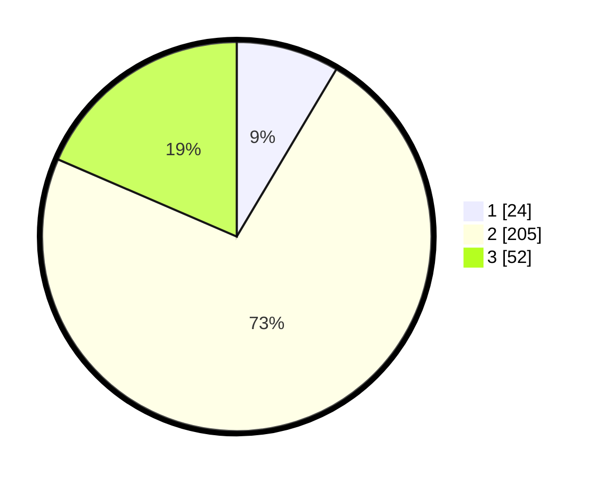

# Hasil

## Grafik

## Tabel

| No. | Nama Paslon    | Suara | Suara (raw) | Persentase |
|:--- |:-------------- | -----:| -----------:| ----------:|
| 1   | ANIES MUHAIMIN | 24    | [24][p-1]   | 8,54       |
| 2   | PRABOWO GIBRAN | 205   | [205][p-2]  | 72,95      |
| 3   | GANJAR MAHFUD  | 52    | [52][p-3]   | 18,51      |

[p-1]: https://github.com/gigit-pemilu/pemilu-2024-92-papua-barat/blob/main/pilpres/hitung-suara/sub/92-papua-barat/sub/02-manokwari/sub/05-masni/sub/2009-bowi-subur/sub/003-tps/sub/paslon-1.txt
[p-2]: https://github.com/gigit-pemilu/pemilu-2024-92-papua-barat/blob/main/pilpres/hitung-suara/sub/92-papua-barat/sub/02-manokwari/sub/05-masni/sub/2009-bowi-subur/sub/003-tps/sub/paslon-2.txt
[p-3]: https://github.com/gigit-pemilu/pemilu-2024-92-papua-barat/blob/main/pilpres/hitung-suara/sub/92-papua-barat/sub/02-manokwari/sub/05-masni/sub/2009-bowi-subur/sub/003-tps/sub/paslon-3.txt

## Foto C Plano

https://sirekap-obj-formc.kpu.go.id/f74d/pemilu/ppwp/92/02/05/20/09/9202052009003-20240215-065222--8ac8ead3-8ccb-4ed8-b59b-0c01f47efa0f.jpg

https://sirekap-obj-formc.kpu.go.id/f74d/pemilu/ppwp/92/02/05/20/09/9202052009003-20240215-065314--8318da3d-40de-4d31-b156-7ffcfe121452.jpg

https://sirekap-obj-formc.kpu.go.id/f74d/pemilu/ppwp/92/02/05/20/09/9202052009003-20240215-065411--0e26893b-8534-43f8-b341-74d00519f345.jpg

## Metadata

| Key        | Value               |
| ---------- | ------------------- |
| Time Stamp | 2024-02-15 19:30:26 |

