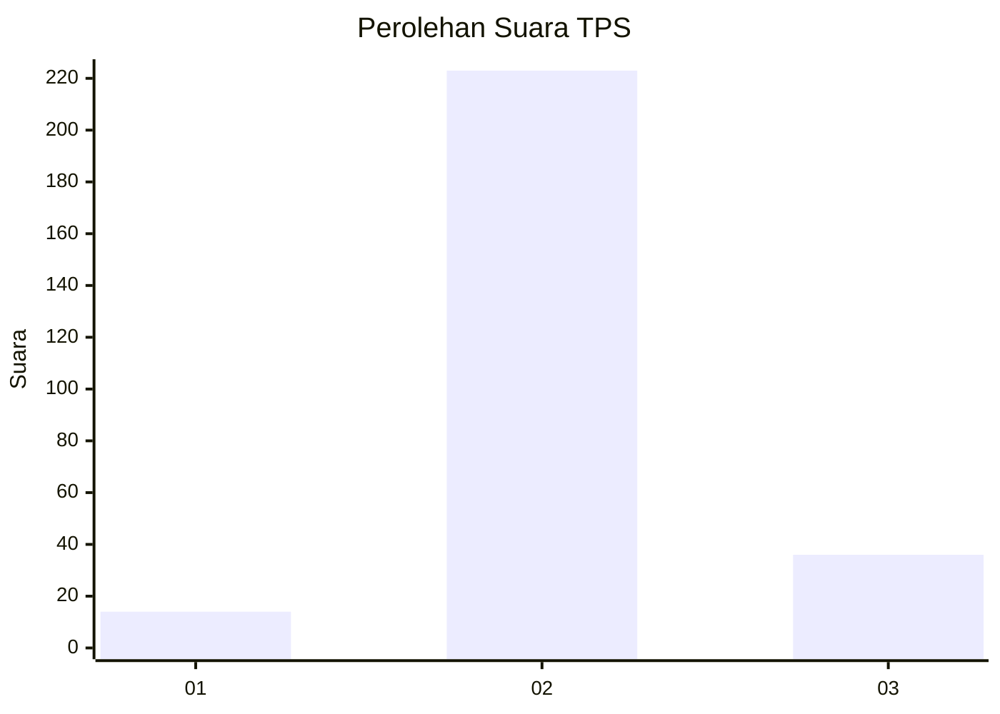
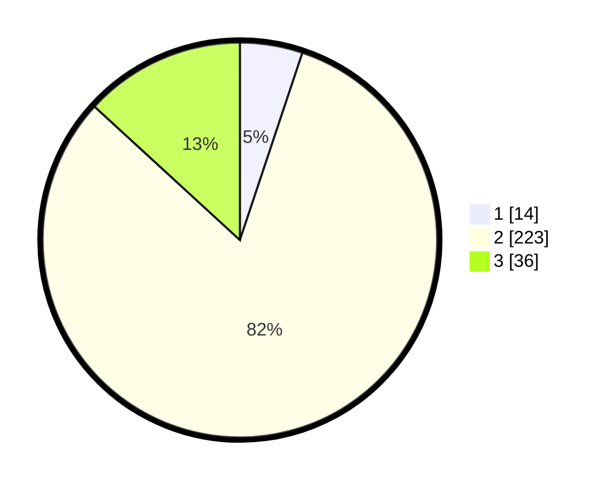

# Hasil

## Grafik

## Tabel

| No. | Nama Paslon    | Suara | Suara (raw) | Persentase |
|:--- |:-------------- | -----:| -----------:| ----------:|
| 1   | ANIES MUHAIMIN | 14    | [14][p-1]   | 5,13       |
| 2   | PRABOWO GIBRAN | 223   | [223][p-2]  | 81,68      |
| 3   | GANJAR MAHFUD  | 36    | [36][p-3]   | 13,19      |

[p-1]: https://github.com/gigit-pemilu/pemilu-2024-92-papua-barat/blob/main/pilpres/hitung-suara/sub/92-papua-barat/sub/02-manokwari/sub/05-masni/sub/2010-makwan/sub/002-tps/sub/paslon-1.txt
[p-2]: https://github.com/gigit-pemilu/pemilu-2024-92-papua-barat/blob/main/pilpres/hitung-suara/sub/92-papua-barat/sub/02-manokwari/sub/05-masni/sub/2010-makwan/sub/002-tps/sub/paslon-2.txt
[p-3]: https://github.com/gigit-pemilu/pemilu-2024-92-papua-barat/blob/main/pilpres/hitung-suara/sub/92-papua-barat/sub/02-manokwari/sub/05-masni/sub/2010-makwan/sub/002-tps/sub/paslon-3.txt

## Foto C Plano

https://sirekap-obj-formc.kpu.go.id/0e90/pemilu/ppwp/92/02/05/20/10/9202052010002-20240215-092913--c23bb49b-348e-44e7-8ae7-6171bb292a0d.jpg

https://sirekap-obj-formc.kpu.go.id/0e90/pemilu/ppwp/92/02/05/20/10/9202052010002-20240215-093421--4f0df461-898f-4010-b2ca-4363b82bfe5c.jpg

https://sirekap-obj-formc.kpu.go.id/0e90/pemilu/ppwp/92/02/05/20/10/9202052010002-20240215-095555--bb7188a1-c65a-4526-98f9-c38d30774723.jpg

## Metadata

| Key        | Value               |
| ---------- | ------------------- |
| Time Stamp | 2024-02-15 16:30:25 |

