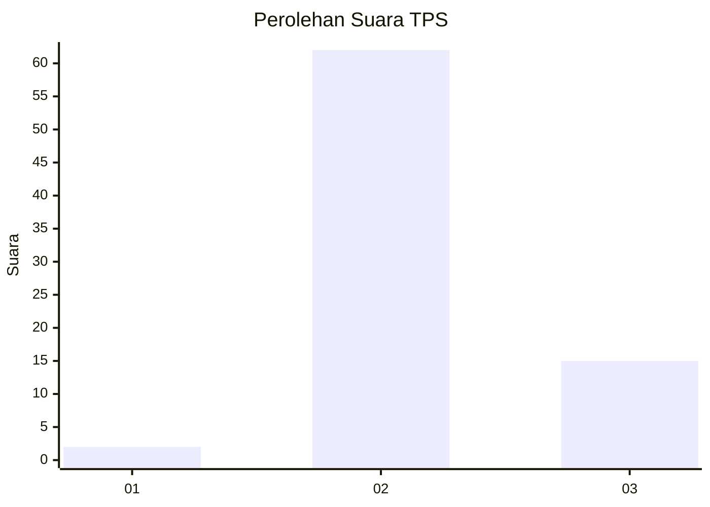
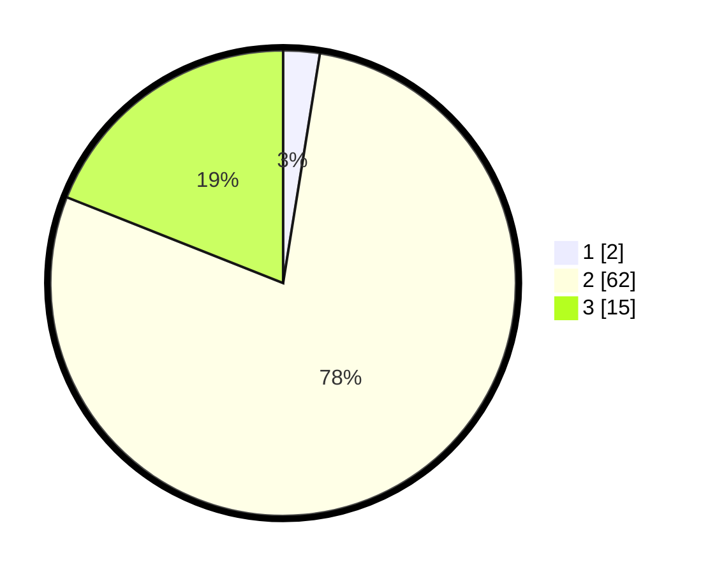

# Hasil

## Grafik

## Tabel

| No. | Nama Paslon    | Suara | Suara (raw) | Persentase |
|:--- |:-------------- | -----:| -----------:| ----------:|
| 1   | ANIES MUHAIMIN | 2     | [2][p-1]    | 2,53       |
| 2   | PRABOWO GIBRAN | 62    | [62][p-2]   | 78,48      |
| 3   | GANJAR MAHFUD  | 15    | [15][p-3]   | 18,99      |

[p-1]: https://github.com/gigit-pemilu/pemilu-2024-92-papua-barat/blob/main/pilpres/hitung-suara/sub/92-papua-barat/sub/02-manokwari/sub/05-masni/sub/2014-yensum/sub/001-tps/sub/paslon-1.txt
[p-2]: https://github.com/gigit-pemilu/pemilu-2024-92-papua-barat/blob/main/pilpres/hitung-suara/sub/92-papua-barat/sub/02-manokwari/sub/05-masni/sub/2014-yensum/sub/001-tps/sub/paslon-2.txt
[p-3]: https://github.com/gigit-pemilu/pemilu-2024-92-papua-barat/blob/main/pilpres/hitung-suara/sub/92-papua-barat/sub/02-manokwari/sub/05-masni/sub/2014-yensum/sub/001-tps/sub/paslon-3.txt

## Foto C Plano

https://sirekap-obj-formc.kpu.go.id/cb40/pemilu/ppwp/92/02/05/20/14/9202052014001-20240318-190534--ef3171ba-cf26-46cb-b282-4d9942a28438.jpg

https://sirekap-obj-formc.kpu.go.id/cb40/pemilu/ppwp/92/02/05/20/14/9202052014001-20240217-133738--c7fedcef-467b-4644-b64e-9899b3ac965c.jpg

https://sirekap-obj-formc.kpu.go.id/cb40/pemilu/ppwp/92/02/05/20/14/9202052014001-20240217-133847--6180bb8d-b7ab-4438-bc82-9127d93d608b.jpg

## Metadata

| Key        | Value               |
| ---------- | ------------------- |
| Time Stamp | 2024-03-18 19:30:00 |

