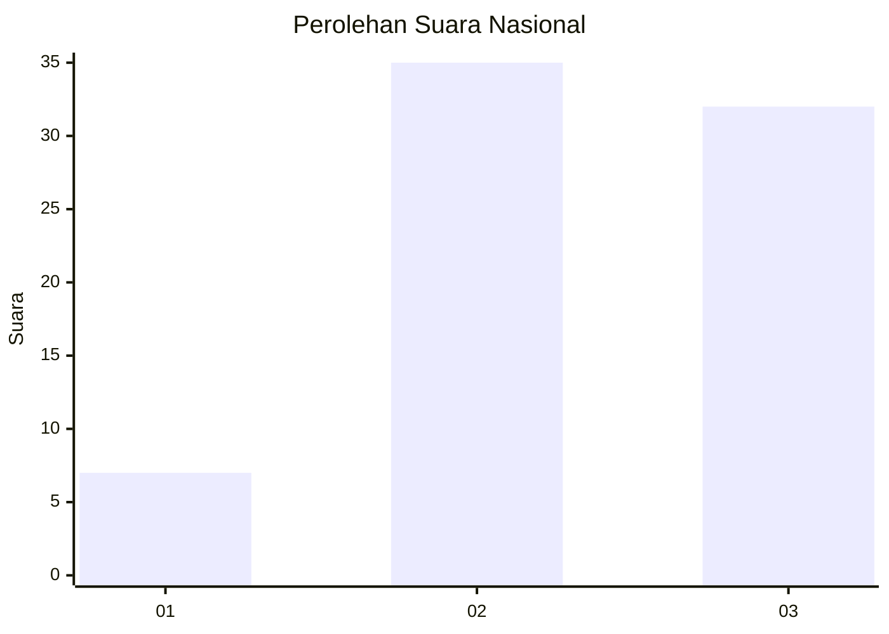
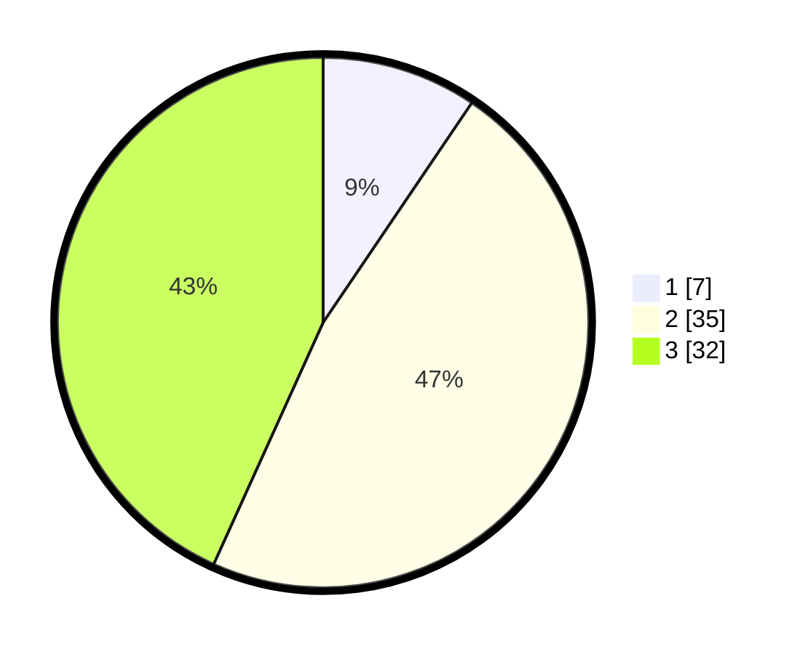

# Hasil

## Grafik

## Tabel

| No. | Nama Paslon    | Suara | Suara (raw) | Persentase |
|:--- |:-------------- | -----:| -----------:| ----------:|
| 1   | ANIES MUHAIMIN | 7     | [7][p-1]    | 9,46       |
| 2   | PRABOWO GIBRAN | 35    | [35][p-2]   | 47,30      |
| 3   | GANJAR MAHFUD  | 32    | [32][p-3]   | 43,24      |

[p-1]: https://github.com/gigit-pemilu/pemilu-2024/blob/main/pilpres/hitung-suara/sub/92-papua-barat/sub/02-manokwari/sub/05-masni/sub/2028-meyof-ii/sub/001-tps/sub/paslon-1.txt
[p-2]: https://github.com/gigit-pemilu/pemilu-2024/blob/main/pilpres/hitung-suara/sub/92-papua-barat/sub/02-manokwari/sub/05-masni/sub/2028-meyof-ii/sub/001-tps/sub/paslon-2.txt
[p-3]: https://github.com/gigit-pemilu/pemilu-2024/blob/main/pilpres/hitung-suara/sub/92-papua-barat/sub/02-manokwari/sub/05-masni/sub/2028-meyof-ii/sub/001-tps/sub/paslon-3.txt

## Foto C Plano

https://sirekap-obj-formc.kpu.go.id/1e10/pemilu/ppwp/92/02/05/20/28/9202052028001-20240215-113753--fca86c68-95c2-40c6-acf1-10f7f983c000.jpg

https://sirekap-obj-formc.kpu.go.id/1e10/pemilu/ppwp/92/02/05/20/28/9202052028001-20240215-113918--74c76167-98ef-4656-a5b5-7100010455a0.jpg

https://sirekap-obj-formc.kpu.go.id/1e10/pemilu/ppwp/92/02/05/20/28/9202052028001-20240215-114039--2ddd1d44-c93b-40b9-a6da-262fbcde2e25.jpg

## Metadata

| Key        | Value               |
| ---------- | ------------------- |
| Time Stamp | 2024-02-15 20:00:44 |

