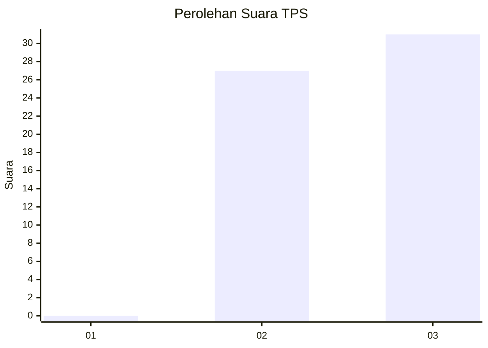
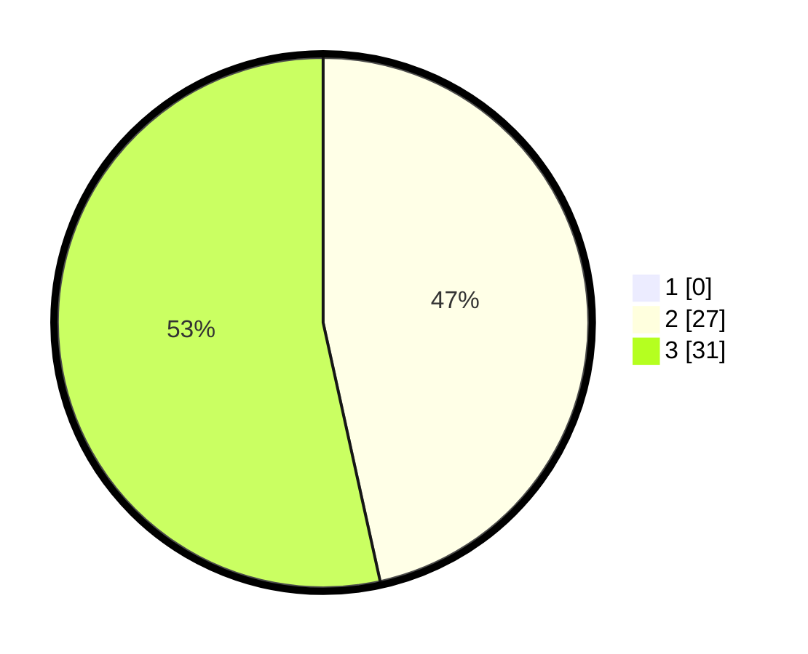

# Hasil

## Grafik

## Tabel

| No. | Nama Paslon    | Suara | Suara (raw) | Persentase |
|:--- |:-------------- | -----:| -----------:| ----------:|
| 1   | ANIES MUHAIMIN | 0     | [0][p-1]    | 0,00       |
| 2   | PRABOWO GIBRAN | 27    | [27][p-2]   | 46,55      |
| 3   | GANJAR MAHFUD  | 31    | [31][p-3]   | 53,45      |

[p-1]: https://github.com/gigit-pemilu/pemilu-2024-92-papua-barat/blob/main/pilpres/hitung-suara/sub/92-papua-barat/sub/02-manokwari/sub/05-masni/sub/2037-undi/sub/001-tps/sub/paslon-1.txt
[p-2]: https://github.com/gigit-pemilu/pemilu-2024-92-papua-barat/blob/main/pilpres/hitung-suara/sub/92-papua-barat/sub/02-manokwari/sub/05-masni/sub/2037-undi/sub/001-tps/sub/paslon-2.txt
[p-3]: https://github.com/gigit-pemilu/pemilu-2024-92-papua-barat/blob/main/pilpres/hitung-suara/sub/92-papua-barat/sub/02-manokwari/sub/05-masni/sub/2037-undi/sub/001-tps/sub/paslon-3.txt

## Foto C Plano

https://sirekap-obj-formc.kpu.go.id/a4c6/pemilu/ppwp/92/02/05/20/37/9202052037001-20240215-083952--c88a1b5a-03fc-4f3b-9338-5f2fa51ae370.jpg

https://sirekap-obj-formc.kpu.go.id/a4c6/pemilu/ppwp/92/02/05/20/37/9202052037001-20240215-082759--d67b873e-5d88-475a-a561-9043687c9b53.jpg

https://sirekap-obj-formc.kpu.go.id/a4c6/pemilu/ppwp/92/02/05/20/37/9202052037001-20240215-082448--22e8ed44-ccad-411a-8650-08138e399327.jpg

## Metadata

| Key        | Value               |
| ---------- | ------------------- |
| Time Stamp | 2024-02-15 17:00:25 |

