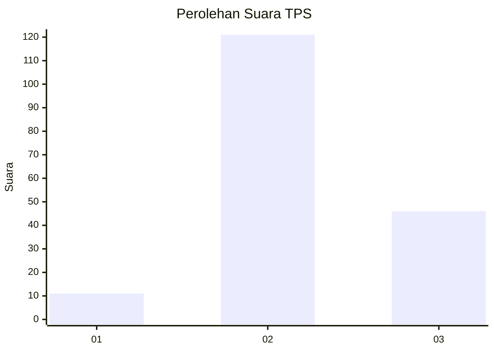

# Hasil

## Grafik

## Tabel

| No. | Nama Paslon    | Suara | Suara (raw) | Persentase |
|:--- |:-------------- | -----:| -----------:| ----------:|
| 1   | ANIES MUHAIMIN | 11    | [11][p-1]   | 6,18       |
| 2   | PRABOWO GIBRAN | 121   | [121][p-2]  | 67,98      |
| 3   | GANJAR MAHFUD  | 46    | [46][p-3]   | 25,84      |

[p-1]: https://github.com/gigit-pemilu/pemilu-2024-92-papua-barat/blob/main/pilpres/hitung-suara/sub/92-papua-barat/sub/02-manokwari/sub/12-manokwari-barat/sub/1001-manokwari-barat/sub/004-tps/sub/paslon-1.txt
[p-2]: https://github.com/gigit-pemilu/pemilu-2024-92-papua-barat/blob/main/pilpres/hitung-suara/sub/92-papua-barat/sub/02-manokwari/sub/12-manokwari-barat/sub/1001-manokwari-barat/sub/004-tps/sub/paslon-2.txt
[p-3]: https://github.com/gigit-pemilu/pemilu-2024-92-papua-barat/blob/main/pilpres/hitung-suara/sub/92-papua-barat/sub/02-manokwari/sub/12-manokwari-barat/sub/1001-manokwari-barat/sub/004-tps/sub/paslon-3.txt

## Foto C Plano

https://sirekap-obj-formc.kpu.go.id/2556/pemilu/ppwp/92/02/12/10/01/9202121001004-20240215-122027--a8bc26da-17a9-4009-9de3-8d10f6c8696e.jpg

https://sirekap-obj-formc.kpu.go.id/2556/pemilu/ppwp/92/02/12/10/01/9202121001004-20240215-123702--83ed9946-5210-4d90-8eee-c66d7f483c22.jpg

https://sirekap-obj-formc.kpu.go.id/2556/pemilu/ppwp/92/02/12/10/01/9202121001004-20240215-124106--47f4d098-bdbf-44f2-8f93-ca98d42c4715.jpg

## Metadata

| Key        | Value               |
| ---------- | ------------------- |
| Time Stamp | 2024-02-16 16:25:10 |

