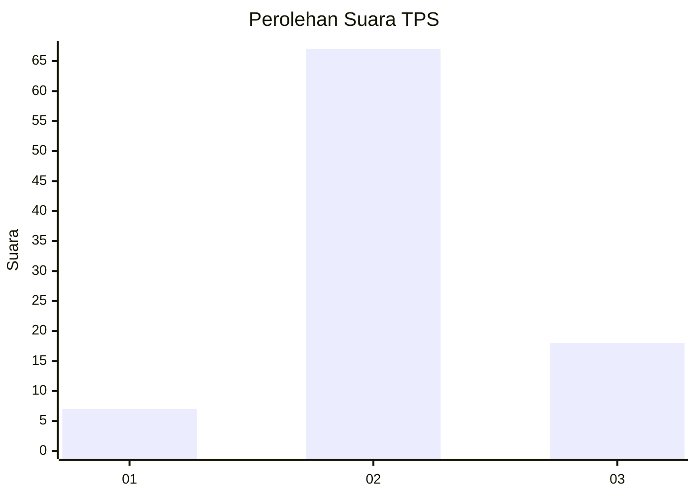
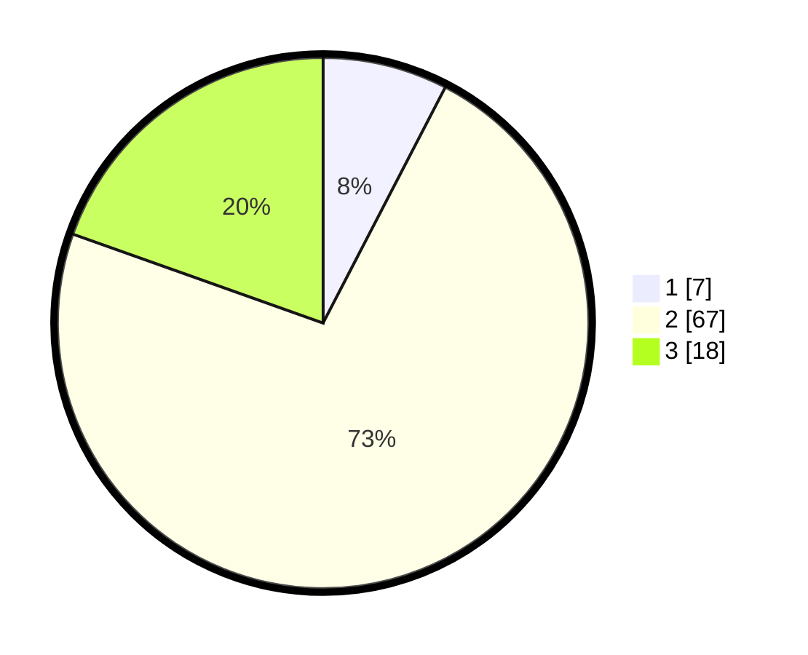

# Hasil

## Grafik

## Tabel

| No. | Nama Paslon    | Suara | Suara (raw) | Persentase |
|:--- |:-------------- | -----:| -----------:| ----------:|
| 1   | ANIES MUHAIMIN | 7     | [7][p-1]    | 7,61       |
| 2   | PRABOWO GIBRAN | 67    | [67][p-2]   | 72,83      |
| 3   | GANJAR MAHFUD  | 18    | [18][p-3]   | 19,57      |

[p-1]: https://github.com/gigit-pemilu/pemilu-2024-92-papua-barat/blob/main/pilpres/hitung-suara/sub/92-papua-barat/sub/02-manokwari/sub/12-manokwari-barat/sub/1001-manokwari-barat/sub/008-tps/sub/paslon-1.txt
[p-2]: https://github.com/gigit-pemilu/pemilu-2024-92-papua-barat/blob/main/pilpres/hitung-suara/sub/92-papua-barat/sub/02-manokwari/sub/12-manokwari-barat/sub/1001-manokwari-barat/sub/008-tps/sub/paslon-2.txt
[p-3]: https://github.com/gigit-pemilu/pemilu-2024-92-papua-barat/blob/main/pilpres/hitung-suara/sub/92-papua-barat/sub/02-manokwari/sub/12-manokwari-barat/sub/1001-manokwari-barat/sub/008-tps/sub/paslon-3.txt

## Foto C Plano

https://sirekap-obj-formc.kpu.go.id/1b7c/pemilu/ppwp/92/02/12/10/01/9202121001008-20240215-081802--e5cf0053-705f-43e8-8c90-ce63b0c49a87.jpg

https://sirekap-obj-formc.kpu.go.id/1b7c/pemilu/ppwp/92/02/12/10/01/9202121001008-20240215-081848--cc3e3766-a563-42b3-b810-61befa3e4fd9.jpg

https://sirekap-obj-formc.kpu.go.id/1b7c/pemilu/ppwp/92/02/12/10/01/9202121001008-20240215-082502--64702a56-ae83-4ac5-9d5b-3a5685d13864.jpg

## Metadata

| Key        | Value               |
| ---------- | ------------------- |
| Time Stamp | 2024-02-16 16:25:10 |

