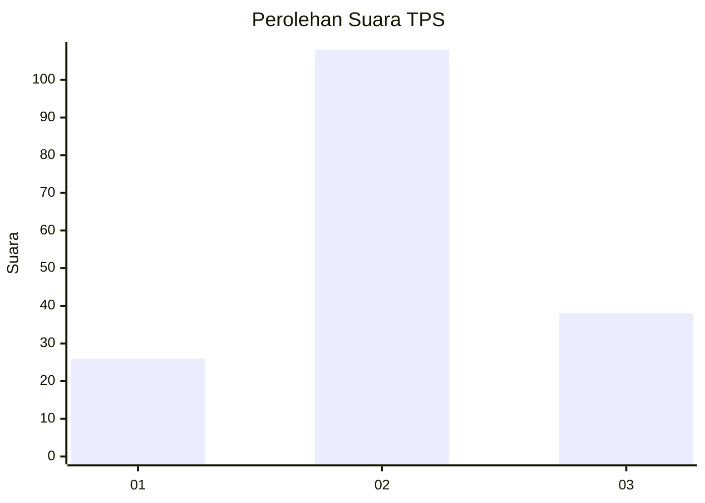
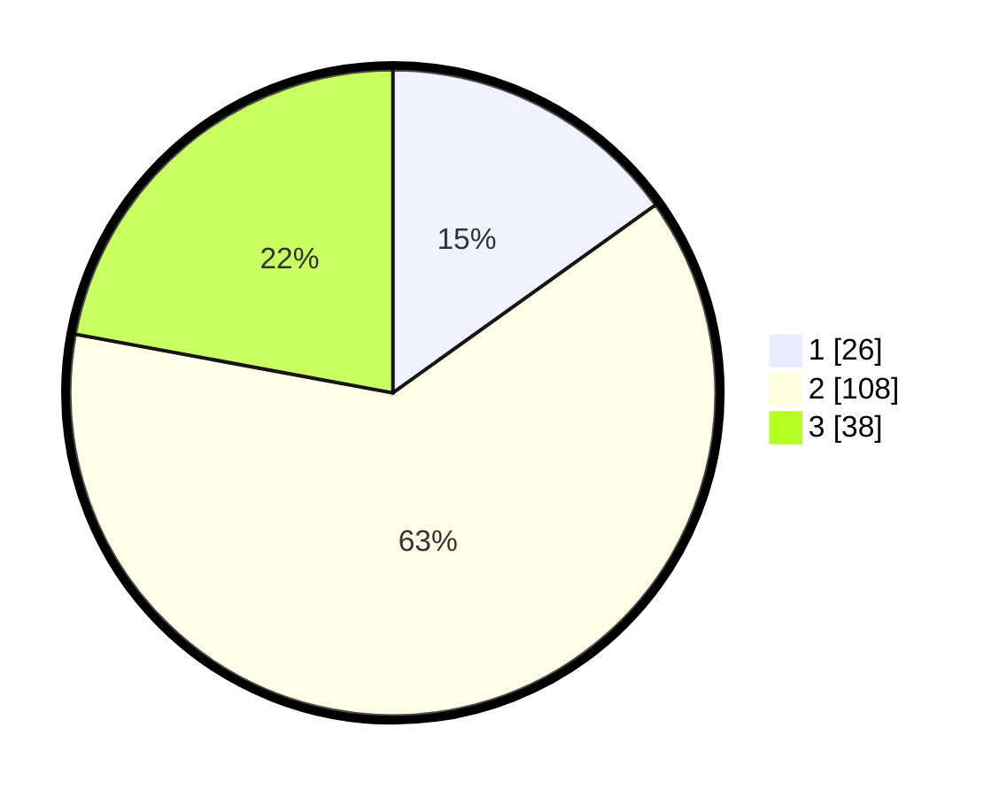

# Hasil

## Grafik

## Tabel

| No. | Nama Paslon    | Suara | Suara (raw) | Persentase |
|:--- |:-------------- | -----:| -----------:| ----------:|
| 1   | ANIES MUHAIMIN | 26    | [26][p-1]   | 15,12      |
| 2   | PRABOWO GIBRAN | 108   | [108][p-2]  | 62,79      |
| 3   | GANJAR MAHFUD  | 38    | [38][p-3]   | 22,09      |

[p-1]: https://github.com/gigit-pemilu/pemilu-2024-92-papua-barat/blob/main/pilpres/hitung-suara/sub/92-papua-barat/sub/02-manokwari/sub/12-manokwari-barat/sub/1001-manokwari-barat/sub/009-tps/sub/paslon-1.txt
[p-2]: https://github.com/gigit-pemilu/pemilu-2024-92-papua-barat/blob/main/pilpres/hitung-suara/sub/92-papua-barat/sub/02-manokwari/sub/12-manokwari-barat/sub/1001-manokwari-barat/sub/009-tps/sub/paslon-2.txt
[p-3]: https://github.com/gigit-pemilu/pemilu-2024-92-papua-barat/blob/main/pilpres/hitung-suara/sub/92-papua-barat/sub/02-manokwari/sub/12-manokwari-barat/sub/1001-manokwari-barat/sub/009-tps/sub/paslon-3.txt

## Foto C Plano

https://sirekap-obj-formc.kpu.go.id/e39a/pemilu/ppwp/92/02/12/10/01/9202121001009-20240215-164308--b0d90d4e-8ae3-450b-aebc-f005eba331e2.jpg

https://sirekap-obj-formc.kpu.go.id/e39a/pemilu/ppwp/92/02/12/10/01/9202121001009-20240215-163617--930fd9d3-fade-4390-9efb-dc0222e09a0b.jpg

https://sirekap-obj-formc.kpu.go.id/e39a/pemilu/ppwp/92/02/12/10/01/9202121001009-20240215-163830--4d38bce1-478e-422d-be40-55fe2af1d65b.jpg

## Metadata

| Key        | Value               |
| ---------- | ------------------- |
| Time Stamp | 2024-02-16 21:01:00 |

