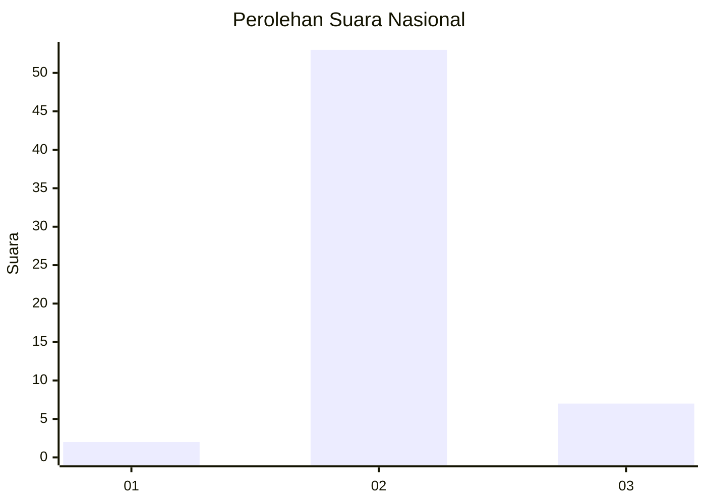
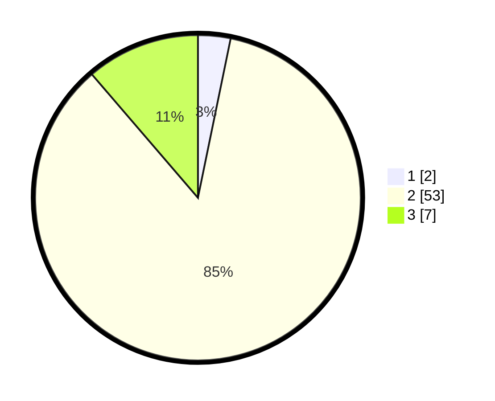

# Hasil

## Grafik

## Tabel

| No. | Nama Paslon    | Suara | Suara (raw) | Persentase |
|:--- |:-------------- | -----:| -----------:| ----------:|
| 1   | ANIES MUHAIMIN | 2     | [2][p-1]    | 3,23       |
| 2   | PRABOWO GIBRAN | 53    | [53][p-2]   | 85,48      |
| 3   | GANJAR MAHFUD  | 7     | [7][p-3]    | 11,29      |

[p-1]: https://github.com/gigit-pemilu/pemilu-2024/blob/main/pilpres/hitung-suara/sub/92-papua-barat/sub/02-manokwari/sub/12-manokwari-barat/sub/1001-manokwari-barat/sub/015-tps/sub/paslon-1.txt
[p-2]: https://github.com/gigit-pemilu/pemilu-2024/blob/main/pilpres/hitung-suara/sub/92-papua-barat/sub/02-manokwari/sub/12-manokwari-barat/sub/1001-manokwari-barat/sub/015-tps/sub/paslon-2.txt
[p-3]: https://github.com/gigit-pemilu/pemilu-2024/blob/main/pilpres/hitung-suara/sub/92-papua-barat/sub/02-manokwari/sub/12-manokwari-barat/sub/1001-manokwari-barat/sub/015-tps/sub/paslon-3.txt

## Foto C Plano

https://sirekap-obj-formc.kpu.go.id/62c8/pemilu/ppwp/92/02/12/10/01/9202121001015-20240214-141242--b3e8bcf4-a1eb-4e7e-b056-2bee944f8726.jpg

https://sirekap-obj-formc.kpu.go.id/62c8/pemilu/ppwp/92/02/12/10/01/9202121001015-20240214-141259--e24c659f-2d20-45d8-a1f9-d4e1fe547351.jpg

https://sirekap-obj-formc.kpu.go.id/62c8/pemilu/ppwp/92/02/12/10/01/9202121001015-20240214-141156--f6672b37-2758-4d36-b919-639d3a682f1c.jpg

## Metadata

| Key        | Value               |
| ---------- | ------------------- |
| Time Stamp | 2024-02-15 15:30:25 |

