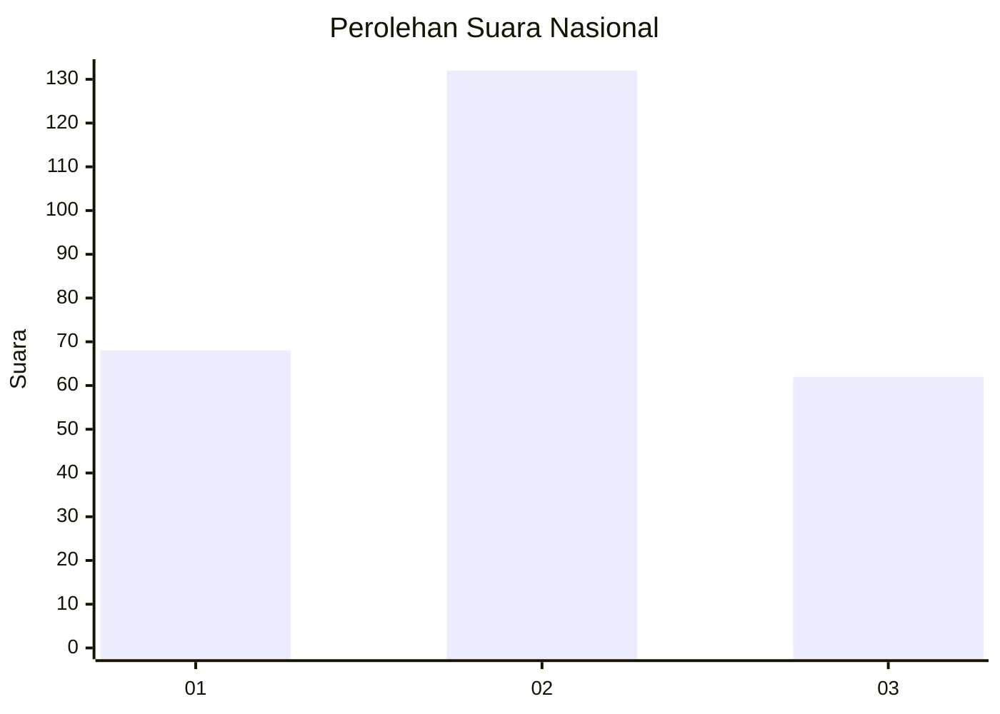
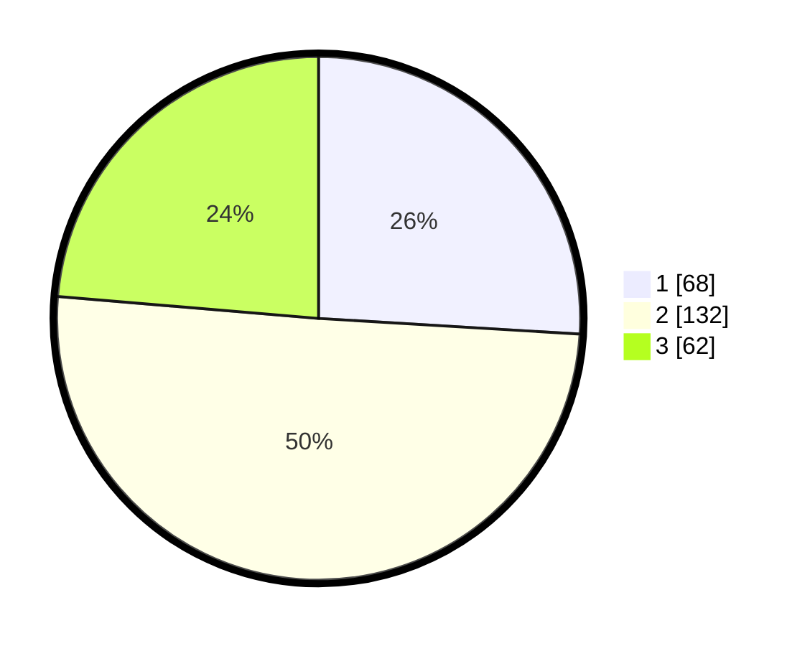

# Hasil

## Grafik

## Tabel

| No. | Nama Paslon    | Suara | Suara (raw) | Persentase |
|:--- |:-------------- | -----:| -----------:| ----------:|
| 1   | ANIES MUHAIMIN | 68    | [68][p-1]   | 25,95      |
| 2   | PRABOWO GIBRAN | 132   | [132][p-2]  | 50,38      |
| 3   | GANJAR MAHFUD  | 62    | [62][p-3]   | 23,66      |

[p-1]: https://github.com/gigit-pemilu/pemilu-2024/blob/main/pilpres/hitung-suara/sub/92-papua-barat/sub/02-manokwari/sub/12-manokwari-barat/sub/1001-manokwari-barat/sub/079-tps/sub/paslon-1.txt
[p-2]: https://github.com/gigit-pemilu/pemilu-2024/blob/main/pilpres/hitung-suara/sub/92-papua-barat/sub/02-manokwari/sub/12-manokwari-barat/sub/1001-manokwari-barat/sub/079-tps/sub/paslon-2.txt
[p-3]: https://github.com/gigit-pemilu/pemilu-2024/blob/main/pilpres/hitung-suara/sub/92-papua-barat/sub/02-manokwari/sub/12-manokwari-barat/sub/1001-manokwari-barat/sub/079-tps/sub/paslon-3.txt

## Foto C Plano

https://sirekap-obj-formc.kpu.go.id/cade/pemilu/ppwp/92/02/12/10/01/9202121001079-20240214-190030--d6edfe52-c944-432e-8164-e6e2165ac9a8.jpg

https://sirekap-obj-formc.kpu.go.id/cade/pemilu/ppwp/92/02/12/10/01/9202121001079-20240214-190048--1ac59de3-aa81-4c92-8e65-1f6e83426514.jpg

https://sirekap-obj-formc.kpu.go.id/cade/pemilu/ppwp/92/02/12/10/01/9202121001079-20240214-190107--c57b2cd2-0a0e-468a-9b5d-90bae8084306.jpg

## Metadata

| Key        | Value               |
| ---------- | ------------------- |
| Time Stamp | 2024-02-16 23:30:00 |

