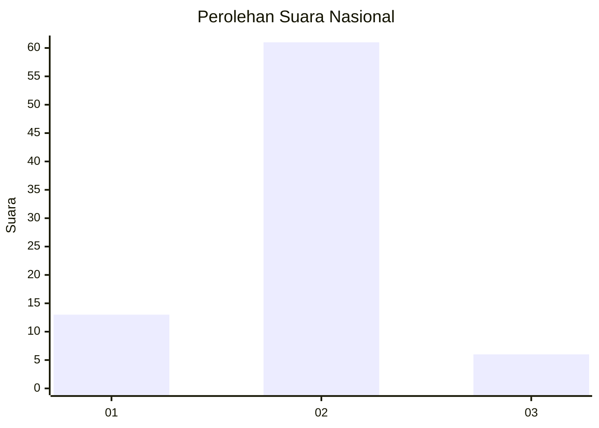
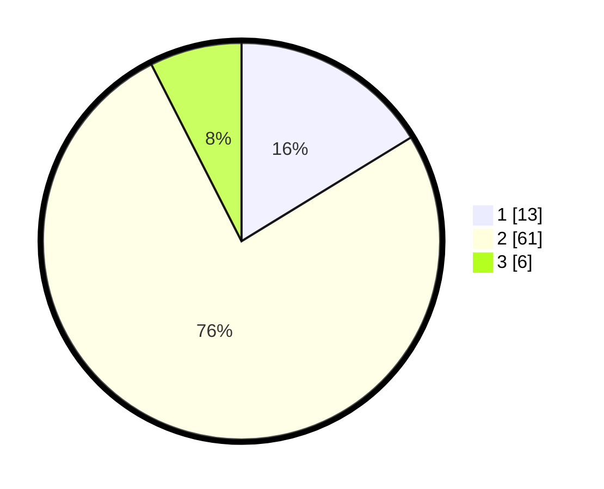

# Hasil

## Grafik

## Tabel

| No. | Nama Paslon    | Suara | Suara (raw) | Persentase |
|:--- |:-------------- | -----:| -----------:| ----------:|
| 1   | ANIES MUHAIMIN | 13    | [13][p-1]   | 16,25      |
| 2   | PRABOWO GIBRAN | 61    | [61][p-2]   | 76,25      |
| 3   | GANJAR MAHFUD  | 6     | [6][p-3]    | 7,50       |

[p-1]: https://github.com/gigit-pemilu/pemilu-2024/blob/main/pilpres/hitung-suara/sub/92-papua-barat/sub/02-manokwari/sub/12-manokwari-barat/sub/1002-sanggeng/sub/028-tps/sub/paslon-1.txt
[p-2]: https://github.com/gigit-pemilu/pemilu-2024/blob/main/pilpres/hitung-suara/sub/92-papua-barat/sub/02-manokwari/sub/12-manokwari-barat/sub/1002-sanggeng/sub/028-tps/sub/paslon-2.txt
[p-3]: https://github.com/gigit-pemilu/pemilu-2024/blob/main/pilpres/hitung-suara/sub/92-papua-barat/sub/02-manokwari/sub/12-manokwari-barat/sub/1002-sanggeng/sub/028-tps/sub/paslon-3.txt

## Foto C Plano

https://sirekap-obj-formc.kpu.go.id/7f34/pemilu/ppwp/92/02/12/10/02/9202121002028-20240214-223941--4b5c2e4d-f840-4c68-9579-bf68252d9487.jpg

https://sirekap-obj-formc.kpu.go.id/7f34/pemilu/ppwp/92/02/12/10/02/9202121002028-20240214-224220--6f64277a-5ce4-4a10-98b9-eea0990e7113.jpg

https://sirekap-obj-formc.kpu.go.id/7f34/pemilu/ppwp/92/02/12/10/02/9202121002028-20240214-224435--c8fa439e-6e7e-43c3-9512-76b89543d25e.jpg

## Metadata

| Key        | Value               |
| ---------- | ------------------- |
| Time Stamp | 2024-02-15 16:00:26 |

