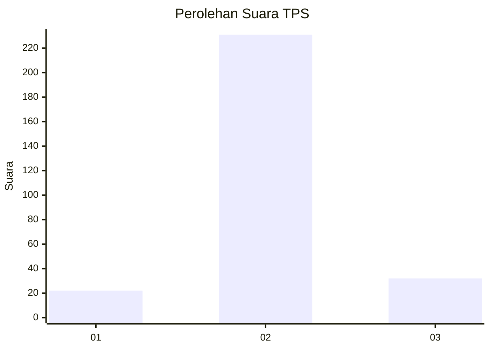
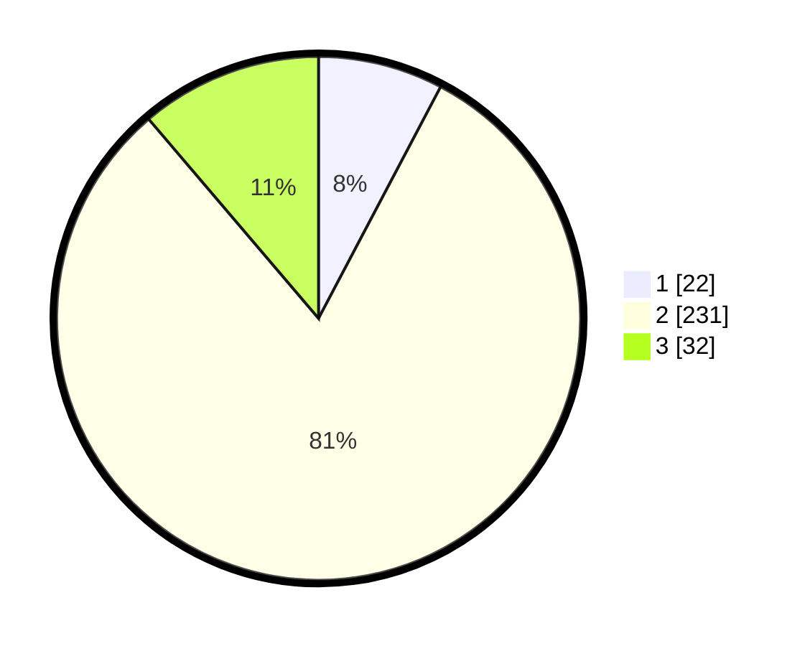

# Hasil

## Grafik

## Tabel

| No. | Nama Paslon    | Suara | Suara (raw) | Persentase |
|:--- |:-------------- | -----:| -----------:| ----------:|
| 1   | ANIES MUHAIMIN | 22    | [22][p-1]   | 7,72       |
| 2   | PRABOWO GIBRAN | 231   | [231][p-2]  | 81,05      |
| 3   | GANJAR MAHFUD  | 32    | [32][p-3]   | 11,23      |

[p-1]: https://github.com/gigit-pemilu/pemilu-2024-92-papua-barat/blob/main/pilpres/hitung-suara/sub/92-papua-barat/sub/02-manokwari/sub/12-manokwari-barat/sub/1002-sanggeng/sub/031-tps/sub/paslon-1.txt
[p-2]: https://github.com/gigit-pemilu/pemilu-2024-92-papua-barat/blob/main/pilpres/hitung-suara/sub/92-papua-barat/sub/02-manokwari/sub/12-manokwari-barat/sub/1002-sanggeng/sub/031-tps/sub/paslon-2.txt
[p-3]: https://github.com/gigit-pemilu/pemilu-2024-92-papua-barat/blob/main/pilpres/hitung-suara/sub/92-papua-barat/sub/02-manokwari/sub/12-manokwari-barat/sub/1002-sanggeng/sub/031-tps/sub/paslon-3.txt

## Foto C Plano

https://sirekap-obj-formc.kpu.go.id/4d40/pemilu/ppwp/92/02/12/10/02/9202121002031-20240215-013459--a2963c72-37e4-419a-80f9-feff1e9c02cb.jpg

https://sirekap-obj-formc.kpu.go.id/4d40/pemilu/ppwp/92/02/12/10/02/9202121002031-20240215-013600--adc1967d-f4ef-4b20-b93b-68dfce0fcc60.jpg

https://sirekap-obj-formc.kpu.go.id/4d40/pemilu/ppwp/92/02/12/10/02/9202121002031-20240215-013921--fa21170c-b63f-453a-aba9-8d5378d4e7b9.jpg

## Metadata

| Key        | Value               |
| ---------- | ------------------- |
| Time Stamp | 2024-02-26 09:00:00 |

