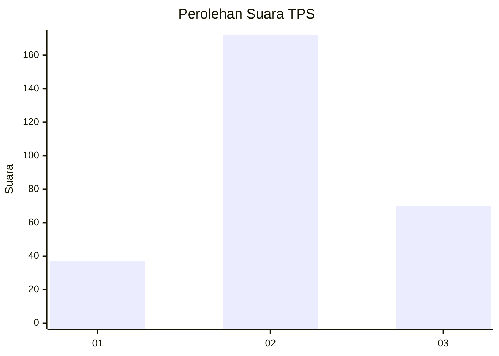
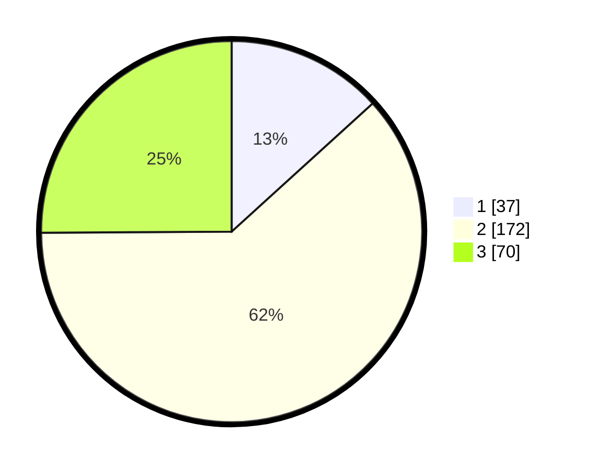

# Hasil

## Grafik

## Tabel

| No. | Nama Paslon    | Suara | Suara (raw) | Persentase |
|:--- |:-------------- | -----:| -----------:| ----------:|
| 1   | ANIES MUHAIMIN | 37    | [37][p-1]   | 13,26      |
| 2   | PRABOWO GIBRAN | 172   | [172][p-2]  | 61,65      |
| 3   | GANJAR MAHFUD  | 70    | [70][p-3]   | 25,09      |

[p-1]: https://github.com/gigit-pemilu/pemilu-2024-92-papua-barat/blob/main/pilpres/hitung-suara/sub/92-papua-barat/sub/02-manokwari/sub/12-manokwari-barat/sub/1004-amban/sub/012-tps/sub/paslon-1.txt
[p-2]: https://github.com/gigit-pemilu/pemilu-2024-92-papua-barat/blob/main/pilpres/hitung-suara/sub/92-papua-barat/sub/02-manokwari/sub/12-manokwari-barat/sub/1004-amban/sub/012-tps/sub/paslon-2.txt
[p-3]: https://github.com/gigit-pemilu/pemilu-2024-92-papua-barat/blob/main/pilpres/hitung-suara/sub/92-papua-barat/sub/02-manokwari/sub/12-manokwari-barat/sub/1004-amban/sub/012-tps/sub/paslon-3.txt

## Foto C Plano

https://sirekap-obj-formc.kpu.go.id/7cbd/pemilu/ppwp/92/02/12/10/04/9202121004012-20240215-223701--304238ca-047a-416a-81e9-c663743c3fdf.jpg

https://sirekap-obj-formc.kpu.go.id/7cbd/pemilu/ppwp/92/02/12/10/04/9202121004012-20240215-223356--e113a04b-25bd-40bd-aa04-775a1bb12e06.jpg

https://sirekap-obj-formc.kpu.go.id/7cbd/pemilu/ppwp/92/02/12/10/04/9202121004012-20240215-223449--089abec8-5bab-4a33-8ee2-4852e65eaf9e.jpg

## Metadata

| Key        | Value               |
| ---------- | ------------------- |
| Time Stamp | 2024-02-16 21:01:00 |

