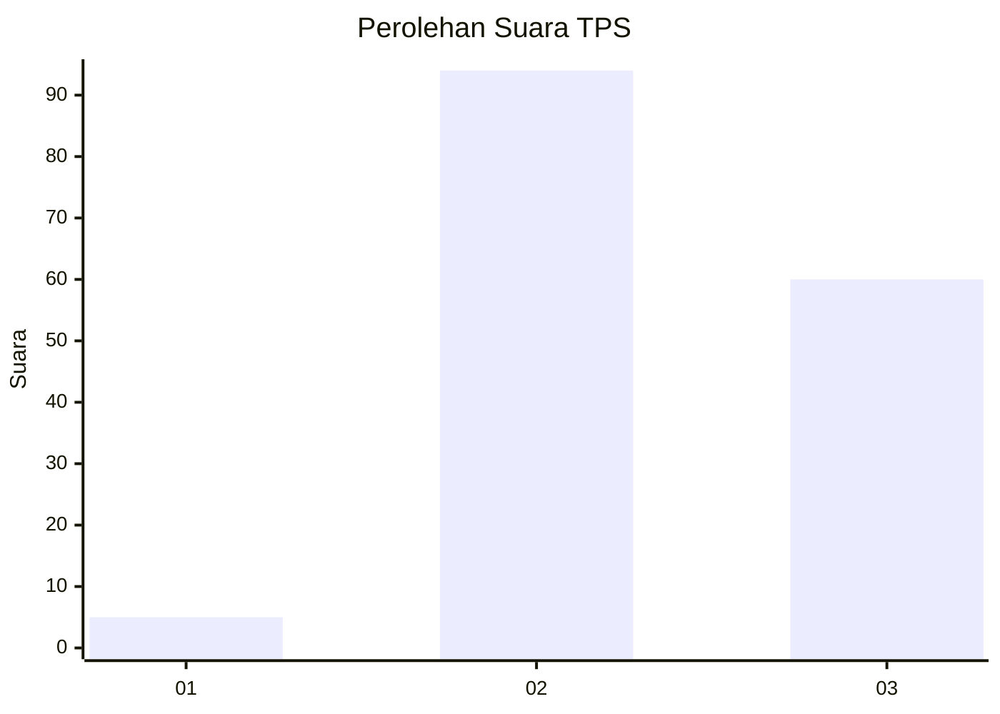
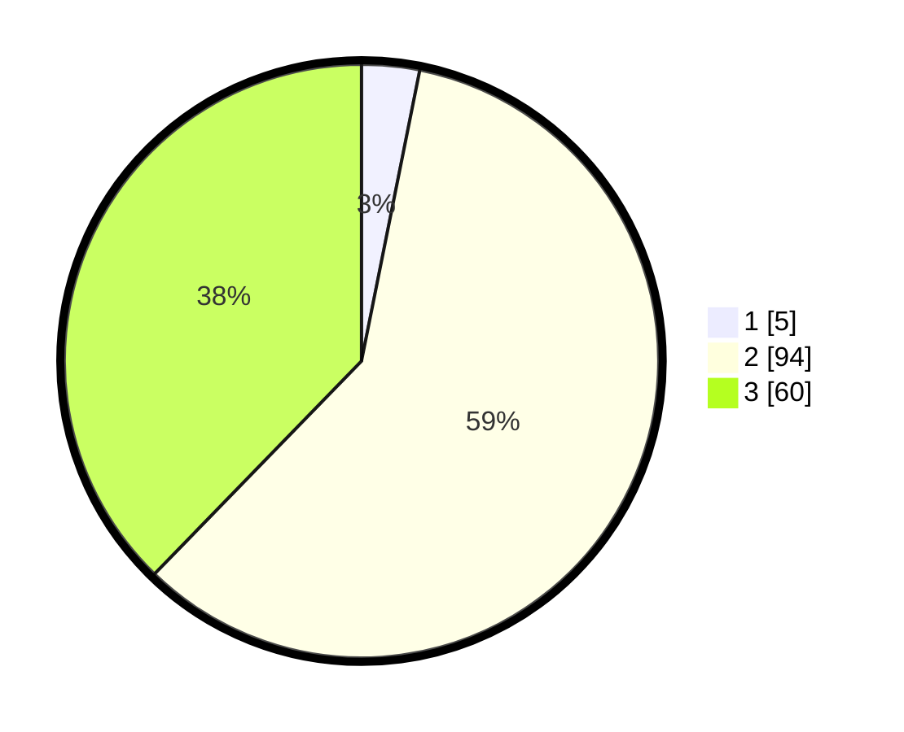

# Hasil

## Grafik

## Tabel

| No. | Nama Paslon    | Suara | Suara (raw) | Persentase |
|:--- |:-------------- | -----:| -----------:| ----------:|
| 1   | ANIES MUHAIMIN | 5     | [5][p-1]    | 3,14       |
| 2   | PRABOWO GIBRAN | 94    | [94][p-2]   | 59,12      |
| 3   | GANJAR MAHFUD  | 60    | [60][p-3]   | 37,74      |

[p-1]: https://github.com/gigit-pemilu/pemilu-2024-92-papua-barat/blob/main/pilpres/hitung-suara/sub/92-papua-barat/sub/02-manokwari/sub/13-manokwari-timur/sub/1001-pasir-putih/sub/001-tps/sub/paslon-1.txt
[p-2]: https://github.com/gigit-pemilu/pemilu-2024-92-papua-barat/blob/main/pilpres/hitung-suara/sub/92-papua-barat/sub/02-manokwari/sub/13-manokwari-timur/sub/1001-pasir-putih/sub/001-tps/sub/paslon-2.txt
[p-3]: https://github.com/gigit-pemilu/pemilu-2024-92-papua-barat/blob/main/pilpres/hitung-suara/sub/92-papua-barat/sub/02-manokwari/sub/13-manokwari-timur/sub/1001-pasir-putih/sub/001-tps/sub/paslon-3.txt

## Foto C Plano

https://sirekap-obj-formc.kpu.go.id/851e/pemilu/ppwp/92/02/13/10/01/9202131001001-20240215-000349--4279f5e5-0b6d-438f-b96b-8eae5c7c0a3c.jpg

https://sirekap-obj-formc.kpu.go.id/851e/pemilu/ppwp/92/02/13/10/01/9202131001001-20240215-000530--6cbe7edf-9787-4495-a7b7-01809476f67d.jpg

https://sirekap-obj-formc.kpu.go.id/851e/pemilu/ppwp/92/02/13/10/01/9202131001001-20240215-000634--023b312b-1955-4c41-9961-b814732d7803.jpg

## Metadata

| Key        | Value               |
| ---------- | ------------------- |
| Time Stamp | 2024-02-15 12:00:28 |

