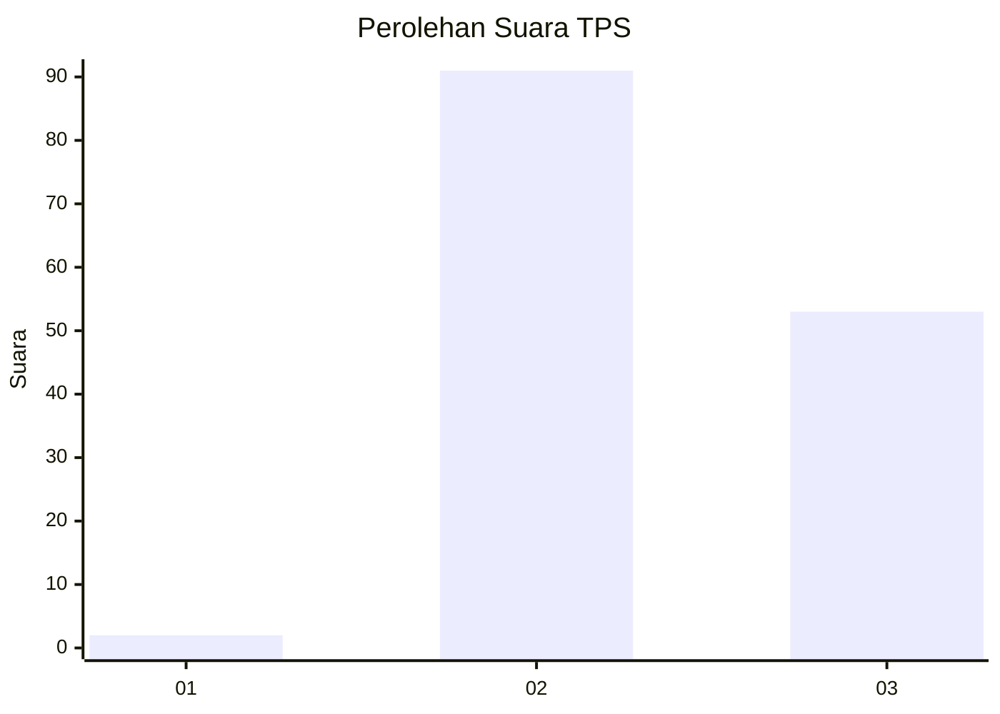
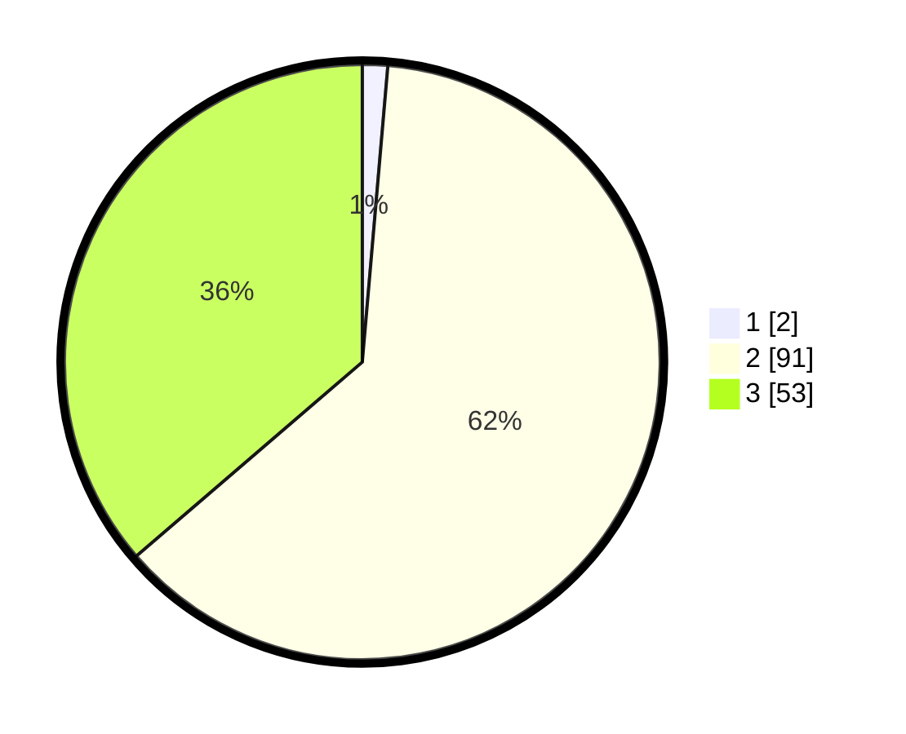

# Hasil

## Grafik

## Tabel

| No. | Nama Paslon    | Suara | Suara (raw) | Persentase |
|:--- |:-------------- | -----:| -----------:| ----------:|
| 1   | ANIES MUHAIMIN | 2     | [2][p-1]    | 1,37       |
| 2   | PRABOWO GIBRAN | 91    | [91][p-2]   | 62,33      |
| 3   | GANJAR MAHFUD  | 53    | [53][p-3]   | 36,30      |

[p-1]: https://github.com/gigit-pemilu/pemilu-2024-92-papua-barat/blob/main/pilpres/hitung-suara/sub/92-papua-barat/sub/02-manokwari/sub/13-manokwari-timur/sub/1001-pasir-putih/sub/002-tps/sub/paslon-1.txt
[p-2]: https://github.com/gigit-pemilu/pemilu-2024-92-papua-barat/blob/main/pilpres/hitung-suara/sub/92-papua-barat/sub/02-manokwari/sub/13-manokwari-timur/sub/1001-pasir-putih/sub/002-tps/sub/paslon-2.txt
[p-3]: https://github.com/gigit-pemilu/pemilu-2024-92-papua-barat/blob/main/pilpres/hitung-suara/sub/92-papua-barat/sub/02-manokwari/sub/13-manokwari-timur/sub/1001-pasir-putih/sub/002-tps/sub/paslon-3.txt

## Foto C Plano

https://sirekap-obj-formc.kpu.go.id/5c77/pemilu/ppwp/92/02/13/10/01/9202131001002-20240217-110322--19f09b78-b6a0-4df6-b05f-e2476f4fec15.jpg

https://sirekap-obj-formc.kpu.go.id/5c77/pemilu/ppwp/92/02/13/10/01/9202131001002-20240217-111558--0c0bea88-f0f9-49ab-b62c-4e7ac7f7eb9e.jpg

https://sirekap-obj-formc.kpu.go.id/5c77/pemilu/ppwp/92/02/13/10/01/9202131001002-20240312-115006--2fde61e7-16c4-4467-929a-23cec4c2d078.jpg

## Metadata

| Key        | Value               |
| ---------- | ------------------- |
| Time Stamp | 2024-03-12 12:00:00 |

