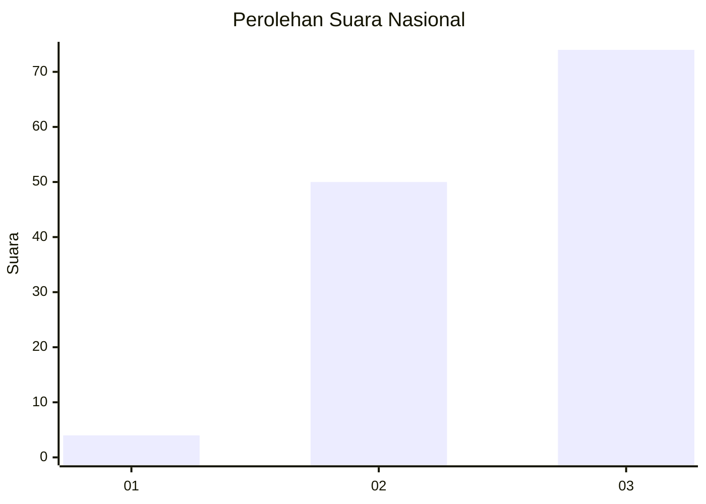
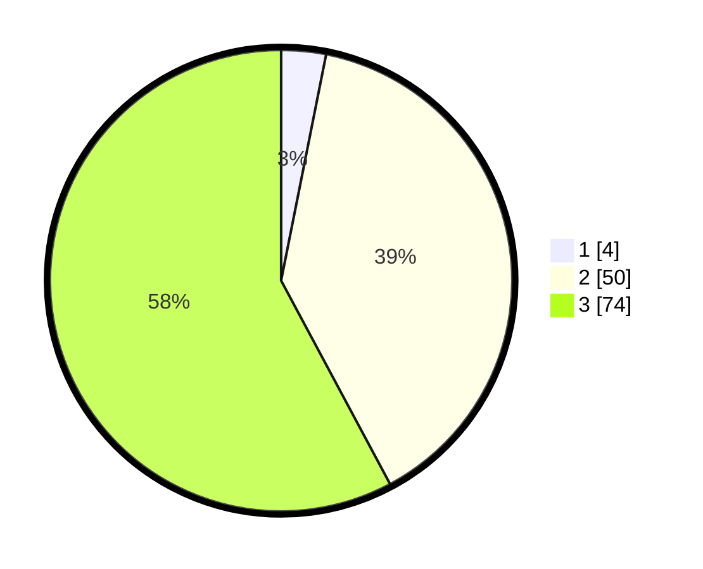

# Hasil

## Grafik

## Tabel

| No. | Nama Paslon    | Suara | Suara (raw) | Persentase |
|:--- |:-------------- | -----:| -----------:| ----------:|
| 1   | ANIES MUHAIMIN | 4     | [4][p-1]    | 3,13       |
| 2   | PRABOWO GIBRAN | 50    | [50][p-2]   | 39,06      |
| 3   | GANJAR MAHFUD  | 74    | [74][p-3]   | 57,81      |

[p-1]: https://github.com/gigit-pemilu/pemilu-2024/blob/main/pilpres/hitung-suara/sub/92-papua-barat/sub/02-manokwari/sub/13-manokwari-timur/sub/1001-pasir-putih/sub/005-tps/sub/paslon-1.txt
[p-2]: https://github.com/gigit-pemilu/pemilu-2024/blob/main/pilpres/hitung-suara/sub/92-papua-barat/sub/02-manokwari/sub/13-manokwari-timur/sub/1001-pasir-putih/sub/005-tps/sub/paslon-2.txt
[p-3]: https://github.com/gigit-pemilu/pemilu-2024/blob/main/pilpres/hitung-suara/sub/92-papua-barat/sub/02-manokwari/sub/13-manokwari-timur/sub/1001-pasir-putih/sub/005-tps/sub/paslon-3.txt

## Foto C Plano

https://sirekap-obj-formc.kpu.go.id/5dbc/pemilu/ppwp/92/02/13/10/01/9202131001005-20240214-230841--4d64ea5a-99b8-4cfb-842f-eea158b12d32.jpg

https://sirekap-obj-formc.kpu.go.id/5dbc/pemilu/ppwp/92/02/13/10/01/9202131001005-20240215-092006--393fcc92-9f41-4e06-bc6e-74769b57c02c.jpg

https://sirekap-obj-formc.kpu.go.id/5dbc/pemilu/ppwp/92/02/13/10/01/9202131001005-20240215-092348--45a08d56-1e15-4939-a450-19114d21e60b.jpg

## Metadata

| Key        | Value               |
| ---------- | ------------------- |
| Time Stamp | 2024-02-15 15:00:29 |

