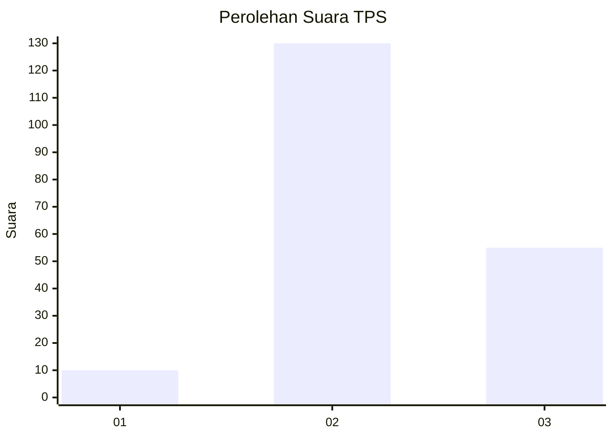
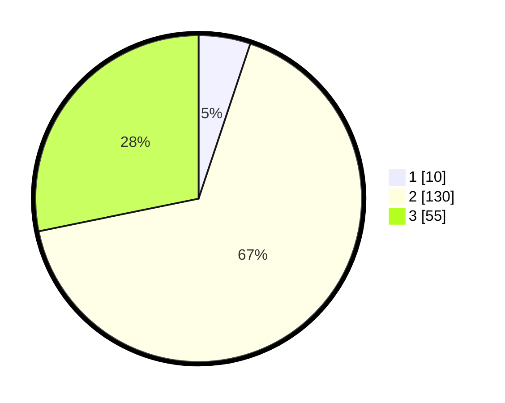

# Hasil

## Grafik

## Tabel

| No. | Nama Paslon    | Suara | Suara (raw) | Persentase |
|:--- |:-------------- | -----:| -----------:| ----------:|
| 1   | ANIES MUHAIMIN | 10    | [10][p-1]   | 5,13       |
| 2   | PRABOWO GIBRAN | 130   | [130][p-2]  | 66,67      |
| 3   | GANJAR MAHFUD  | 55    | [55][p-3]   | 28,21      |

[p-1]: https://github.com/gigit-pemilu/pemilu-2024-92-papua-barat/blob/main/pilpres/hitung-suara/sub/92-papua-barat/sub/02-manokwari/sub/13-manokwari-timur/sub/1001-pasir-putih/sub/006-tps/sub/paslon-1.txt
[p-2]: https://github.com/gigit-pemilu/pemilu-2024-92-papua-barat/blob/main/pilpres/hitung-suara/sub/92-papua-barat/sub/02-manokwari/sub/13-manokwari-timur/sub/1001-pasir-putih/sub/006-tps/sub/paslon-2.txt
[p-3]: https://github.com/gigit-pemilu/pemilu-2024-92-papua-barat/blob/main/pilpres/hitung-suara/sub/92-papua-barat/sub/02-manokwari/sub/13-manokwari-timur/sub/1001-pasir-putih/sub/006-tps/sub/paslon-3.txt

## Foto C Plano

https://sirekap-obj-formc.kpu.go.id/b7c0/pemilu/ppwp/92/02/13/10/01/9202131001006-20240313-122008--03523372-f3f3-4b99-8e97-848dd3dd25b7.jpg

https://sirekap-obj-formc.kpu.go.id/b7c0/pemilu/ppwp/92/02/13/10/01/9202131001006-20240214-204853--96ff887c-3b60-4391-84f4-36f1b194f87a.jpg

https://sirekap-obj-formc.kpu.go.id/b7c0/pemilu/ppwp/92/02/13/10/01/9202131001006-20240214-191314--9c3d1c5b-5550-453e-b106-f5299e0001cb.jpg

## Metadata

| Key        | Value               |
| ---------- | ------------------- |
| Time Stamp | 2024-03-13 12:30:00 |

