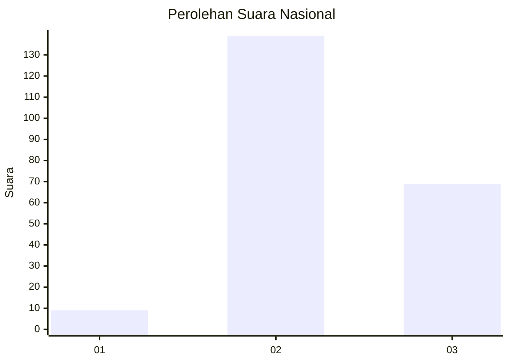
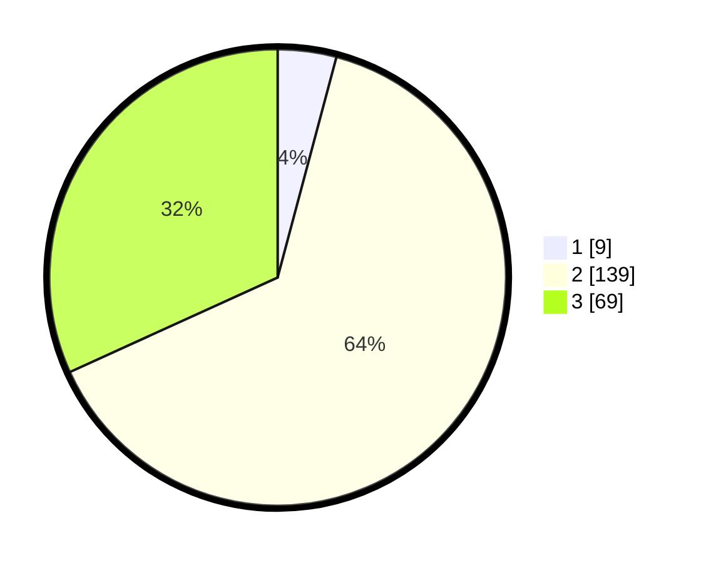

# Hasil

## Grafik

## Tabel

| No. | Nama Paslon    | Suara | Suara (raw) | Persentase |
|:--- |:-------------- | -----:| -----------:| ----------:|
| 1   | ANIES MUHAIMIN | 9     | [9][p-1]    | 4,15       |
| 2   | PRABOWO GIBRAN | 139   | [139][p-2]  | 64,06      |
| 3   | GANJAR MAHFUD  | 69    | [69][p-3]   | 31,80      |

[p-1]: https://github.com/gigit-pemilu/pemilu-2024/blob/main/pilpres/hitung-suara/sub/92-papua-barat/sub/02-manokwari/sub/13-manokwari-timur/sub/2005-arowi/sub/003-tps/sub/paslon-1.txt
[p-2]: https://github.com/gigit-pemilu/pemilu-2024/blob/main/pilpres/hitung-suara/sub/92-papua-barat/sub/02-manokwari/sub/13-manokwari-timur/sub/2005-arowi/sub/003-tps/sub/paslon-2.txt
[p-3]: https://github.com/gigit-pemilu/pemilu-2024/blob/main/pilpres/hitung-suara/sub/92-papua-barat/sub/02-manokwari/sub/13-manokwari-timur/sub/2005-arowi/sub/003-tps/sub/paslon-3.txt

## Foto C Plano

https://sirekap-obj-formc.kpu.go.id/9166/pemilu/ppwp/92/02/13/20/05/9202132005003-20240215-125351--2aab7c8a-43ec-4ec7-b28b-b7aa8db4ce9f.jpg

https://sirekap-obj-formc.kpu.go.id/9166/pemilu/ppwp/92/02/13/20/05/9202132005003-20240215-130957--c3cd92b2-f154-4fd9-b95b-47effc2b0d86.jpg

https://sirekap-obj-formc.kpu.go.id/9166/pemilu/ppwp/92/02/13/20/05/9202132005003-20240215-125555--8cd6602c-c56a-4aef-80cc-dcced63894ee.jpg

## Metadata

| Key        | Value               |
| ---------- | ------------------- |
| Time Stamp | 2024-02-16 23:45:47 |

