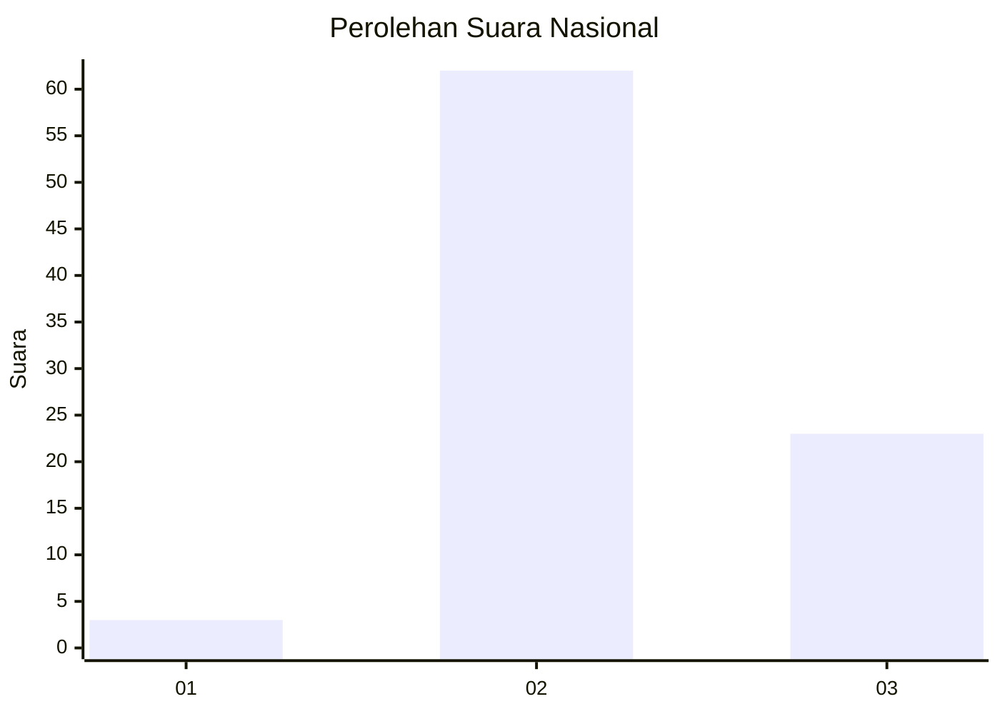
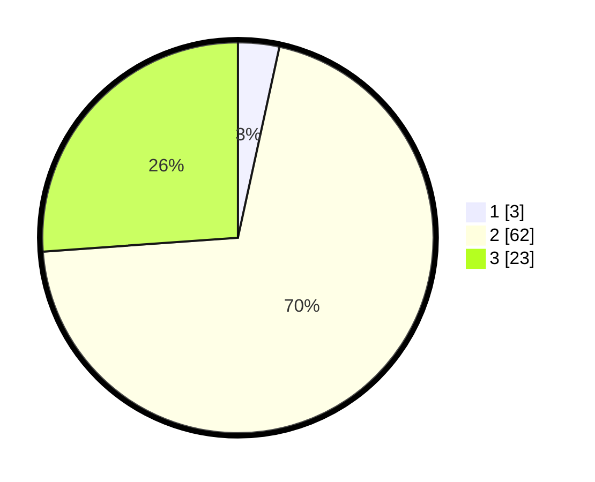

# Hasil

## Grafik

## Tabel

| No. | Nama Paslon    | Suara | Suara (raw) | Persentase |
|:--- |:-------------- | -----:| -----------:| ----------:|
| 1   | ANIES MUHAIMIN | 3     | [3][p-1]    | 3,41       |
| 2   | PRABOWO GIBRAN | 62    | [62][p-2]   | 70,45      |
| 3   | GANJAR MAHFUD  | 23    | [23][p-3]   | 26,14      |

[p-1]: https://github.com/gigit-pemilu/pemilu-2024/blob/main/pilpres/hitung-suara/sub/92-papua-barat/sub/02-manokwari/sub/14-manokwari-utara/sub/2003-mubri/sub/001-tps/sub/paslon-1.txt
[p-2]: https://github.com/gigit-pemilu/pemilu-2024/blob/main/pilpres/hitung-suara/sub/92-papua-barat/sub/02-manokwari/sub/14-manokwari-utara/sub/2003-mubri/sub/001-tps/sub/paslon-2.txt
[p-3]: https://github.com/gigit-pemilu/pemilu-2024/blob/main/pilpres/hitung-suara/sub/92-papua-barat/sub/02-manokwari/sub/14-manokwari-utara/sub/2003-mubri/sub/001-tps/sub/paslon-3.txt

## Foto C Plano

https://sirekap-obj-formc.kpu.go.id/cc95/pemilu/ppwp/92/02/14/20/03/9202142003001-20240312-171834--d80405c5-d14d-4b43-adcb-e6c8fbc6e1f2.jpg

https://sirekap-obj-formc.kpu.go.id/cc95/pemilu/ppwp/92/02/14/20/03/9202142003001-20240214-232710--e7777832-5b10-4d85-8e6a-a4430222c4c0.jpg

https://sirekap-obj-formc.kpu.go.id/cc95/pemilu/ppwp/92/02/14/20/03/9202142003001-20240214-233220--1ff8c234-3c1d-4569-ab82-4a3911b8aabc.jpg

## Metadata

| Key        | Value               |
| ---------- | ------------------- |
| Time Stamp | 2024-03-12 17:30:00 |

