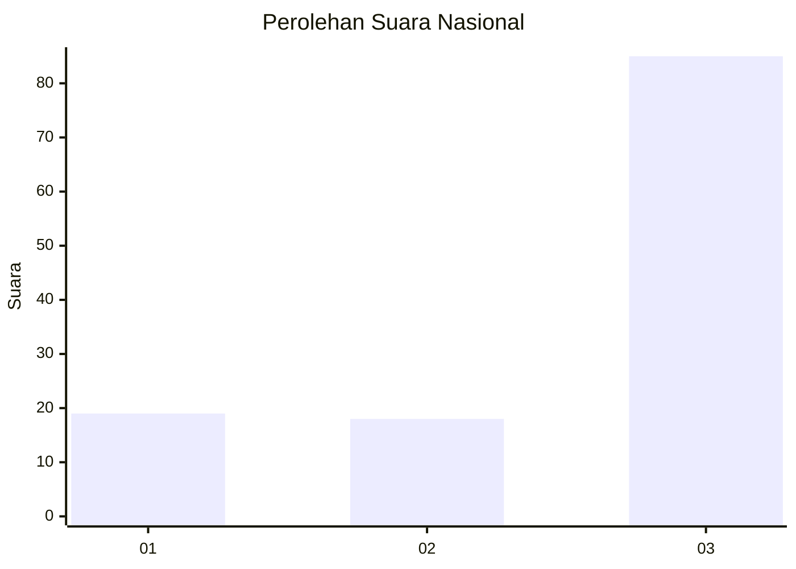
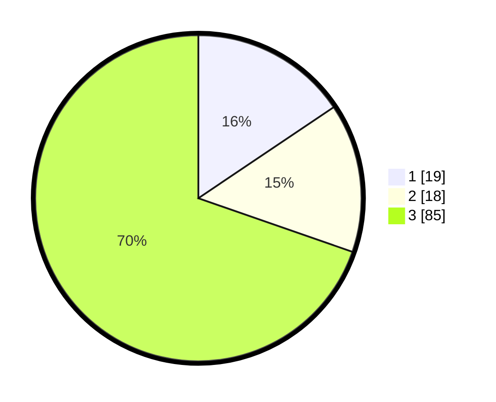

# Hasil

## Grafik

## Tabel

| No. | Nama Paslon    | Suara | Suara (raw) | Persentase |
|:--- |:-------------- | -----:| -----------:| ----------:|
| 1   | ANIES MUHAIMIN | 19    | [19][p-1]   | 15,57      |
| 2   | PRABOWO GIBRAN | 18    | [18][p-2]   | 14,75      |
| 3   | GANJAR MAHFUD  | 85    | [85][p-3]   | 69,67      |

[p-1]: https://github.com/gigit-pemilu/pemilu-2024/blob/main/pilpres/hitung-suara/sub/92-papua-barat/sub/02-manokwari/sub/14-manokwari-utara/sub/2010-warbefor/sub/001-tps/sub/paslon-1.txt
[p-2]: https://github.com/gigit-pemilu/pemilu-2024/blob/main/pilpres/hitung-suara/sub/92-papua-barat/sub/02-manokwari/sub/14-manokwari-utara/sub/2010-warbefor/sub/001-tps/sub/paslon-2.txt
[p-3]: https://github.com/gigit-pemilu/pemilu-2024/blob/main/pilpres/hitung-suara/sub/92-papua-barat/sub/02-manokwari/sub/14-manokwari-utara/sub/2010-warbefor/sub/001-tps/sub/paslon-3.txt

## Foto C Plano

https://sirekap-obj-formc.kpu.go.id/6b3d/pemilu/ppwp/92/02/14/20/10/9202142010001-20240216-092050--f23a27ac-6732-4f70-bec2-128760b21a0c.jpg

https://sirekap-obj-formc.kpu.go.id/6b3d/pemilu/ppwp/92/02/14/20/10/9202142010001-20240216-092200--8cdf092b-6e17-40fd-8239-0ee9bfef7b26.jpg

https://sirekap-obj-formc.kpu.go.id/6b3d/pemilu/ppwp/92/02/14/20/10/9202142010001-20240216-092303--aa3cff1b-c932-4033-a6e6-2219a1fa45cf.jpg

## Metadata

| Key        | Value               |
| ---------- | ------------------- |
| Time Stamp | 2024-02-16 23:45:47 |

