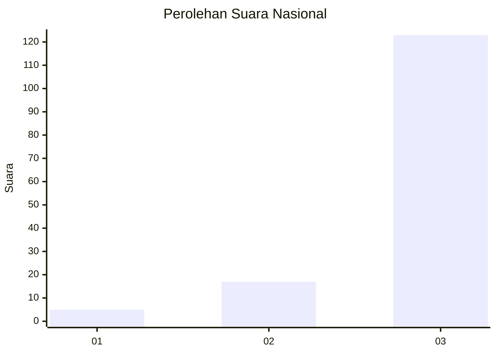
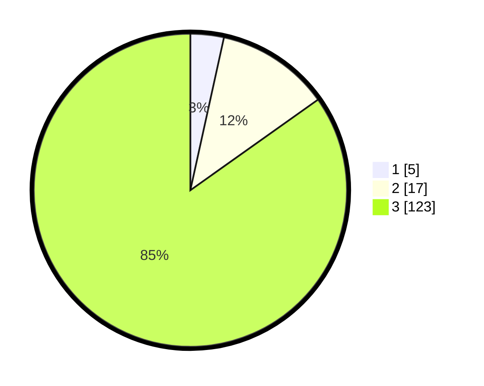

# Hasil

## Grafik

## Tabel

| No. | Nama Paslon    | Suara | Suara (raw) | Persentase |
|:--- |:-------------- | -----:| -----------:| ----------:|
| 1   | ANIES MUHAIMIN | 5     | [5][p-1]    | 3,45       |
| 2   | PRABOWO GIBRAN | 17    | [17][p-2]   | 11,72      |
| 3   | GANJAR MAHFUD  | 123   | [123][p-3]  | 84,83      |

[p-1]: https://github.com/gigit-pemilu/pemilu-2024/blob/main/pilpres/hitung-suara/sub/92-papua-barat/sub/02-manokwari/sub/14-manokwari-utara/sub/2013-meyunfoka/sub/001-tps/sub/paslon-1.txt
[p-2]: https://github.com/gigit-pemilu/pemilu-2024/blob/main/pilpres/hitung-suara/sub/92-papua-barat/sub/02-manokwari/sub/14-manokwari-utara/sub/2013-meyunfoka/sub/001-tps/sub/paslon-2.txt
[p-3]: https://github.com/gigit-pemilu/pemilu-2024/blob/main/pilpres/hitung-suara/sub/92-papua-barat/sub/02-manokwari/sub/14-manokwari-utara/sub/2013-meyunfoka/sub/001-tps/sub/paslon-3.txt

## Foto C Plano

https://sirekap-obj-formc.kpu.go.id/433a/pemilu/ppwp/92/02/14/20/13/9202142013001-20240215-091214--11238cb1-40c7-4570-85be-b98671ac7213.jpg

https://sirekap-obj-formc.kpu.go.id/433a/pemilu/ppwp/92/02/14/20/13/9202142013001-20240215-091235--98999787-caf5-4b65-a312-0fdd79023202.jpg

https://sirekap-obj-formc.kpu.go.id/433a/pemilu/ppwp/92/02/14/20/13/9202142013001-20240215-091255--f87dd93f-570a-4550-afb7-7aabc5663cb1.jpg

## Metadata

| Key        | Value               |
| ---------- | ------------------- |
| Time Stamp | 2024-02-15 21:01:18 |

