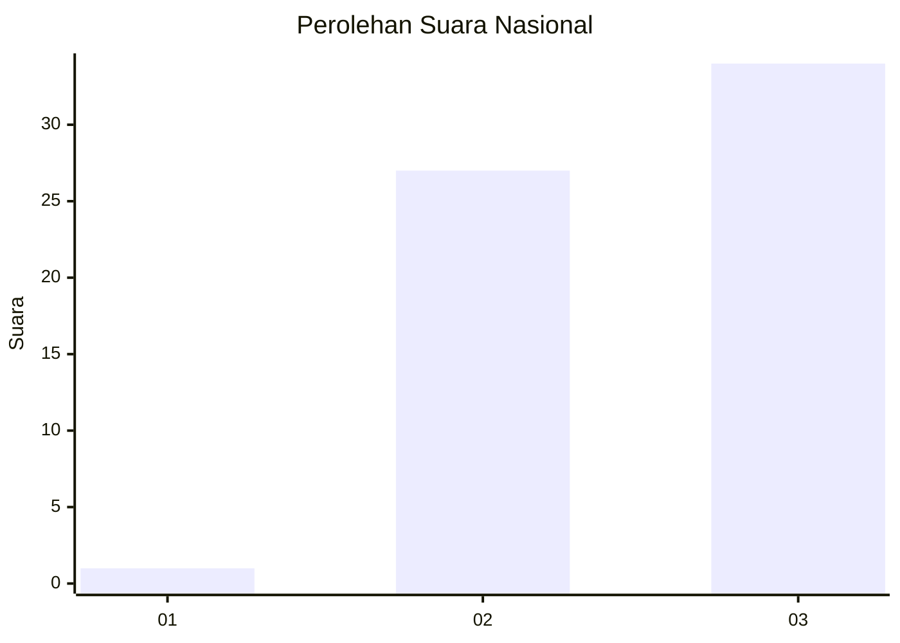
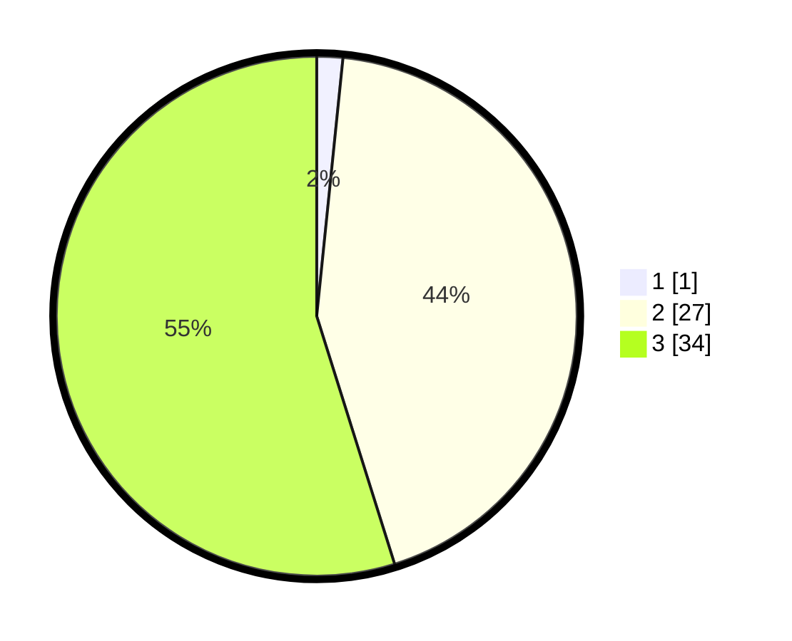

# Hasil

## Grafik

## Tabel

| No. | Nama Paslon    | Suara | Suara (raw) | Persentase |
|:--- |:-------------- | -----:| -----------:| ----------:|
| 1   | ANIES MUHAIMIN | 1     | [1][p-1]    | 1,61       |
| 2   | PRABOWO GIBRAN | 27    | [27][p-2]   | 43,55      |
| 3   | GANJAR MAHFUD  | 34    | [34][p-3]   | 54,84      |

[p-1]: https://github.com/gigit-pemilu/pemilu-2024/blob/main/pilpres/hitung-suara/sub/92-papua-barat/sub/02-manokwari/sub/14-manokwari-utara/sub/2014-tanah-rubuh/sub/001-tps/sub/paslon-1.txt
[p-2]: https://github.com/gigit-pemilu/pemilu-2024/blob/main/pilpres/hitung-suara/sub/92-papua-barat/sub/02-manokwari/sub/14-manokwari-utara/sub/2014-tanah-rubuh/sub/001-tps/sub/paslon-2.txt
[p-3]: https://github.com/gigit-pemilu/pemilu-2024/blob/main/pilpres/hitung-suara/sub/92-papua-barat/sub/02-manokwari/sub/14-manokwari-utara/sub/2014-tanah-rubuh/sub/001-tps/sub/paslon-3.txt

## Foto C Plano

https://sirekap-obj-formc.kpu.go.id/88d7/pemilu/ppwp/92/02/14/20/14/9202142014001-20240215-045732--a74abc54-7003-4b59-b580-e5ac55d02f4a.jpg

https://sirekap-obj-formc.kpu.go.id/88d7/pemilu/ppwp/92/02/14/20/14/9202142014001-20240215-050311--553d10df-2051-439d-a16a-300be164138e.jpg

https://sirekap-obj-formc.kpu.go.id/88d7/pemilu/ppwp/92/02/14/20/14/9202142014001-20240215-050716--27faa549-446c-49e2-9ef5-ef0e6daec8b4.jpg

## Metadata

| Key        | Value               |
| ---------- | ------------------- |
| Time Stamp | 2024-02-15 15:00:29 |

