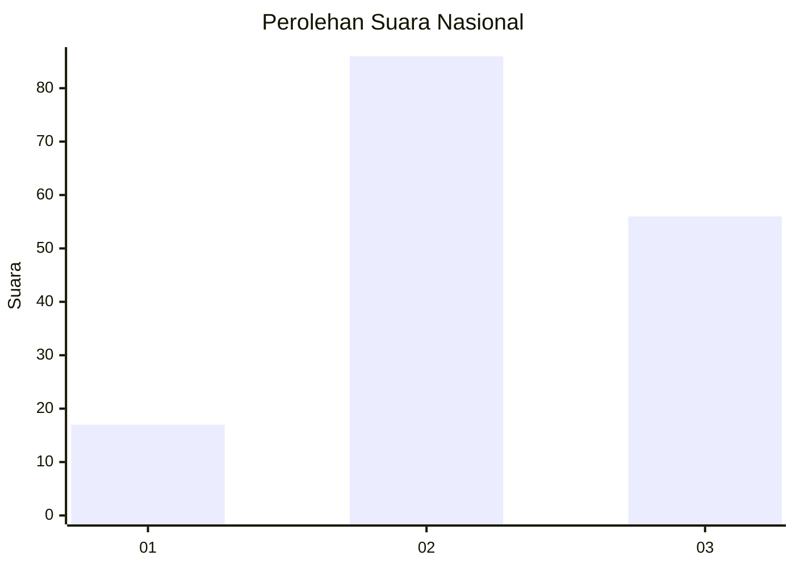
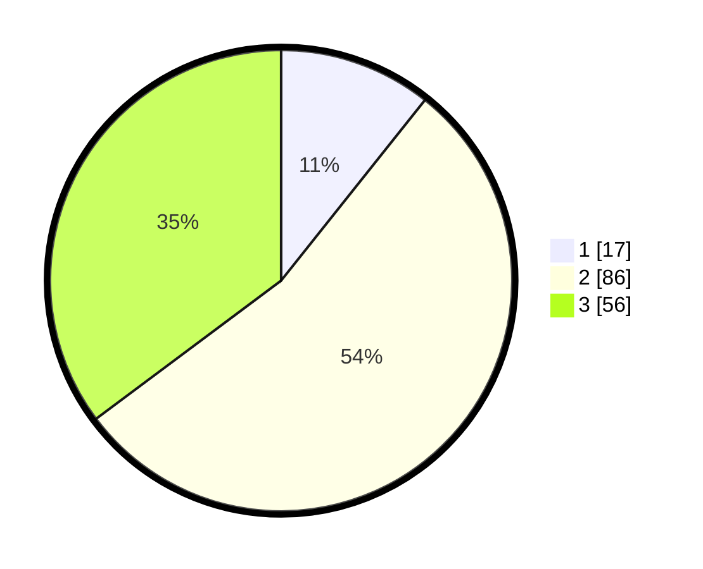

# Hasil

## Grafik

## Tabel

| No. | Nama Paslon    | Suara | Suara (raw) | Persentase |
|:--- |:-------------- | -----:| -----------:| ----------:|
| 1   | ANIES MUHAIMIN | 17    | [17][p-1]   | 10,69      |
| 2   | PRABOWO GIBRAN | 86    | [86][p-2]   | 54,09      |
| 3   | GANJAR MAHFUD  | 56    | [56][p-3]   | 35,22      |

[p-1]: https://github.com/gigit-pemilu/pemilu-2024/blob/main/pilpres/hitung-suara/sub/92-papua-barat/sub/02-manokwari/sub/15-manokwari-selatan/sub/1001-sowi/sub/008-tps/sub/paslon-1.txt
[p-2]: https://github.com/gigit-pemilu/pemilu-2024/blob/main/pilpres/hitung-suara/sub/92-papua-barat/sub/02-manokwari/sub/15-manokwari-selatan/sub/1001-sowi/sub/008-tps/sub/paslon-2.txt
[p-3]: https://github.com/gigit-pemilu/pemilu-2024/blob/main/pilpres/hitung-suara/sub/92-papua-barat/sub/02-manokwari/sub/15-manokwari-selatan/sub/1001-sowi/sub/008-tps/sub/paslon-3.txt

## Foto C Plano

https://sirekap-obj-formc.kpu.go.id/18e6/pemilu/ppwp/92/02/15/10/01/9202151001008-20240214-204239--1a38b426-46da-450a-a906-abd24adb7335.jpg

https://sirekap-obj-formc.kpu.go.id/18e6/pemilu/ppwp/92/02/15/10/01/9202151001008-20240214-204352--4d28da7a-3bc5-4a40-97ab-8627f1178212.jpg

https://sirekap-obj-formc.kpu.go.id/18e6/pemilu/ppwp/92/02/15/10/01/9202151001008-20240214-204441--6694de88-ae55-41cb-91e8-78a3d1655b68.jpg

## Metadata

| Key        | Value               |
| ---------- | ------------------- |
| Time Stamp | 2024-02-15 21:01:18 |

