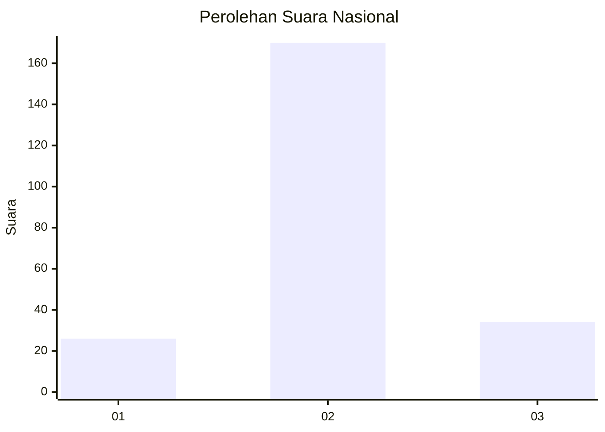
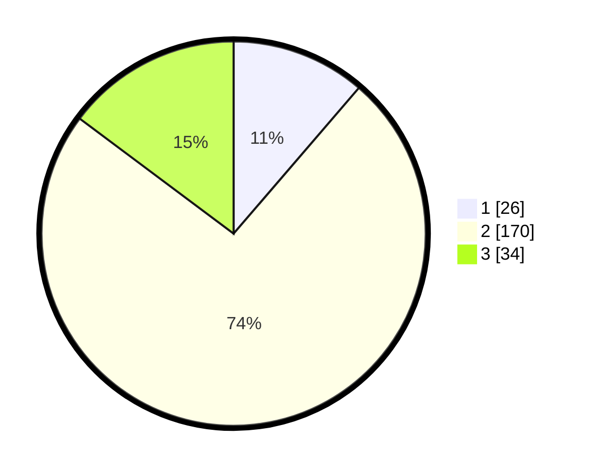

# Hasil

## Grafik

## Tabel

| No. | Nama Paslon    | Suara | Suara (raw) | Persentase |
|:--- |:-------------- | -----:| -----------:| ----------:|
| 1   | ANIES MUHAIMIN | 26    | [26][p-1]   | 11,30      |
| 2   | PRABOWO GIBRAN | 170   | [170][p-2]  | 73,91      |
| 3   | GANJAR MAHFUD  | 34    | [34][p-3]   | 14,78      |

[p-1]: https://github.com/gigit-pemilu/pemilu-2024/blob/main/pilpres/hitung-suara/sub/92-papua-barat/sub/02-manokwari/sub/15-manokwari-selatan/sub/1001-sowi/sub/017-tps/sub/paslon-1.txt
[p-2]: https://github.com/gigit-pemilu/pemilu-2024/blob/main/pilpres/hitung-suara/sub/92-papua-barat/sub/02-manokwari/sub/15-manokwari-selatan/sub/1001-sowi/sub/017-tps/sub/paslon-2.txt
[p-3]: https://github.com/gigit-pemilu/pemilu-2024/blob/main/pilpres/hitung-suara/sub/92-papua-barat/sub/02-manokwari/sub/15-manokwari-selatan/sub/1001-sowi/sub/017-tps/sub/paslon-3.txt

## Foto C Plano

https://sirekap-obj-formc.kpu.go.id/25ee/pemilu/ppwp/92/02/15/10/01/9202151001017-20240215-065910--4351347b-fae2-4fe2-9185-0067149eaac8.jpg

https://sirekap-obj-formc.kpu.go.id/25ee/pemilu/ppwp/92/02/15/10/01/9202151001017-20240215-070110--3f18b981-0651-4598-8a83-255d2ef8b1c8.jpg

https://sirekap-obj-formc.kpu.go.id/25ee/pemilu/ppwp/92/02/15/10/01/9202151001017-20240215-072038--247f8a6b-a5ae-4c1d-ac81-d5ac76a3ed99.jpg

## Metadata

| Key        | Value               |
| ---------- | ------------------- |
| Time Stamp | 2024-02-15 17:00:25 |

