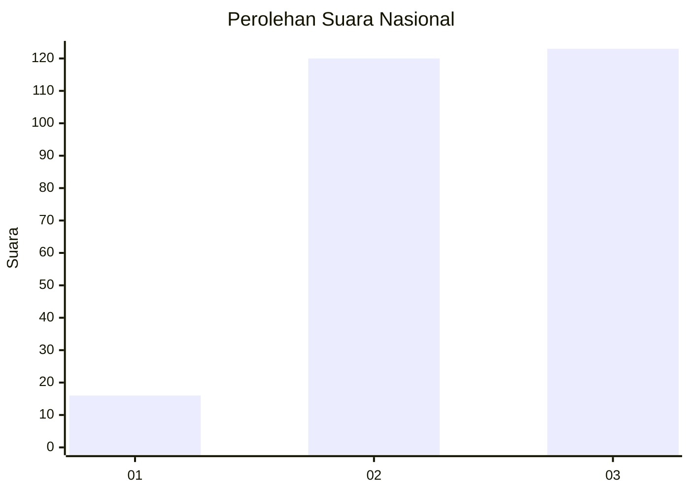
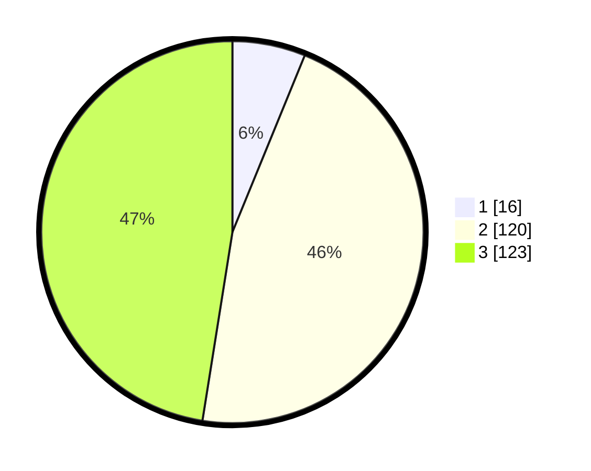

# Hasil

## Grafik

## Tabel

| No. | Nama Paslon    | Suara | Suara (raw) | Persentase |
|:--- |:-------------- | -----:| -----------:| ----------:|
| 1   | ANIES MUHAIMIN | 16    | [16][p-1]   | 6,18       |
| 2   | PRABOWO GIBRAN | 120   | [120][p-2]  | 46,33      |
| 3   | GANJAR MAHFUD  | 123   | [123][p-3]  | 47,49      |

[p-1]: https://github.com/gigit-pemilu/pemilu-2024/blob/main/pilpres/hitung-suara/sub/92-papua-barat/sub/02-manokwari/sub/15-manokwari-selatan/sub/1001-sowi/sub/021-tps/sub/paslon-1.txt
[p-2]: https://github.com/gigit-pemilu/pemilu-2024/blob/main/pilpres/hitung-suara/sub/92-papua-barat/sub/02-manokwari/sub/15-manokwari-selatan/sub/1001-sowi/sub/021-tps/sub/paslon-2.txt
[p-3]: https://github.com/gigit-pemilu/pemilu-2024/blob/main/pilpres/hitung-suara/sub/92-papua-barat/sub/02-manokwari/sub/15-manokwari-selatan/sub/1001-sowi/sub/021-tps/sub/paslon-3.txt

## Foto C Plano

https://sirekap-obj-formc.kpu.go.id/5052/pemilu/ppwp/92/02/15/10/01/9202151001021-20240214-231910--bcc30cae-e907-488b-8525-729511449d35.jpg

https://sirekap-obj-formc.kpu.go.id/5052/pemilu/ppwp/92/02/15/10/01/9202151001021-20240214-225513--3abdb370-50ec-4f72-9f5e-a031cb53bf2f.jpg

https://sirekap-obj-formc.kpu.go.id/5052/pemilu/ppwp/92/02/15/10/01/9202151001021-20240214-231240--5ee07f23-7186-4630-a81d-9b8f55026c99.jpg

## Metadata

| Key        | Value               |
| ---------- | ------------------- |
| Time Stamp | 2024-02-15 12:00:28 |

