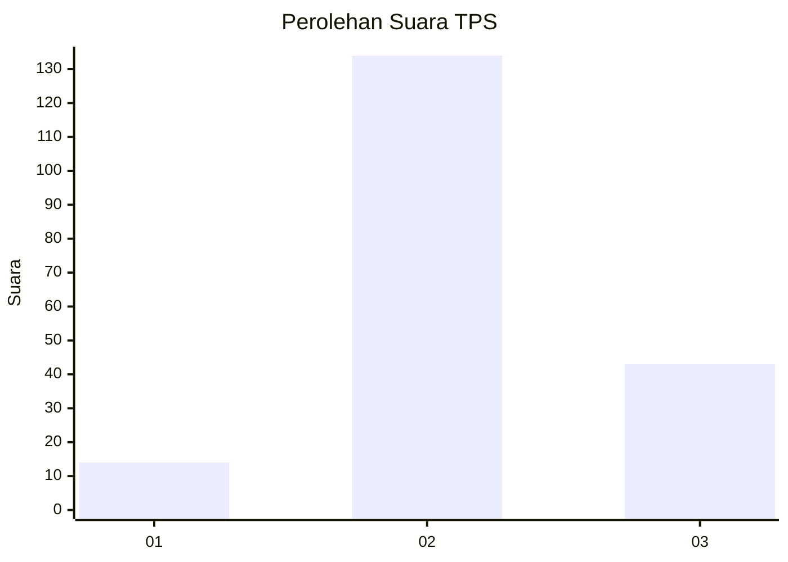
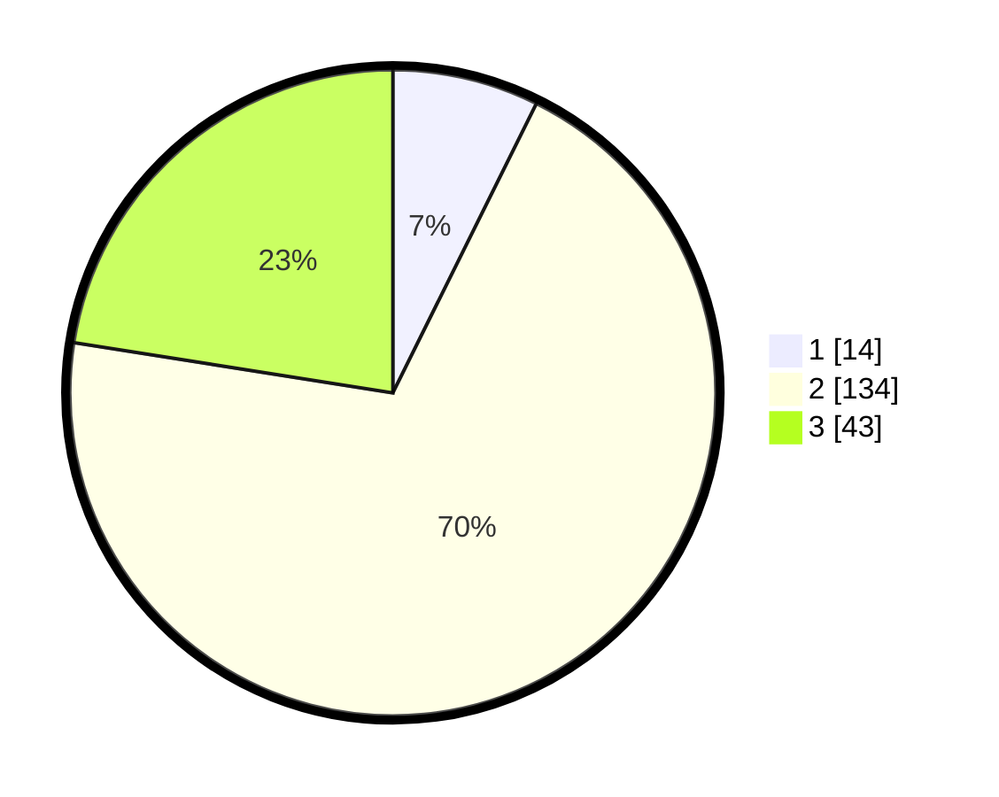

# Hasil

## Grafik

## Tabel

| No. | Nama Paslon    | Suara | Suara (raw) | Persentase |
|:--- |:-------------- | -----:| -----------:| ----------:|
| 1   | ANIES MUHAIMIN | 14    | [14][p-1]   | 7,33       |
| 2   | PRABOWO GIBRAN | 134   | [134][p-2]  | 70,16      |
| 3   | GANJAR MAHFUD  | 43    | [43][p-3]   | 22,51      |

[p-1]: https://github.com/gigit-pemilu/pemilu-2024-92-papua-barat/blob/main/pilpres/hitung-suara/sub/92-papua-barat/sub/02-manokwari/sub/15-manokwari-selatan/sub/1001-sowi/sub/029-tps/sub/paslon-1.txt
[p-2]: https://github.com/gigit-pemilu/pemilu-2024-92-papua-barat/blob/main/pilpres/hitung-suara/sub/92-papua-barat/sub/02-manokwari/sub/15-manokwari-selatan/sub/1001-sowi/sub/029-tps/sub/paslon-2.txt
[p-3]: https://github.com/gigit-pemilu/pemilu-2024-92-papua-barat/blob/main/pilpres/hitung-suara/sub/92-papua-barat/sub/02-manokwari/sub/15-manokwari-selatan/sub/1001-sowi/sub/029-tps/sub/paslon-3.txt

## Foto C Plano

https://sirekap-obj-formc.kpu.go.id/db31/pemilu/ppwp/92/02/15/10/01/9202151001029-20240215-091519--3f44f245-8acf-44b9-ae7d-f8e577b9b0b4.jpg

https://sirekap-obj-formc.kpu.go.id/db31/pemilu/ppwp/92/02/15/10/01/9202151001029-20240215-091546--d39200c9-f40e-4c31-8c01-52e093830a00.jpg

https://sirekap-obj-formc.kpu.go.id/db31/pemilu/ppwp/92/02/15/10/01/9202151001029-20240215-091601--7569e446-8fd7-4704-bded-b641ebfebf8e.jpg

## Metadata

| Key        | Value               |
| ---------- | ------------------- |
| Time Stamp | 2024-02-15 15:30:25 |

