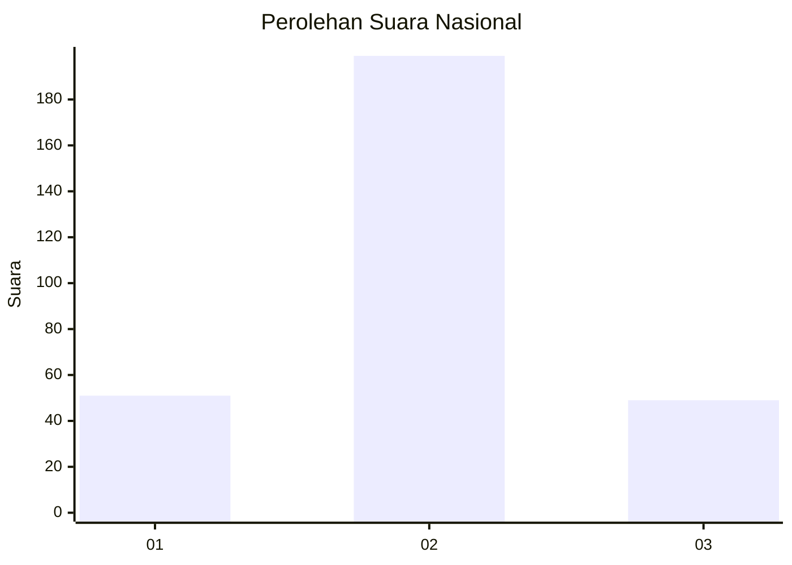
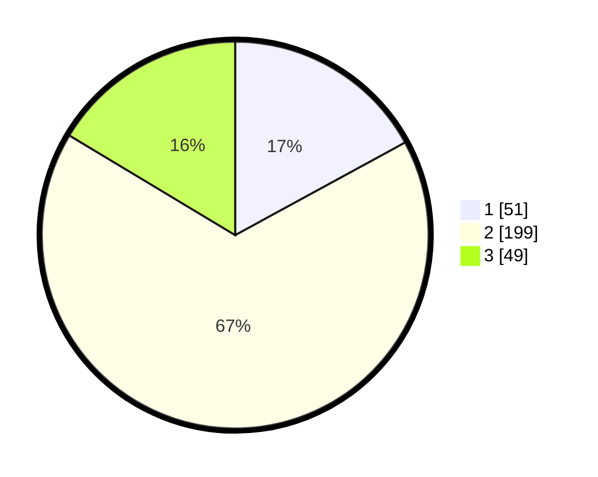

# Hasil

## Grafik

## Tabel

| No. | Nama Paslon    | Suara | Suara (raw) | Persentase |
|:--- |:-------------- | -----:| -----------:| ----------:|
| 1   | ANIES MUHAIMIN | 51    | [51][p-1]   | 17,06      |
| 2   | PRABOWO GIBRAN | 199   | [199][p-2]  | 66,56      |
| 3   | GANJAR MAHFUD  | 49    | [49][p-3]   | 16,39      |

[p-1]: https://github.com/gigit-pemilu/pemilu-2024/blob/main/pilpres/hitung-suara/sub/92-papua-barat/sub/02-manokwari/sub/15-manokwari-selatan/sub/1002-anday/sub/012-tps/sub/paslon-1.txt
[p-2]: https://github.com/gigit-pemilu/pemilu-2024/blob/main/pilpres/hitung-suara/sub/92-papua-barat/sub/02-manokwari/sub/15-manokwari-selatan/sub/1002-anday/sub/012-tps/sub/paslon-2.txt
[p-3]: https://github.com/gigit-pemilu/pemilu-2024/blob/main/pilpres/hitung-suara/sub/92-papua-barat/sub/02-manokwari/sub/15-manokwari-selatan/sub/1002-anday/sub/012-tps/sub/paslon-3.txt

## Foto C Plano

https://sirekap-obj-formc.kpu.go.id/8305/pemilu/ppwp/92/02/15/10/02/9202151002012-20240215-091248--8ef45425-ba0d-45ac-a823-4c6ab4dbed58.jpg

https://sirekap-obj-formc.kpu.go.id/8305/pemilu/ppwp/92/02/15/10/02/9202151002012-20240215-090835--f2c74463-0373-4f71-90c6-9b9f407f1c17.jpg

https://sirekap-obj-formc.kpu.go.id/8305/pemilu/ppwp/92/02/15/10/02/9202151002012-20240215-091353--72a5e1db-c12c-4df4-983e-2b075a9f6f68.jpg

## Metadata

| Key        | Value               |
| ---------- | ------------------- |
| Time Stamp | 2024-02-15 15:30:25 |

