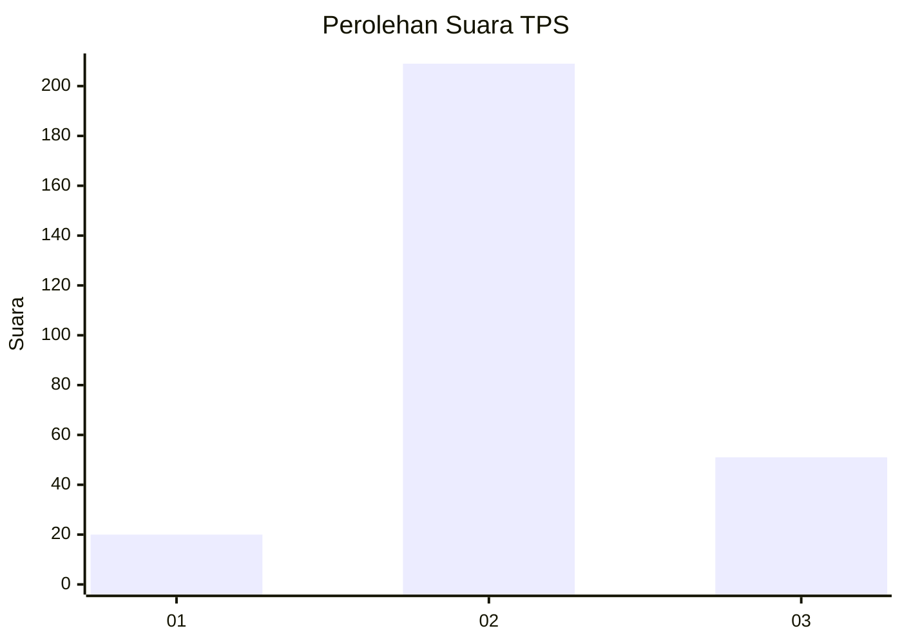

# Hasil

## Grafik

## Tabel

| No. | Nama Paslon    | Suara | Suara (raw) | Persentase |
|:--- |:-------------- | -----:| -----------:| ----------:|
| 1   | ANIES MUHAIMIN | 20    | [20][p-1]   | 7,14       |
| 2   | PRABOWO GIBRAN | 209   | [209][p-2]  | 74,64      |
| 3   | GANJAR MAHFUD  | 51    | [51][p-3]   | 18,21      |

[p-1]: https://github.com/gigit-pemilu/pemilu-2024-92-papua-barat/blob/main/pilpres/hitung-suara/sub/92-papua-barat/sub/02-manokwari/sub/15-manokwari-selatan/sub/1002-anday/sub/016-tps/sub/paslon-1.txt
[p-2]: https://github.com/gigit-pemilu/pemilu-2024-92-papua-barat/blob/main/pilpres/hitung-suara/sub/92-papua-barat/sub/02-manokwari/sub/15-manokwari-selatan/sub/1002-anday/sub/016-tps/sub/paslon-2.txt
[p-3]: https://github.com/gigit-pemilu/pemilu-2024-92-papua-barat/blob/main/pilpres/hitung-suara/sub/92-papua-barat/sub/02-manokwari/sub/15-manokwari-selatan/sub/1002-anday/sub/016-tps/sub/paslon-3.txt

## Foto C Plano

https://sirekap-obj-formc.kpu.go.id/32f5/pemilu/ppwp/92/02/15/10/02/9202151002016-20240214-194156--440f3375-17ba-43dc-b216-35940f840a3f.jpg

https://sirekap-obj-formc.kpu.go.id/32f5/pemilu/ppwp/92/02/15/10/02/9202151002016-20240214-194256--82bc636f-c525-4926-adf6-550d9970d052.jpg

https://sirekap-obj-formc.kpu.go.id/32f5/pemilu/ppwp/92/02/15/10/02/9202151002016-20240215-124513--b41bb84d-55a5-4c69-944e-e739bc93b5a3.jpg

## Metadata

| Key        | Value               |
| ---------- | ------------------- |
| Time Stamp | 2024-02-15 17:00:25 |

