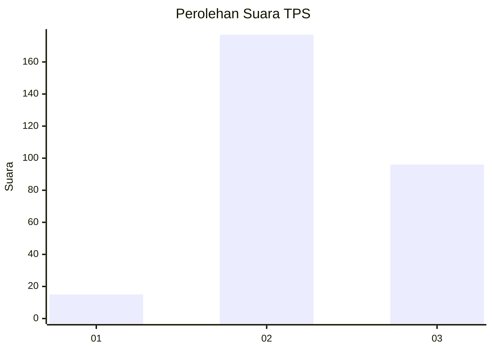
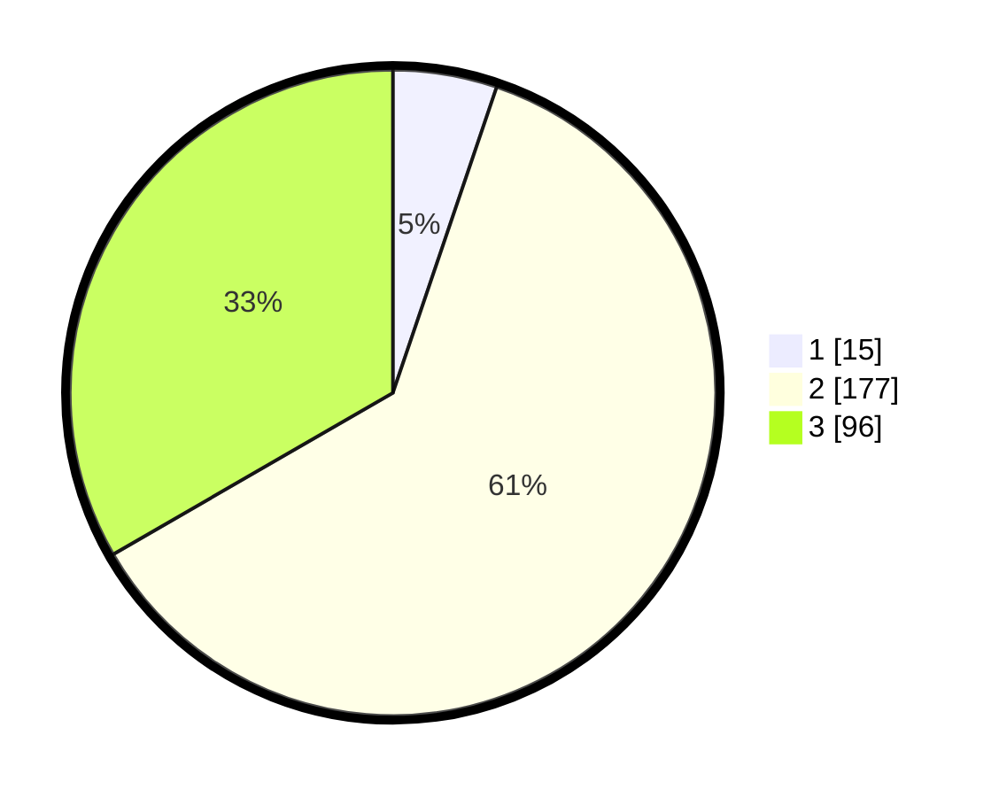

# Hasil

## Grafik

## Tabel

| No. | Nama Paslon    | Suara | Suara (raw) | Persentase |
|:--- |:-------------- | -----:| -----------:| ----------:|
| 1   | ANIES MUHAIMIN | 15    | [15][p-1]   | 5,21       |
| 2   | PRABOWO GIBRAN | 177   | [177][p-2]  | 61,46      |
| 3   | GANJAR MAHFUD  | 96    | [96][p-3]   | 33,33      |

[p-1]: https://github.com/gigit-pemilu/pemilu-2024-92-papua-barat/blob/main/pilpres/hitung-suara/sub/92-papua-barat/sub/02-manokwari/sub/15-manokwari-selatan/sub/1002-anday/sub/017-tps/sub/paslon-1.txt
[p-2]: https://github.com/gigit-pemilu/pemilu-2024-92-papua-barat/blob/main/pilpres/hitung-suara/sub/92-papua-barat/sub/02-manokwari/sub/15-manokwari-selatan/sub/1002-anday/sub/017-tps/sub/paslon-2.txt
[p-3]: https://github.com/gigit-pemilu/pemilu-2024-92-papua-barat/blob/main/pilpres/hitung-suara/sub/92-papua-barat/sub/02-manokwari/sub/15-manokwari-selatan/sub/1002-anday/sub/017-tps/sub/paslon-3.txt

## Foto C Plano

https://sirekap-obj-formc.kpu.go.id/0cd0/pemilu/ppwp/92/02/15/10/02/9202151002017-20240215-152328--027a6e34-5445-4e6a-b27f-f1e02a3ccc4d.jpg

https://sirekap-obj-formc.kpu.go.id/0cd0/pemilu/ppwp/92/02/15/10/02/9202151002017-20240215-155201--b4484773-ac00-4282-ad06-ae9fd333ee71.jpg

https://sirekap-obj-formc.kpu.go.id/0cd0/pemilu/ppwp/92/02/15/10/02/9202151002017-20240215-184850--abd8f014-2a55-41ba-8a23-bb0b99abbfbe.jpg

## Metadata

| Key        | Value               |
| ---------- | ------------------- |
| Time Stamp | 2024-02-15 19:00:26 |

