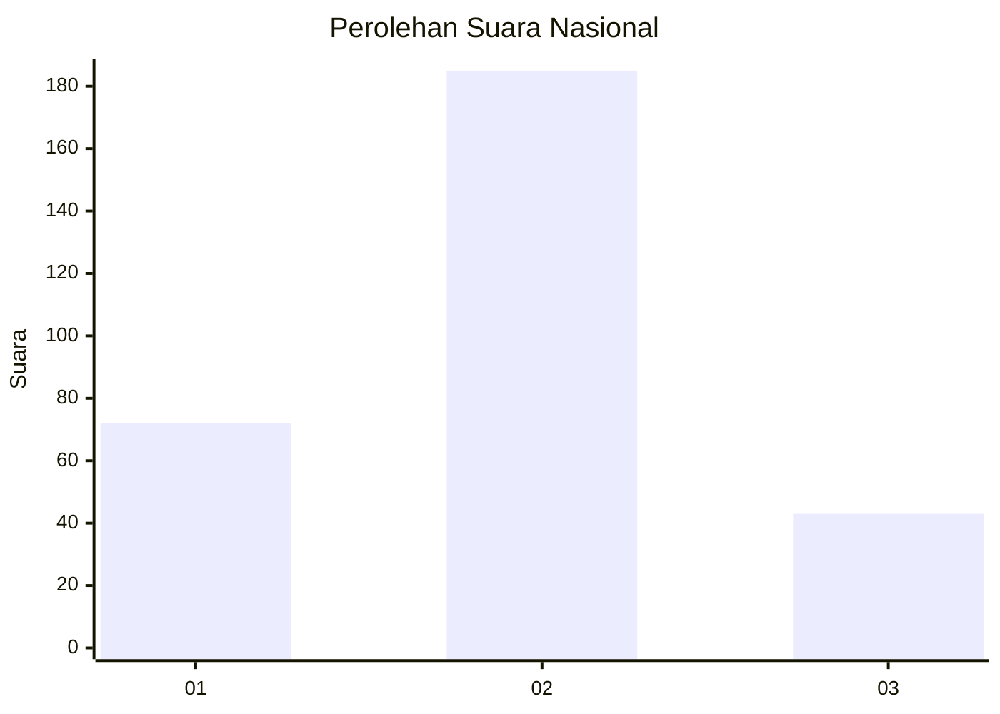
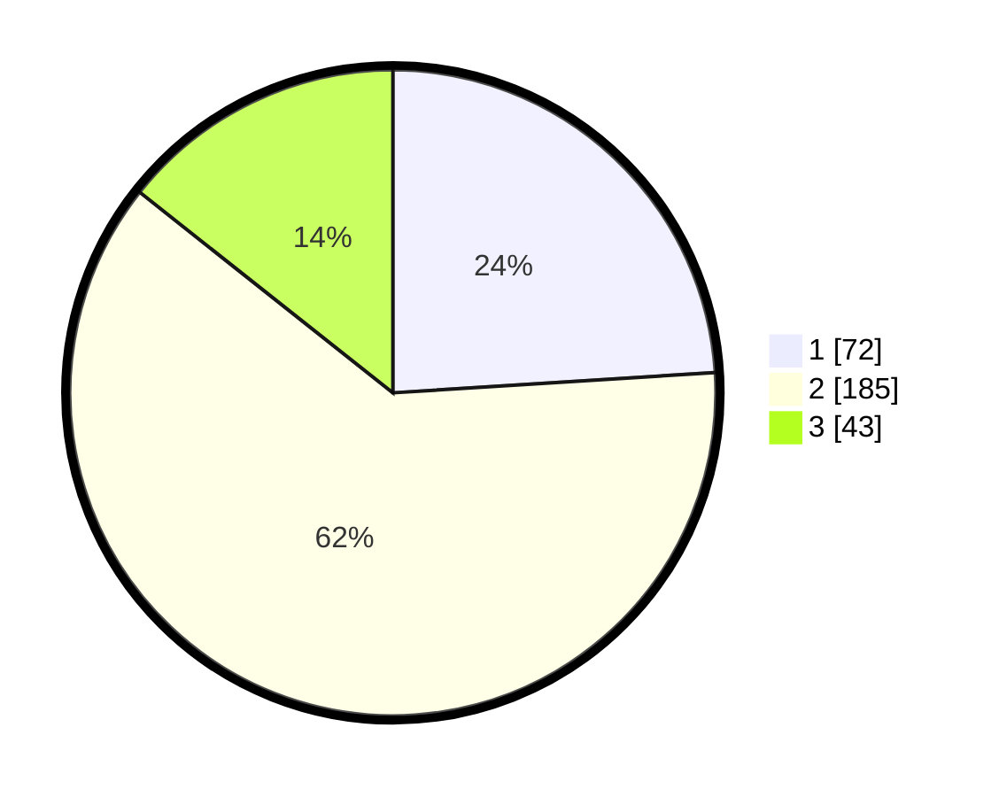

# Hasil

## Grafik

## Tabel

| No. | Nama Paslon    | Suara | Suara (raw) | Persentase |
|:--- |:-------------- | -----:| -----------:| ----------:|
| 1   | ANIES MUHAIMIN | 72    | [72][p-1]   | 24,00      |
| 2   | PRABOWO GIBRAN | 185   | [185][p-2]  | 61,67      |
| 3   | GANJAR MAHFUD  | 43    | [43][p-3]   | 14,33      |

[p-1]: https://github.com/gigit-pemilu/pemilu-2024/blob/main/pilpres/hitung-suara/sub/92-papua-barat/sub/02-manokwari/sub/15-manokwari-selatan/sub/1002-anday/sub/018-tps/sub/paslon-1.txt
[p-2]: https://github.com/gigit-pemilu/pemilu-2024/blob/main/pilpres/hitung-suara/sub/92-papua-barat/sub/02-manokwari/sub/15-manokwari-selatan/sub/1002-anday/sub/018-tps/sub/paslon-2.txt
[p-3]: https://github.com/gigit-pemilu/pemilu-2024/blob/main/pilpres/hitung-suara/sub/92-papua-barat/sub/02-manokwari/sub/15-manokwari-selatan/sub/1002-anday/sub/018-tps/sub/paslon-3.txt

## Foto C Plano

https://sirekap-obj-formc.kpu.go.id/ec9b/pemilu/ppwp/92/02/15/10/02/9202151002018-20240214-200053--9ef94863-01a4-43c2-bbec-1e3b4dfe05c2.jpg

https://sirekap-obj-formc.kpu.go.id/ec9b/pemilu/ppwp/92/02/15/10/02/9202151002018-20240214-200242--5823bd9d-4e5f-4a70-b1f6-0bae224b816c.jpg

https://sirekap-obj-formc.kpu.go.id/ec9b/pemilu/ppwp/92/02/15/10/02/9202151002018-20240214-200410--5fe4f87a-e947-49b0-874b-f5b9593e811c.jpg

## Metadata

| Key        | Value               |
| ---------- | ------------------- |
| Time Stamp | 2024-02-15 12:00:28 |

