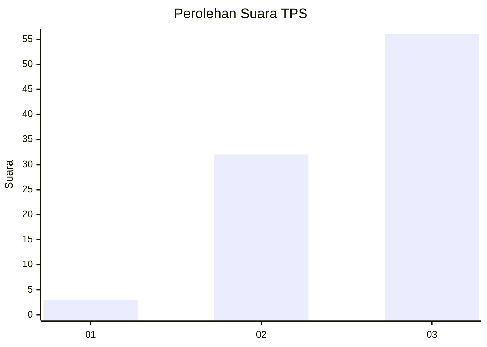
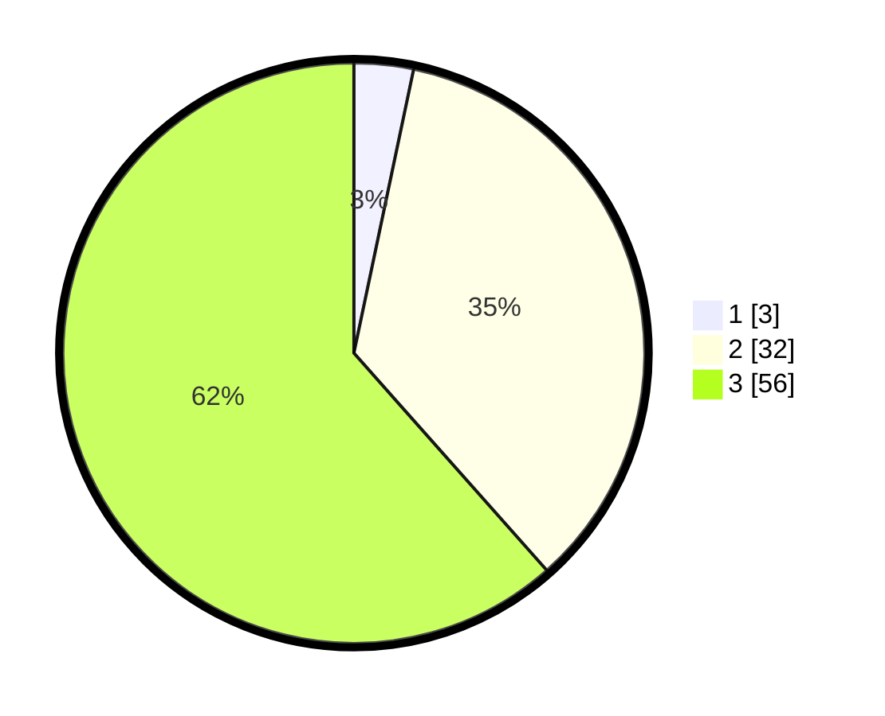

# Hasil

## Grafik

## Tabel

| No. | Nama Paslon    | Suara | Suara (raw) | Persentase |
|:--- |:-------------- | -----:| -----------:| ----------:|
| 1   | ANIES MUHAIMIN | 3     | [3][p-1]    | 3,30       |
| 2   | PRABOWO GIBRAN | 32    | [32][p-2]   | 35,16      |
| 3   | GANJAR MAHFUD  | 56    | [56][p-3]   | 61,54      |

[p-1]: https://github.com/gigit-pemilu/pemilu-2024-92-papua-barat/blob/main/pilpres/hitung-suara/sub/92-papua-barat/sub/02-manokwari/sub/15-manokwari-selatan/sub/2014-acemo/sub/001-tps/sub/paslon-1.txt
[p-2]: https://github.com/gigit-pemilu/pemilu-2024-92-papua-barat/blob/main/pilpres/hitung-suara/sub/92-papua-barat/sub/02-manokwari/sub/15-manokwari-selatan/sub/2014-acemo/sub/001-tps/sub/paslon-2.txt
[p-3]: https://github.com/gigit-pemilu/pemilu-2024-92-papua-barat/blob/main/pilpres/hitung-suara/sub/92-papua-barat/sub/02-manokwari/sub/15-manokwari-selatan/sub/2014-acemo/sub/001-tps/sub/paslon-3.txt

## Foto C Plano

https://sirekap-obj-formc.kpu.go.id/10a9/pemilu/ppwp/92/02/15/20/14/9202152014001-20240215-085714--59295890-ac49-4c63-ad7b-0a1abcaff3eb.jpg

https://sirekap-obj-formc.kpu.go.id/10a9/pemilu/ppwp/92/02/15/20/14/9202152014001-20240215-085805--d6d02274-06a1-4d6c-a2f4-ab8326a395cd.jpg

https://sirekap-obj-formc.kpu.go.id/10a9/pemilu/ppwp/92/02/15/20/14/9202152014001-20240215-085854--562cccf2-5430-45d5-ab11-d21d084ef9c2.jpg

## Metadata

| Key        | Value               |
| ---------- | ------------------- |
| Time Stamp | 2024-02-15 15:00:29 |

