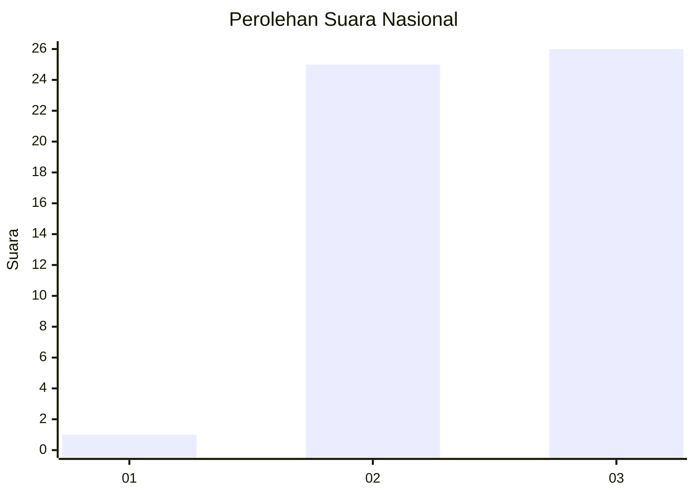
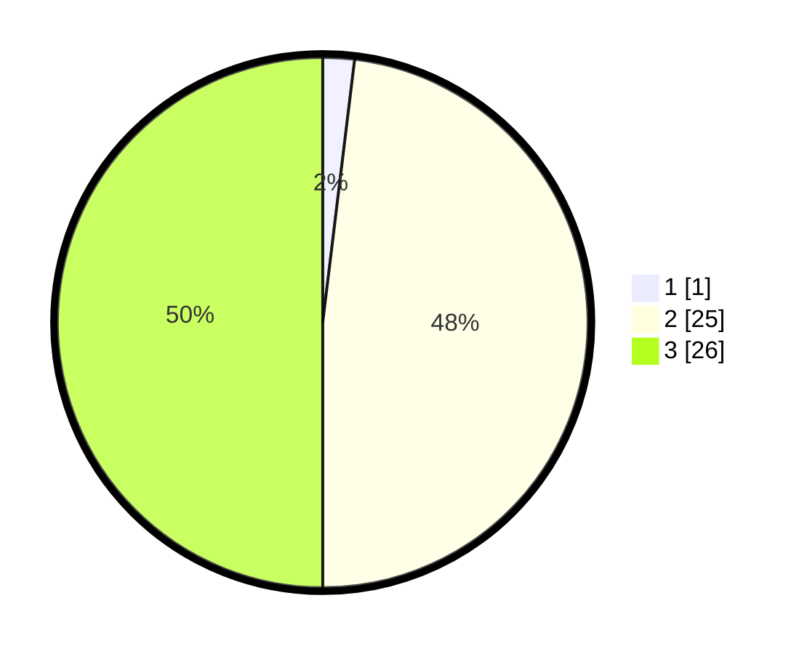

# Hasil

## Grafik

## Tabel

| No. | Nama Paslon    | Suara | Suara (raw) | Persentase |
|:--- |:-------------- | -----:| -----------:| ----------:|
| 1   | ANIES MUHAIMIN | 1     | [1][p-1]    | 1,92       |
| 2   | PRABOWO GIBRAN | 25    | [25][p-2]   | 48,08      |
| 3   | GANJAR MAHFUD  | 26    | [26][p-3]   | 50,00      |

[p-1]: https://github.com/gigit-pemilu/pemilu-2024/blob/main/pilpres/hitung-suara/sub/92-papua-barat/sub/02-manokwari/sub/17-tanah-rubuh/sub/2010-rembuy/sub/001-tps/sub/paslon-1.txt
[p-2]: https://github.com/gigit-pemilu/pemilu-2024/blob/main/pilpres/hitung-suara/sub/92-papua-barat/sub/02-manokwari/sub/17-tanah-rubuh/sub/2010-rembuy/sub/001-tps/sub/paslon-2.txt
[p-3]: https://github.com/gigit-pemilu/pemilu-2024/blob/main/pilpres/hitung-suara/sub/92-papua-barat/sub/02-manokwari/sub/17-tanah-rubuh/sub/2010-rembuy/sub/001-tps/sub/paslon-3.txt

## Foto C Plano

https://sirekap-obj-formc.kpu.go.id/92c3/pemilu/ppwp/92/02/17/20/10/9202172010001-20240217-103212--a35c75a8-085d-4ac9-97ed-1deeb2d777d3.jpg

https://sirekap-obj-formc.kpu.go.id/92c3/pemilu/ppwp/92/02/17/20/10/9202172010001-20240217-103405--cdd3fa8f-ae12-42df-b190-18525bdc2a36.jpg

https://sirekap-obj-formc.kpu.go.id/92c3/pemilu/ppwp/92/02/17/20/10/9202172010001-20240217-103823--75ccf48b-6f39-4eb1-a9c3-e4ef1b1413d0.jpg

## Metadata

| Key        | Value               |
| ---------- | ------------------- |
| Time Stamp | 2024-02-19 06:16:00 |

