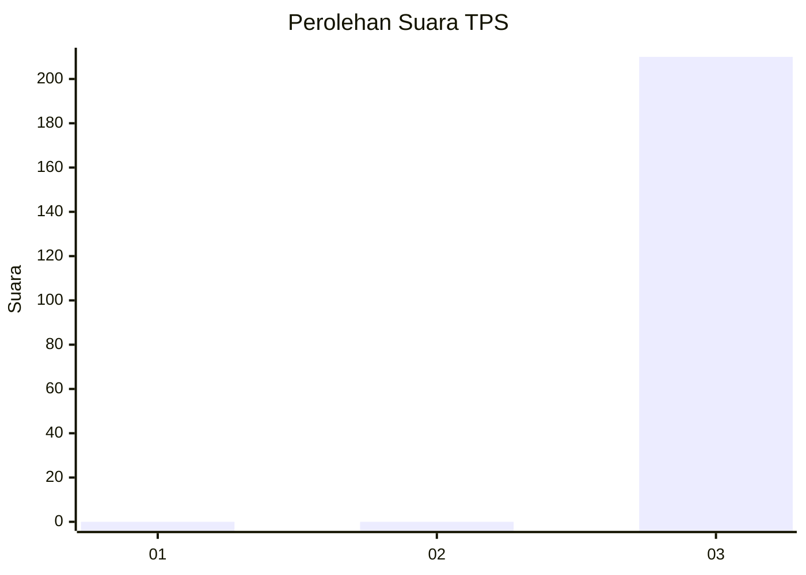
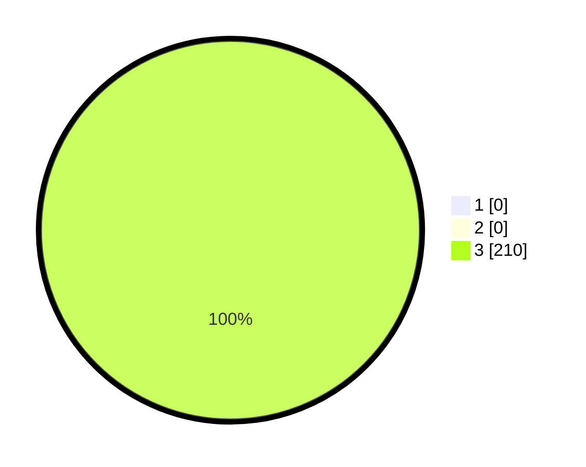

# Hasil

## Grafik

## Tabel

| No. | Nama Paslon    | Suara | Suara (raw) | Persentase |
|:--- |:-------------- | -----:| -----------:| ----------:|
| 1   | ANIES MUHAIMIN | 0     | [0][p-1]    | 0,00       |
| 2   | PRABOWO GIBRAN | 0     | [0][p-2]    | 0,00       |
| 3   | GANJAR MAHFUD  | 210   | [210][p-3]  | 100,00     |

[p-1]: https://github.com/gigit-pemilu/pemilu-2024-92-papua-barat/blob/main/pilpres/hitung-suara/sub/92-papua-barat/sub/02-manokwari/sub/17-tanah-rubuh/sub/2011-imhasuma/sub/001-tps/sub/paslon-1.txt
[p-2]: https://github.com/gigit-pemilu/pemilu-2024-92-papua-barat/blob/main/pilpres/hitung-suara/sub/92-papua-barat/sub/02-manokwari/sub/17-tanah-rubuh/sub/2011-imhasuma/sub/001-tps/sub/paslon-2.txt
[p-3]: https://github.com/gigit-pemilu/pemilu-2024-92-papua-barat/blob/main/pilpres/hitung-suara/sub/92-papua-barat/sub/02-manokwari/sub/17-tanah-rubuh/sub/2011-imhasuma/sub/001-tps/sub/paslon-3.txt

## Foto C Plano

https://sirekap-obj-formc.kpu.go.id/6a4c/pemilu/ppwp/92/02/17/20/11/9202172011001-20240214-132909--80a2e363-cd5f-43ac-86d1-0b7d11c17ec3.jpg

https://sirekap-obj-formc.kpu.go.id/6a4c/pemilu/ppwp/92/02/17/20/11/9202172011001-20240214-131440--8306f1fb-acab-415d-a0fe-0a19eb9b489a.jpg

https://sirekap-obj-formc.kpu.go.id/6a4c/pemilu/ppwp/92/02/17/20/11/9202172011001-20240214-130517--00312c1e-481d-4d5d-9b06-5c9cec702b83.jpg

## Metadata

| Key        | Value               |
| ---------- | ------------------- |
| Time Stamp | 2024-02-15 12:00:28 |

