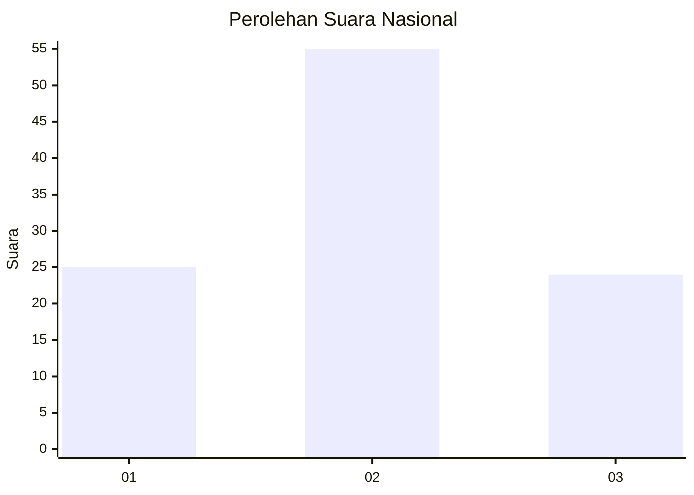
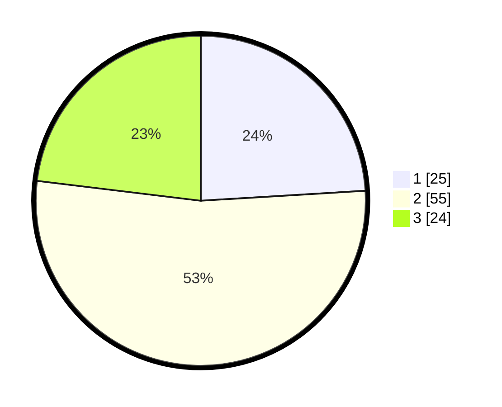

# Hasil

## Grafik

## Tabel

| No. | Nama Paslon    | Suara | Suara (raw) | Persentase |
|:--- |:-------------- | -----:| -----------:| ----------:|
| 1   | ANIES MUHAIMIN | 25    | [25][p-1]   | 24,04      |
| 2   | PRABOWO GIBRAN | 55    | [55][p-2]   | 52,88      |
| 3   | GANJAR MAHFUD  | 24    | [24][p-3]   | 23,08      |

[p-1]: https://github.com/gigit-pemilu/pemilu-2024/blob/main/pilpres/hitung-suara/sub/92-papua-barat/sub/03-fak-fak/sub/01-fak-fak/sub/1001-fak-fak-selatan/sub/901-tps/sub/paslon-1.txt
[p-2]: https://github.com/gigit-pemilu/pemilu-2024/blob/main/pilpres/hitung-suara/sub/92-papua-barat/sub/03-fak-fak/sub/01-fak-fak/sub/1001-fak-fak-selatan/sub/901-tps/sub/paslon-2.txt
[p-3]: https://github.com/gigit-pemilu/pemilu-2024/blob/main/pilpres/hitung-suara/sub/92-papua-barat/sub/03-fak-fak/sub/01-fak-fak/sub/1001-fak-fak-selatan/sub/901-tps/sub/paslon-3.txt

## Foto C Plano

https://sirekap-obj-formc.kpu.go.id/b617/pemilu/ppwp/92/03/01/10/01/9203011001901-20240215-015651--b406f565-94ab-45e8-83dd-e7ee2b0d4a6e.jpg

https://sirekap-obj-formc.kpu.go.id/b617/pemilu/ppwp/92/03/01/10/01/9203011001901-20240215-015747--d71c5535-88fb-4957-9614-1027871a3426.jpg

## Metadata

| Key        | Value               |
| ---------- | ------------------- |
| Time Stamp | 2024-02-24 22:31:28 |

