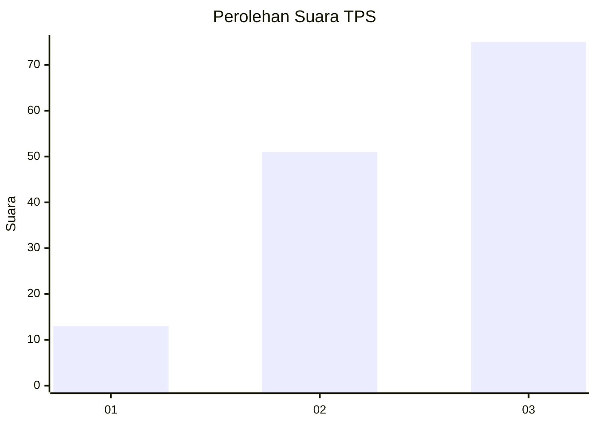
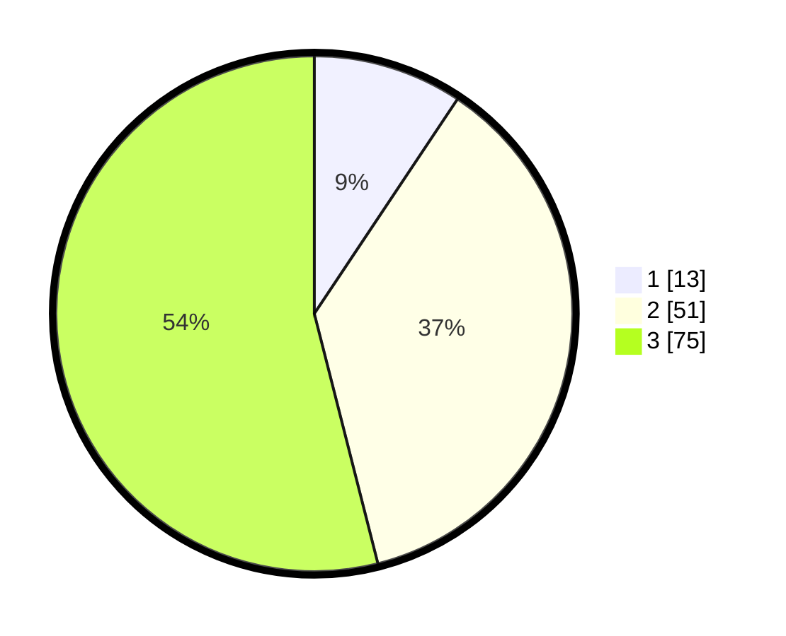

# Hasil

## Grafik

## Tabel

| No. | Nama Paslon    | Suara | Suara (raw) | Persentase |
|:--- |:-------------- | -----:| -----------:| ----------:|
| 1   | ANIES MUHAIMIN | 13    | [13][p-1]   | 9,35       |
| 2   | PRABOWO GIBRAN | 51    | [51][p-2]   | 36,69      |
| 3   | GANJAR MAHFUD  | 75    | [75][p-3]   | 53,96      |

[p-1]: https://github.com/gigit-pemilu/pemilu-2024-92-papua-barat/blob/main/pilpres/hitung-suara/sub/92-papua-barat/sub/03-fak-fak/sub/01-fak-fak/sub/1002-fak-fak-utara/sub/007-tps/sub/paslon-1.txt
[p-2]: https://github.com/gigit-pemilu/pemilu-2024-92-papua-barat/blob/main/pilpres/hitung-suara/sub/92-papua-barat/sub/03-fak-fak/sub/01-fak-fak/sub/1002-fak-fak-utara/sub/007-tps/sub/paslon-2.txt
[p-3]: https://github.com/gigit-pemilu/pemilu-2024-92-papua-barat/blob/main/pilpres/hitung-suara/sub/92-papua-barat/sub/03-fak-fak/sub/01-fak-fak/sub/1002-fak-fak-utara/sub/007-tps/sub/paslon-3.txt

## Foto C Plano

https://sirekap-obj-formc.kpu.go.id/1e2d/pemilu/ppwp/92/03/01/10/02/9203011002007-20240215-182147--0890cecc-b48d-4a78-8112-81f2bcb9daf3.jpg

https://sirekap-obj-formc.kpu.go.id/1e2d/pemilu/ppwp/92/03/01/10/02/9203011002007-20240215-182302--6b45398e-4694-421b-b4f2-31793ee3e1fa.jpg

https://sirekap-obj-formc.kpu.go.id/1e2d/pemilu/ppwp/92/03/01/10/02/9203011002007-20240215-182415--8470bfdd-f3f9-43f6-919f-a704bd3b0e54.jpg

## Metadata

| Key        | Value               |
| ---------- | ------------------- |
| Time Stamp | 2024-02-25 21:00:00 |

