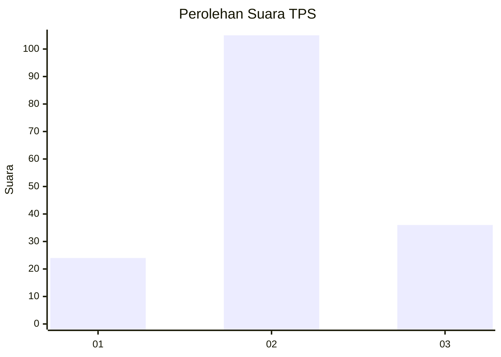
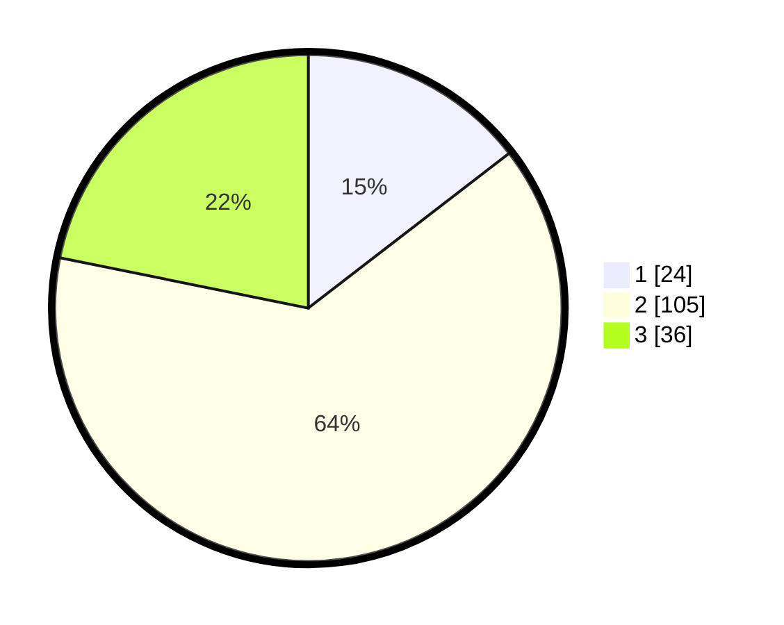

# Hasil

## Grafik

## Tabel

| No. | Nama Paslon    | Suara | Suara (raw) | Persentase |
|:--- |:-------------- | -----:| -----------:| ----------:|
| 1   | ANIES MUHAIMIN | 24    | [24][p-1]   | 14,55      |
| 2   | PRABOWO GIBRAN | 105   | [105][p-2]  | 63,64      |
| 3   | GANJAR MAHFUD  | 36    | [36][p-3]   | 21,82      |

[p-1]: https://github.com/gigit-pemilu/pemilu-2024-92-papua-barat/blob/main/pilpres/hitung-suara/sub/92-papua-barat/sub/03-fak-fak/sub/01-fak-fak/sub/1002-fak-fak-utara/sub/008-tps/sub/paslon-1.txt
[p-2]: https://github.com/gigit-pemilu/pemilu-2024-92-papua-barat/blob/main/pilpres/hitung-suara/sub/92-papua-barat/sub/03-fak-fak/sub/01-fak-fak/sub/1002-fak-fak-utara/sub/008-tps/sub/paslon-2.txt
[p-3]: https://github.com/gigit-pemilu/pemilu-2024-92-papua-barat/blob/main/pilpres/hitung-suara/sub/92-papua-barat/sub/03-fak-fak/sub/01-fak-fak/sub/1002-fak-fak-utara/sub/008-tps/sub/paslon-3.txt

## Foto C Plano

https://sirekap-obj-formc.kpu.go.id/bf64/pemilu/ppwp/92/03/01/10/02/9203011002008-20240214-230728--399ee4b8-2e3b-4511-bd3b-41deb0bd8467.jpg

https://sirekap-obj-formc.kpu.go.id/bf64/pemilu/ppwp/92/03/01/10/02/9203011002008-20240214-230947--43ae5fde-7a7b-41db-a713-48d0e81fdf25.jpg

https://sirekap-obj-formc.kpu.go.id/bf64/pemilu/ppwp/92/03/01/10/02/9203011002008-20240214-231107--a724400f-fe0e-40e4-ac96-0c719eb19bc3.jpg

## Metadata

| Key        | Value               |
| ---------- | ------------------- |
| Time Stamp | 2024-02-25 13:00:00 |

