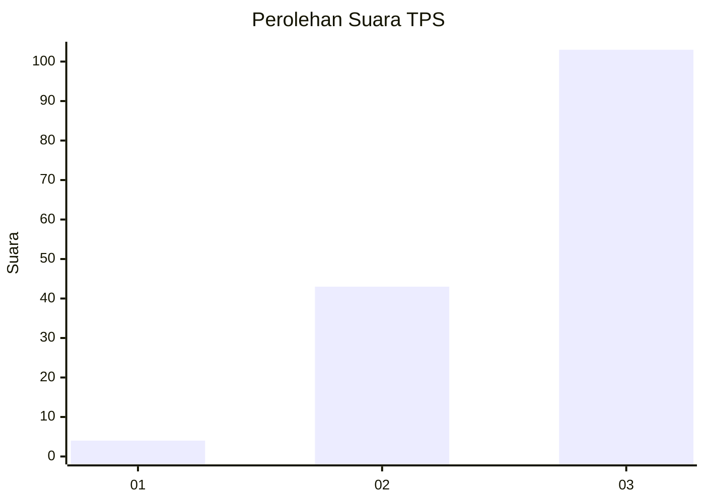
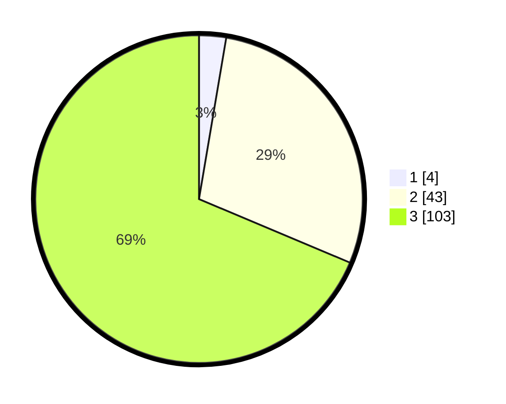

# Hasil

## Grafik

## Tabel

| No. | Nama Paslon    | Suara | Suara (raw) | Persentase |
|:--- |:-------------- | -----:| -----------:| ----------:|
| 1   | ANIES MUHAIMIN | 4     | [4][p-1]    | 2,67       |
| 2   | PRABOWO GIBRAN | 43    | [43][p-2]   | 28,67      |
| 3   | GANJAR MAHFUD  | 103   | [103][p-3]  | 68,67      |

[p-1]: https://github.com/gigit-pemilu/pemilu-2024-92-papua-barat/blob/main/pilpres/hitung-suara/sub/92-papua-barat/sub/03-fak-fak/sub/02-fak-fak-barat/sub/2008-wurkendik/sub/001-tps/sub/paslon-1.txt
[p-2]: https://github.com/gigit-pemilu/pemilu-2024-92-papua-barat/blob/main/pilpres/hitung-suara/sub/92-papua-barat/sub/03-fak-fak/sub/02-fak-fak-barat/sub/2008-wurkendik/sub/001-tps/sub/paslon-2.txt
[p-3]: https://github.com/gigit-pemilu/pemilu-2024-92-papua-barat/blob/main/pilpres/hitung-suara/sub/92-papua-barat/sub/03-fak-fak/sub/02-fak-fak-barat/sub/2008-wurkendik/sub/001-tps/sub/paslon-3.txt

## Foto C Plano

https://sirekap-obj-formc.kpu.go.id/543e/pemilu/ppwp/92/03/02/20/08/9203022008001-20240214-211212--bdb85ae9-569e-41bb-b1b2-c945c803b93a.jpg

https://sirekap-obj-formc.kpu.go.id/543e/pemilu/ppwp/92/03/02/20/08/9203022008001-20240214-211427--c266e108-84d8-4087-a1aa-793c0a26d940.jpg

https://sirekap-obj-formc.kpu.go.id/543e/pemilu/ppwp/92/03/02/20/08/9203022008001-20240214-211602--0c110bff-a8e3-49df-838b-9ad80ea391d9.jpg

## Metadata

| Key        | Value               |
| ---------- | ------------------- |
| Time Stamp | 2024-02-25 16:00:00 |

