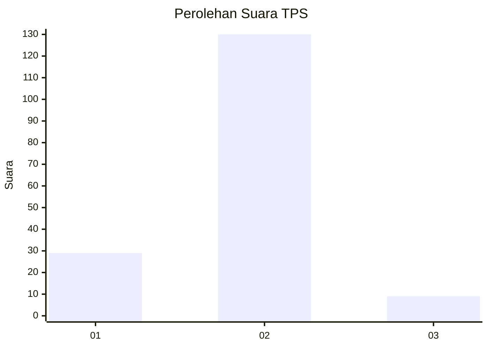
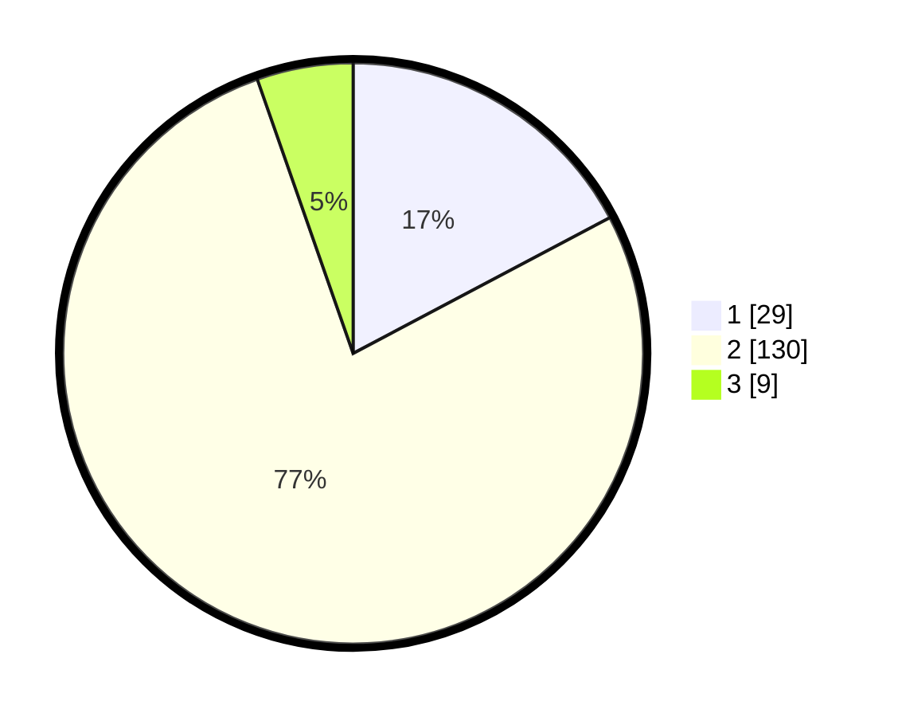

# Hasil

## Grafik

## Tabel

| No. | Nama Paslon    | Suara | Suara (raw) | Persentase |
|:--- |:-------------- | -----:| -----------:| ----------:|
| 1   | ANIES MUHAIMIN | 29    | [29][p-1]   | 17,26      |
| 2   | PRABOWO GIBRAN | 130   | [130][p-2]  | 77,38      |
| 3   | GANJAR MAHFUD  | 9     | [9][p-3]    | 5,36       |

[p-1]: https://github.com/gigit-pemilu/pemilu-2024-92-papua-barat/blob/main/pilpres/hitung-suara/sub/92-papua-barat/sub/03-fak-fak/sub/05-fak-fak-tengah/sub/1001-danaweria/sub/005-tps/sub/paslon-1.txt
[p-2]: https://github.com/gigit-pemilu/pemilu-2024-92-papua-barat/blob/main/pilpres/hitung-suara/sub/92-papua-barat/sub/03-fak-fak/sub/05-fak-fak-tengah/sub/1001-danaweria/sub/005-tps/sub/paslon-2.txt
[p-3]: https://github.com/gigit-pemilu/pemilu-2024-92-papua-barat/blob/main/pilpres/hitung-suara/sub/92-papua-barat/sub/03-fak-fak/sub/05-fak-fak-tengah/sub/1001-danaweria/sub/005-tps/sub/paslon-3.txt

## Foto C Plano

https://sirekap-obj-formc.kpu.go.id/1a79/pemilu/ppwp/92/03/05/10/01/9203051001005-20240215-091440--db76c4e4-50f1-48bd-8e72-65052249c191.jpg

https://sirekap-obj-formc.kpu.go.id/1a79/pemilu/ppwp/92/03/05/10/01/9203051001005-20240215-091738--653890c0-2b83-48bb-8465-a38749b85906.jpg

https://sirekap-obj-formc.kpu.go.id/1a79/pemilu/ppwp/92/03/05/10/01/9203051001005-20240215-092205--4913afce-1c47-4e9b-8e5b-21c1a9abc97d.jpg

## Metadata

| Key        | Value               |
| ---------- | ------------------- |
| Time Stamp | 2024-02-15 15:00:29 |

